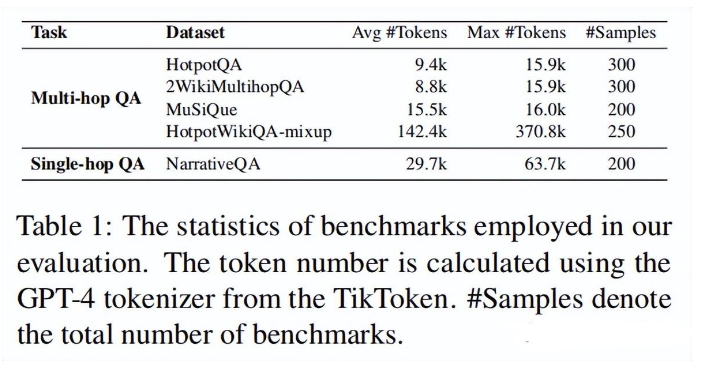
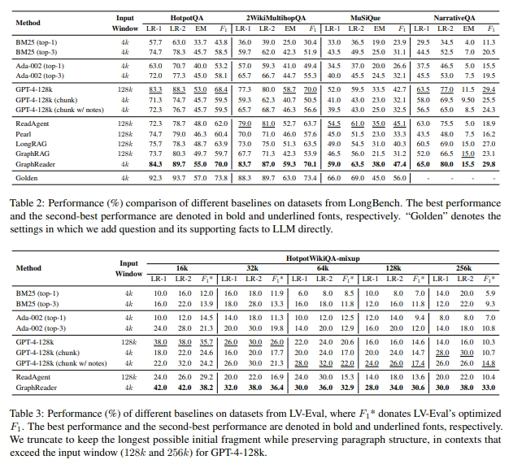
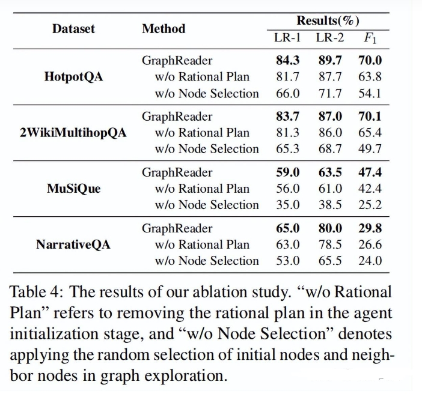

# GraphReader:基于图的智能体，增强大型语言模型的长文本处理能力

> **图解专家**：像个善于制作思维导图的导师，将冗长的文本转化为清晰的知识网络，让AI能够像沿着地图探索一样，轻松找到答案需要的各个关键点，有效克服了处理长文本时的"迷路"问题。

* 发表时间：2024.01.20
* 论文名称：GraphReader: Building Graph-based Agent to Enhance Long-Context Abilities of Large Language Models
* 论文地址：https://arxiv.org/abs/2406.14550  

这篇文章介绍了GraphReader，一种基于图结构的智能体系统，旨在解决大型语言模型（LLMs）处理长文本时遇到的挑战，并在多跳问答等任务上表现出色。以下是文章的总结：

## 一、论文动机

随着自然语言理解和生成技术的进步，LLMs面临的一个主要限制是上下文窗口大小和内存使用的局限性，这使得它们难以有效处理大量文本输入。为了解决这一问题，研究人员探索了多种方法，包括改进模型结构、引入检索增强机制以及利用代理进行复杂推理。然而，这些方法各自存在一定的局限性，如训练成本增加、忽略细节信息或决策机制不够灵活。

## 二、论文创新点

- **目标**：通过构建图结构并采用自主代理探索策略，GraphReader能够在有限的上下文窗口内捕捉长距离依赖关系，从而实现对冗长文档的有效处理。
- **创新点**：
  - 将长文本分割成离散块，并提取关键元素和原子事实；
  - 使用这些组件构建一个能够反映文本内部关系的图结构；
  - 智能体根据预定义函数和逐步理性计划，在图中导航并收集必要信息；
  - 整个过程包括做笔记和反思，确保最终答案的准确性和完整性。

## 三、论文思路

GraphReader的操作分为三个阶段：
- **图构建**：文档被划分为多个部分，每个部分被总结为原子事实，并从中抽取关键元素形成节点；节点之间根据共享的关键元素建立链接。
- **图探索**：智能体按照合理规划选择起始节点，并通过检查相邻节点来遍历整个图结构；在此过程中，智能体会记录支持性事实以备后续分析。
  - 探索原子事实： 由于无法将所有与节点相关的原始文本块都包含在上下文窗口内，因此代理采用从粗到精的策略，从阅读原子事实开始，逐步探索原始文本。所有原子事实都可以适应上下文窗口，因此代理首先将每个节点关联的所有原子事实按其对应的文本块分组，并标记相应的文本块 ID，然后将其输入给代理。这允许代理通过阅读所有原子事实组来捕捉每个文本块的概述。同时，代理利用问题、理性计划和笔记本中的笔记来反思所需的线索，并确定哪些文本块可能包含有用的信息。随后，代理会得到两个函数：
    - 1) read_chunk，如果代理确定某些文本块值得进一步阅读，它将使用文本块 ID 完成函数参数，即 read_chunk(List[ID])，并将这些 ID 添加到文本块队列中。
    - 2) stop_and_read_neighbor，相反，如果代理认为没有任何文本块值得进一步阅读，它将完成阅读当前节点并开始探索相邻节点。
  - 探索文本块： 当文本块队列不为空时，这意味着代理已经识别了多个感兴趣的文本块。然后，GraphReader 遍历队列，逐个读取每个文本块。这一步至关重要，因为原子事实只是总结关键信息和提供简短线索，而具体细节最好直接从原始文本块中获得。在读取文本块的过程中，代理将再次考虑问题和计划，思考可以添加到当前笔记本中的内容。发现的任何支持事实都将记录在笔记本中。根据更新后的笔记本，代理将选择以下四种函数之一：
    - 1) search_more，如果支持事实不足，代理将继续探索队列中的文本块；
    - 2) read_previous_chunk 和 3) read_subsequent_chunk，由于截断问题，相邻文本块可能包含相关和有用的信息，代理可以将这些 ID 插入队列中；
    - 4) termination，如果已经收集到足够的信息来回答问题，代理将完成探索。
  - 探索相邻节点： 当当前节点的原子事实和文本块队列都被完全处理后，这意味着这个节点已经被彻底探索，代理需要访问下一个节点。考虑到问题、理性计划和笔记本内容，代理检查所有相邻节点，即关键元素，并执行以下两种函数之一：
    - 1) read_neighbor_node，代理选择一个可能有助于回答问题的相邻节点，并重新进入探索原子事实和文本块的过程；
    - 2) termination，代理确定没有任何相邻节点包含有用信息，它将完成探索。
- **答案推理**：编译来自不同智能体的笔记，使用思维链推理生成针对给定问题的答案。

## 四、性能评估

通过对多个长上下文基准测试的数据集进行实验，GraphReader展示了显著优于其他方法的表现。例如，在HotpotQA数据集上，GraphReader实现了55.0%的EM和70.0%的F1分数，超过了GPT-4-128k和其他现有方法。此外，在处理极长上下文时，GraphReader同样保持了良好的性能，特别是在LV-Eval基准测试中，其相对于GPT-4-128k显示出了75.00%的相对性能提升。

实验结果表明，GraphReader 在长文本处理方面取得了显著的性能提升，尤其是在多跳问题和极长文本方面。

## 五、影响与展望

GraphReader不仅代表了解决LLMs长上下文处理难题的一项重要进展，也为未来更先进的语言模型铺平了道路。它证明了即使是在较小的上下文窗口下，也可以高效地捕获和利用长距离依赖关系，这对于涉及冗长文档和复杂多步骤推理的任务具有重要意义。这项工作可能会彻底改变文档分析、研究辅助等多个领域的现状，为AI应用开辟新的可能性。

## 结论

GraphReader通过将长文本组织成图结构并利用智能体探索，成功克服了传统LLMs处理长文本时的障碍，提供了更为有效的解决方案。这项研究为长上下文处理树立了新的标杆，并为未来的进一步发展奠定了坚实的基础。

## 参考

1. GraphReader【图解专家】 [https://mp.weixin.qq.com/s/eg3zIZ_3yhiJK83aTvQE2g](https://mp.weixin.qq.com/s/eg3zIZ_3yhiJK83aTvQE2g)
