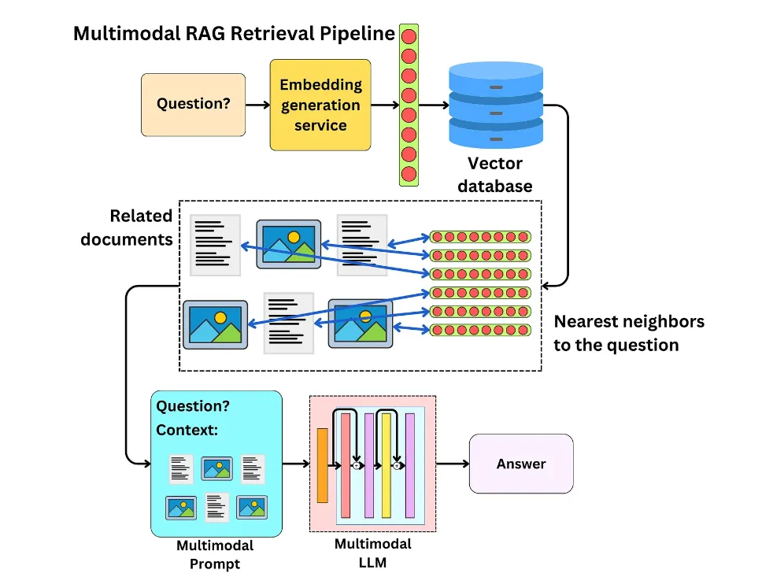

# MM-RAG【多面手】

> **多面手**：就像一个能同时精通视觉、听觉和语言的全能选手，不仅能理解不同形式的信息，还能在它们之间自如切换和关联。通过对各种信息的综合理解，它能在推荐、助手、媒体等多个领域提供更智能、更自然的服务。
>

* 时间：2024.01.22

这篇文章介绍了多模态检索增强生成（MM-RAG）技术及其在生产系统中的实现方式，展示了该技术如何通过结合对比学习和向量数据库来提升语言生成模型的能力。以下是文章的总结：

### 1. 背景与动机

随着多模态嵌入技术的发展，模型现在能够理解图片、文本、音频、视频等多种形式之间的关系。研究人员探索了如何利用这些先进的表示学习方法改进语言生成模型，特别是通过引入相关模态的信息来提高输出的相关性和准确性。

### 2. 论文思路

- **定义**：MM-RAG是一种将大型语言模型（如GPT-3）与使用对比学习嵌入的多模态检索器相结合的技术。
- **多模态嵌入空间**：将不同格式的数据（图片、音频、视频、文本）编码到同一语义嵌入空间中，使得可以通过嵌入相似性进行跨模态搜索。在文本生成过程中，模型会将检索到的不同格式的数据（图片、音频、视频、文本）作为额外上下文，指导其完成更具体且连贯的输出。

> 举个栗子：用户可以通过一张图片检索相关的文本描述，或者通过文本查询找到相关的图片、音频或视频内容.

为了使MM-RAG能够在实际应用中大规模部署，文章提出了一个包含三个主要组件的解决方案：

- **对比训练多模态模型**：例如CLIP，用于将不同模态的数据编码到共享的向量空间中。
- **高效向量数据库**：例如Weaviate，它能够处理数十亿个嵌入并执行快速的向量相似性搜索。
- **用户查询接口**：允许用户提交查询，并即时从数据库中检索跨模态的相关结果。

这套系统不仅支持高效的多模态搜索，还为构建大规模的MM-RAG生产环境提供了基础架构。

### 3. 实验结果展示

Anthropic团队展示了MM-RAG的有效性。例如，在描述“海滩上的一天”这个任务中，未使用MM-RAG生成的内容较为笼统，而使用MM-RAG后，生成的内容更加生动具体，包含了更多细节描述，如金色沙滩、蓝色波浪等元素。这表明MM-RAG确实能显著提升语言AI的表现。

### 4. 多模态人工智能的未来展望

文章强调了MM-RAG和其他多模态技术对扩展AI感知、构思和实现范围的重要性。预计未来，多模态AI将变得更加普遍，应用于推荐系统、虚拟助手回答问题、媒体和电子商务等领域，提供更加精细和个性化的服务。同时，专门构建的向量数据库将是实现这一愿景的关键，使得多模态技术可以被广泛采用并在现实世界中发挥作用。

### 结论

MM-RAG代表了语言生成模型的一个重要进步，它通过整合来自多种模态的信息，提高了生成内容的质量。借助对比学习和向量数据库的力量，这项技术正逐步从实验室走向实际应用，为用户提供更为丰富和准确的语言交互体验。随着技术的不断发展，我们正迎来一个多模态智能的新时代。

## 参考

* 参考：[https://mp.weixin.qq.com/s/wGar-qBfvjdi5juO1c0YxQ](https://mp.weixin.qq.com/s/wGar-qBfvjdi5juO1c0YxQ)
