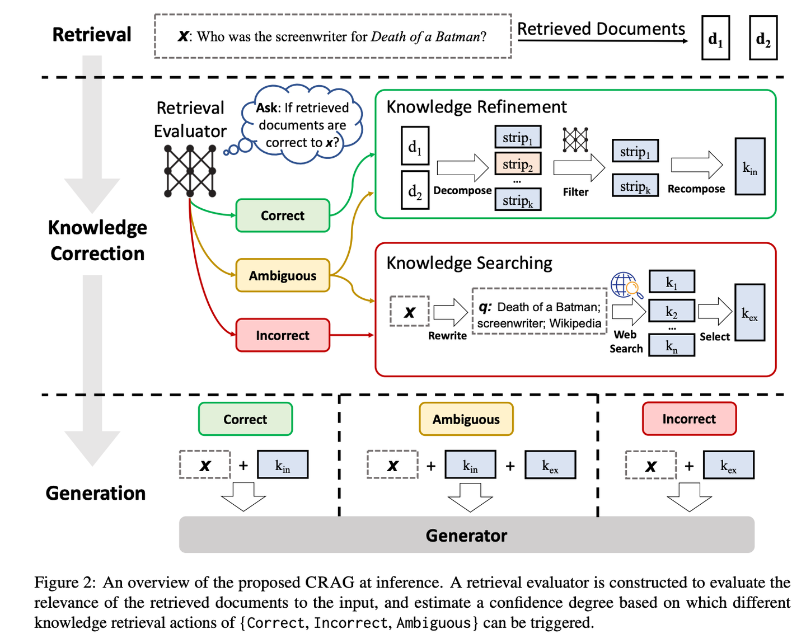
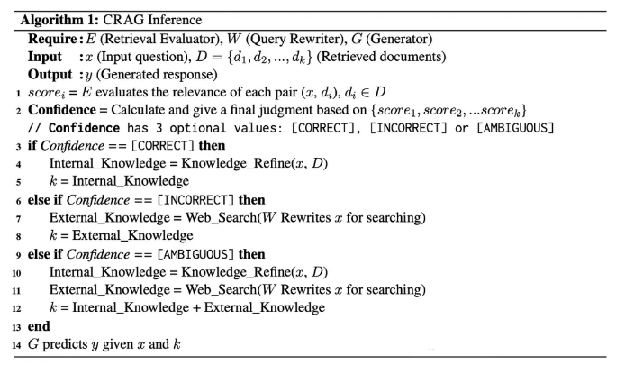

# CRAG【自我校正】
> **自我校正**：像个经验丰富的编辑，先用简单快速的方式筛选初步资料，再通过网络搜索扩充信息，最后通过拆解重组的方式，确保最终呈现的内容既准确又可靠。就像是给RAG装上了一个质量控制系统，让它产出的内容更值得信赖。
>

* 发表时间：2024.01.29
* 论文名称：Corrective Retrieval Augmented Generation
* 论文地址：[https://arxiv.org/abs/2401.15884](https://arxiv.org/abs/2401.15884)
* Github 地址：[https://github.com/HuskyInSalt/CRAG](https://github.com/HuskyInSalt/CRAG)

> **自我校正**：像个经验丰富的编辑，先用简单快速的方式筛选初步资料，再通过网络搜索扩充信息，最后通过拆解重组的方式，确保最终呈现的内容既准确又可靠。就像是给RAG装上了一个质量控制系统，让它产出的内容更值得信赖。
>

* 发表时间：2024.01.29
* 论文名称：Corrective Retrieval Augmented Generation
* 论文地址：[https://arxiv.org/abs/2401.15884](https://arxiv.org/abs/2401.15884)
* Github 地址：[https://github.com/HuskyInSalt/CRAG](https://github.com/HuskyInSalt/CRAG)

## 一、论文动机

传统RAG的局限性：**传统的检索增强生成（RAG）方法在信息检索过程中存在局限性，如缺乏对检索文档与问题相关性的评估，导致生成内容可能不准确或包含无关信息**.

## 二、论文思路

- **检索评估器**：CRAG使用一个轻量级的T5-large模型作为检索评估器，评估检索到的文档与问题之间的相关性，并给出三种结果：正确、错误、模棱两可.
  - 正确：使用知识细化算法对检索到的信息进行处理和精炼.
  - 错误：利用网络搜索引擎获取更相关的信息.
  - 模棱两可：结合使用知识细化算法和网络搜索引擎，获取更多信息来完善答案.
- **知识精炼算法**：先将文档细分为细小的知识单元，利用检索评估器为每个知识单元计算相关性评分，筛除评分较低的单元，剩下的单元重新组合构建成完整的内部知识体系.


> CRAG 在 RAG 中的位置 ( 红色虚线框 )。检索评估器用于评估检索到的信息与输入问题的相关性。它还会估计一个置信水平，并根据置信水平触发不同的知识检索操作，包括 { 正确、错误、模棱两可 } 三种情况。图中，“x”代表输入问题。图片由作者提供，CRAG 部分 ( 红色虚线框 ) 来源于纠正性检索增强生成。


>  评估和处理流程。来源：纠正性检索增强生成。

## 三、优势与不足

- 优势：CRAG通过自我校正检索结果，增强了生成文本的鲁棒性，模型结构轻量级，推理速度快.
- 不足：需要根据具体问题和需求调整相关性分数的阈值，以在信息检索的准确性和全面性之间取得平衡.

## 四、代码实现

CRAG 是一个开源项目，LangChain 和 LlamaIndex 都提供了各自的实现版本。本文将以 LlamaIndex 的实现为例进行说明。

### 4.1、环境配置

```s
conda create -n crag python=3.11

conda activate crag

pip install llama-index llama-index-tools-tavily-research

mkdir "YOUR_DOWNLOAD_DIR"
```

安装完成后，LlamaIndex 和 Tavily 的相应版本如下：

```s
(crag) $ pip list | grep llama
llama-index                             0.10.29
llama-index-agent-openai                0.2.2
llama-index-cli                         0.1.11
llama-index-core                        0.10.29
llama-index-embeddings-openai           0.1.7
llama-index-indices-managed-llama-cloud 0.1.5
llama-index-legacy                      0.9.48
llama-index-llms-openai                 0.1.15
llama-index-multi-modal-llms-openai     0.1.5
llama-index-packs-corrective-rag        0.1.1
llama-index-program-openai              0.1.5
llama-index-question-gen-openai         0.1.3
llama-index-readers-file                0.1.19
llama-index-readers-llama-parse         0.1.4
llama-index-tools-tavily-research       0.1.3
llama-parse                             0.4.1
llamaindex-py-client                    0.1.18

(crag) $ pip list | grep tavily
llama-index-tools-tavily-research       0.1.3
```

### 4.2、环境配置

以下是测试代码示例。首次运行时，需要先下载 CorrectiveRAGPack 包。

```s
import os
os.environ["OPENAI_API_KEY"] = "YOUR_OPENAI_API_KEY"

from llama_index.core import Document


# 选项：下载 CorrectiveRAGPack
# 第一次执行需要下载 CorrectiveRAGPack
# 后续执行可以注释掉这一行。
from llama_index.core.llama_pack import download_llama_pack
CorrectiveRAGPack = download_llama_pack(
    "CorrectiveRAGPack", "YOUR_DOWNLOAD_DIR"
)


# 创建测试文档
documents = [
    Document(
        text="一群企鹅，在陆地上被称为“摇摆者”，在南极冰面上蹒跚而行，它们燕尾服般的羽毛在雪地上格外醒目。"
    ),
    Document(
        text="帝企鹅是所有企鹅物种中最高的，可以比任何其他鸟类潜得更深，达到 500 多米的深度。"
    ),
    Document(
        text="企鹅的黑白颜色是一种被称为反荫蔽的伪装形式；从上面看，它们的黑色背部与海洋深处融为一体，而从下面看，它们的白色腹部与明亮的表面相匹配。"
    ),
    Document(
        text="尽管企鹅站姿挺拔，但它们是不会飞的鸟类；它们的翅膀已经进化成鳍状肢，使它们成为游泳健将。"
    ),
    Document(
        text="速度最快的物种巴布亚企鹅，游泳速度可达每小时 36 公里，它们利用鳍状肢和流线型身体在水中穿梭。"
    ),
    Document(
        text="企鹅是群居鸟类；许多物种形成大型繁殖群，数量可达数万只。"
    ),
    Document(
        text="有趣的是，企鹅的听力非常好，它们依靠独特的叫声在嘈杂的群体中识别它们的配偶和雏鸟。"
    ),
    Document(
        text="最小的企鹅物种小蓝企鹅，身高只有 40 厘米左右，分布在澳大利亚南部和新西兰的海岸线上。"
    ),
    Document(
        text="在繁殖季节，雄性帝企鹅会在严酷的南极冬季忍受数月，禁食并孵化它们的蛋，而雌性则在海上捕猎。"
    ),
    Document(
        text="企鹅吃各种海鲜；它们的饮食主要包括鱼、鱿鱼和磷虾，它们在潜水探险中捕获这些食物。"
    ),
]

from llama_index.packs.corrective_rag import CorrectiveRAGPack
corrective_rag = CorrectiveRAGPack(documents, "YOUR_TAVILYAI_API_KEY")

# 从这里开始，您可以使用该包，或在 ./corrective_rag_pack 中检查和修改该包。
# run() 函数包含纠正性检索增强生成 - CRAG 论文背后的逻辑。
query = "最小的企鹅有多高？"
print('-' * 100)
print("查询 " + query + " 的响应是：")
response = corrective_rag.run(query, similarity_top_k=2)
print(response)
```

首先，您需要申请一个 TavilyAI 的 API 密钥 (YOUR_TAVILYAI_API_KEY) 并将其填入代码中。TavilyAI 提供了用于信息检索和知识提取的 API 接口，可以通过这个网站（https://app.tavily.com/sign-in）申请。

测试代码产生了以下结果（大部分调试信息已被移除）：

```s
(crag) $ python /Users/dream/Documents/crag.py
----------------------------------------------------------------------------------------------------
The response of the query How tall is the smallest penguins? is:
----------------------------------------------------------------------------------------------------
The smallest penguins are about 40 cm (16 inches) tall.
```

理解测试代码的关键在于 corrective_rag.run() 的实现，让我们深入探讨。

### 4.3、CorrectiveRAGPack 类的构造器

要理解 CRAG 的工作原理，我们需要深入研究 corrective_rag.run() 函数的代码。这个函数实现了 CRAG 的核心逻辑，包括信息检索、相关性评估、信息提取等步骤。

```s
class CorrectiveRAGPack(BaseLlamaPack):
    def __init__(self, documents: List[Document], tavily_ai_apikey: str) -> None:
        """Init params."""
        llm = OpenAI(model="gpt-4")
        self.relevancy_pipeline = QueryPipeline(
            chain=[DEFAULT_RELEVANCY_PROMPT_TEMPLATE, llm]
        )
        self.transform_query_pipeline = QueryPipeline(
            chain=[DEFAULT_TRANSFORM_QUERY_TEMPLATE, llm]
        )

        self.llm = llm
        self.index = VectorStoreIndex.from_documents(documents)
        self.tavily_tool = TavilyToolSpec(api_key=tavily_ai_apikey)
```

请注意，默认设置是 gpt-4。如果您没有使用 gpt-4 的权限，您可以手动切换到 gpt-3.5-turbo。

### 4.4、class CorrectiveRAGPack:: run()

函数 run() 的源代码如下：

```s
class CorrectiveRAGPack(BaseLlamaPack):
    ...
    ...
    def run(self, query_str: str, **kwargs: Any) -> Any:
        """Run the pipeline."""
        # 根据输入的查询字符串检索节点。
        retrieved_nodes = self.retrieve_nodes(query_str, **kwargs)

        # 评估检索到的每个文档与查询字符串的相关性。
        relevancy_results = self.evaluate_relevancy(retrieved_nodes, query_str)
        # 从评估为相关的文档中提取文本。
        relevant_text = self.extract_relevant_texts(retrieved_nodes, relevancy_results)

        # 初始化 search_text 变量以处理可能未定义的情况。
        search_text = ""

        # 如果发现任何文档不相关，转换查询字符串以获得更好的搜索结果。
        if "no" in relevancy_results:
            transformed_query_str = self.transform_query_pipeline.run(
                query_str=query_str
            ).message.content
            # 使用转换后的查询字符串进行搜索并收集结果。
            search_text = self.search_with_transformed_query(transformed_query_str)

        # 编译最终结果。如果有来自转换查询的额外搜索文本，
        # 则包含在内；否则，只返回初始检索的相关文本。
        if search_text:
            return self.get_result(relevant_text, search_text, query_str)
        else:
            return self.get_result(relevant_text, "", query_str)
```

LlamaIndex 的 CRAG 实现与标准 CRAG 流程有一些区别：

1. **没有处理模棱两可的信息**： LlamaIndex 的实现没有对模棱两可的信息进行判断和处理，而是直接将其与相关信息一起传递给大语言模型。
2. **使用大语言模型评估相关性**： LlamaIndex 使用大语言模型 (例如 GPT-3.5) 来评估检索到的信息与问题的相关性，而不是使用训练好的 T5-large 模型。这是因为大语言模型具有更强的理解和推理能力，可以更准确地判断信息的相关性。
3. **跳过知识精炼的过程**： LlamaIndex 跳过了知识精炼的步骤，直接将提取的相关信息传递给大语言模型进行答案生成。这是因为大语言模型本身就具备一定的知识整合和信息处理能力，可以将相关信息组织成连贯的答案。

LlamaIndex 的 CRAG 实现提供了一种更简洁、更高效的信息检索和答案生成方式，利用了大语言模型的强大能力，避免了复杂的知识细化过程。

### 4.5、使用LLM评估检索到的信息

代码如下：

```s
class CorrectiveRAGPack(BaseLlamaPack):
    ...
    ...
    def evaluate_relevancy(
        self, retrieved_nodes: List[Document], query_str: str
    ) -> List[str]:
        """评估检索到的文档与查询的相关性。"""
        relevancy_results = []
        for node in retrieved_nodes:
            relevancy = self.relevancy_pipeline.run(
                context_str=node.text, query_str=query_str
            )
            relevancy_results.append(relevancy.message.content.lower().strip())
        return relevancy_results
```

调用LLM的提示如下：

```s
DEFAULT_RELEVANCY_PROMPT_TEMPLATE = PromptTemplate(
    template="""作为评分员，您的任务是评估检索到的文档对用户问题的回答的相关性。

    检索到的文档：
    -------------------
    {context_str}

    用户问题：
    --------------
    {query_str}

    评估标准：
    - 考虑文档是否包含与用户问题相关的关键词或主题。
    - 评估不应过于严格；主要目标是识别并过滤掉明显不相关的检索。

    决定：
    - 分配一个二进制分数来表示文档的相关性。
    - 如果文档与问题相关，请使用 'yes'；如果无关，请使用 'no'。

    请在下方提供您的二进制分数（'yes' 或 'no'），以指示文档对用户问题的相关性。"""
)
```

CRAG 论文指出，ChatGPT 在判断信息与问题之间相关性的能力方面，不如 T5-Large 模型。

此外，在实际应用中，我们可以使用 CRAG 论文中提出的知识精炼算法来进一步提升结果的准确性。相关的代码实现可以在 CRAG 的开源项目中找到。

### 4.6、使用 GPT-3.5 优化搜索查询

如前所述，CRAG 在进行网络搜索时，并不会直接使用用户输入的问题作为搜索关键词。相反，它会利用 GPT-3.5 模型来生成更有效的搜索查询。CRAG 会向 GPT-3.5 提供以下提示：

```s
DEFAULT_TRANSFORM_QUERY_TEMPLATE = PromptTemplate(
    template=""“你的任务是优化一个查询，以确保它能够高效地检索到相关的搜索结果。\n
    请分析给定的查询以抓住其核心语义或意图。\n
    原始查询：
    \n ------- \n
    {query_str}
    \n ------- \n
    目标是改进这个查询，以提升其搜索效果。确保修改后的查询既精确又简洁。\n
    请仅回复优化后的查询：”""
)
```

这段提示告诉 GPT-3.5，它的任务是将原始问题改写成一个更有效的搜索查询，以便检索到更相关的结果。

## 总结

文章强调了CRAG在提升信息检索与生成质量方面的潜力，并展示了其在自然语言处理领域的理论和实践意义，为提升语言模型在复杂知识密集型任务中的表现提供了新的思路和方法.

## 参考

* 参考：[https://mp.weixin.qq.com/s/HTN66ca6OTF_2YcW0Mmsbw](https://mp.weixin.qq.com/s/HTN66ca6OTF_2YcW0Mmsbw)
