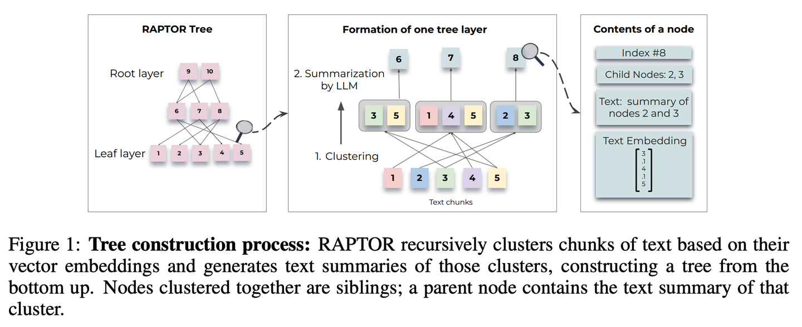

# 【论文学习】 RAPTOR【分层归纳】
> **分层归纳**：像个善于组织的图书管理员，将文档内容自下而上地整理成树状结构，让信息检索能在不同层级间灵活穿梭，既能看到整体概要，又能深入细节。
>

* 发表时间：2024.01.31
* 论文名称：[RAPTOR: Recursive Abstractive Processing for Tree-Organized Retrieval](https://arxiv.org/abs/2401.18059)
* 论文地址：[https://arxiv.org/abs/2401.18059](https://arxiv.org/abs/2401.18059)
* Github 项目：[https://github.com/parthsarthi03/raptor](https://github.com/parthsarthi03/raptor)

## 一、论文动机

传统的RAG方法通常**仅从检索语料库中提取短的连续文本块，这限制了模型对整个文档上下文的整体理解能力**。

## 二、论文思路

RAPTOR（Recursive Abstractive Processing for Tree-Organized Retrieval）旨在通过递归处理、聚类和总结文本块，构建具有不同抽象级别的树形结构，从而改进长文档信息的整合与检索效率。

### 2.1 RAPTOR检索树的构建过程

1. **文本切片**：首先对文本进行合理的切片处理，选择合适的切片算法.
2. **递归聚类与总结**：根据语义embedding递归地对文本块进行聚类，并生成这些聚类的文本摘要.采用软聚类方法，允许文本块跨多个聚类，并使用高斯混合模型（GMMs）和UMAP技术进行降维，以优化文本聚类效果.
3. **树形模型构建**：通过递归的向量分析，精准地对文本块进行聚类，并提炼出这些聚类的核心摘要，自下而上地构建出一个结构化的树形模型.相近的节点形成兄弟关系，父节点承载整个集群的概要性文本信息.

### 2.2 RAPTOR的检索过程

1. **深度检索树**：从树的根级别开始，根据与查询向量的余弦相似度逐层检索top-k节点，直到达到叶节点，最后将所有选定节点的文本连接起来形成检索到的上下文.
2. **广度检索树**：将整个树压缩成单一层，然后根据与查询向量的余弦相似度评估所有层的节点，直到达到设定阈值.

## 三、论文创新点

1. 树状结构的构建
   1. **递归嵌入与聚类**：RAPTOR通过递归的方式对文本块进行嵌入和聚类，生成不同层次的文本摘要，构建出具有不同总结级别的树形结构。这种递归嵌入与聚类的方法使得模型能够逐步细化文本信息的粒度，捕捉到不同层次上的关键信息，为后续的文本分析和应用奠定了坚实的基础.
   2. **软聚类与降维技术**：采用软聚类方法，允许文本块跨多个聚类，基于高斯混合模型（GMMs）和UMAP技术进行降维。这种软聚类与降维技术的结合，能够更好地捕捉文本数据的复杂结构和关系，优化文本聚类效果，提高模型对文本信息的理解和处理能力.
2. 检索过程的优化
   1. **深度与广度检索树**：提出了基于深度检索树（树遍历）和广度检索树（折叠树）的两种检索方式。深度检索树从树的根级别开始逐层检索，广度检索树将整个树压缩成单一层进行评估。这两种检索方式为不同场景下的信息检索提供了灵活的选择，能够根据具体需求和查询向量的相似度，高效地检索到相关的信息.
   2. **多级信息整合**：在推理时，RAPTOR模型能够从构建的树中整合不同抽象级别的长文档中的信息。这种多级信息整合的方式，使得模型在生成答案时能够综合考虑不同层次上的文本内容，提高生成结果的准确性和可靠性.
3. 性能提升
   1. **显著提高准确度**：与传统的检索增强型语言模型相比，RAPTOR在性能和绝对准确度上提高了20%。这一显著的性能提升，证明了RAPTOR模型在信息检索与生成任务中的有效性，展示了其在处理长文本和复杂文档方面的优势.

## 四、论文总结

RAPTOR模型通过其独特的树状结构构建、优化的检索过程以及显著的性能提升，为检索增强生成领域带来了新的创新和突破，为处理长文本和复杂文档提供了更高效、更准确的方法.

## 参考

* 参考：[https://mp.weixin.qq.com/s/8kt5qbHeTP1_ELY_YKwonA](https://mp.weixin.qq.com/s/8kt5qbHeTP1_ELY_YKwonA)