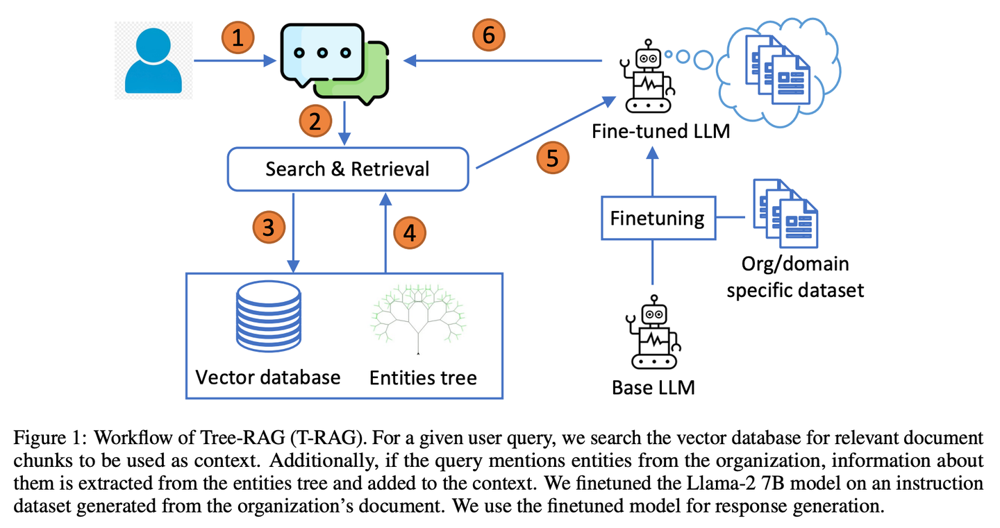

# T-RAG【私人顾问】

> **私人顾问**：像个熟悉组织架构的内部顾问，善于利用树状结构组织信息，在保护隐私的同时，高效且经济地提供本地化服务。
>

* 发表时间：2024.02.12
* 论文名称：[T-RAG: Lessons from the LLM Trenches](https://arxiv.org/abs/2402.07483)
* 论文地址：https://arxiv.org/abs/2402.07483

#### 一、论文动机

- **数据隐私与安全性**：在处理私营企业文档的问答任务时，数据的安全性和稳健性至关重要。由于文档的敏感性，使用公共API上的专有LLM模型存在数据泄露的风险，因此需要使用可以在本地部署的开源模型.
- **现有挑战**：有限的计算资源和较小的训练数据集也带来了挑战，同时需要确保对用户查询的可靠和准确的响应，这增加了部署强大应用程序的复杂性.

#### 二、论文思路

- **架构设计**：T-RAG将RAG架构与经过微调的开源LLM（如Llama-2 7B模型）相结合，使用源自组织文档的指令数据集进行训练，以生成响应.
- **实体树与向量数据库**：T-RAG结合了实体树和向量数据库进行上下文检索。实体树存储有关组织实体及其层次结构的信息，而向量数据库用于搜索相关文档块.
- **工作流程**：

1. 解析用户查询，识别与组织内实体名称相对应的关键字.
2. 从实体树中提取相关实体的详细信息，并将其转换为文本陈述，提供有关实体及其在组织层次结构中的位置的信息.
3. 将这些信息与从向量数据库检索的文档块合并，构建上下文.
4. 经过微调的LLM根据提供的上下文生成响应.

#### 三、论文创新点

- **实体树的利用**：通过实体树增强上下文检索，使得模型能够获得有关实体及其在组织内层次定位的相关信息，从而提高回答的准确性和相关性.
- **数据隐私保护**：使用本地部署的开源模型，避免了数据泄露的风险，同时解决了推理延迟、令牌使用成本以及区域和地理可用性问题.
- **评估指标**：引入了Correct-Verbose评估指标，用于评估生成的响应质量，不仅考虑答案的正确性，还考虑包含超出原始问题范围的其他相关信息.

#### 四、论文总结

T-RAG（树状检索增强生成）结合RAG与微调的开源LLM，使用树结构来表示组织内的实体层次结构增强上下文，利用本地托管的开源模型来解决数据隐私问题，同时解决推理延迟、令牌使用成本以及区域和地理可用性问题。

## 致谢

* 参考：[https://mp.weixin.qq.com/s/ytEkDAuxK1tLecbFxa6vfA](https://mp.weixin.qq.com/s/ytEkDAuxK1tLecbFxa6vfA)