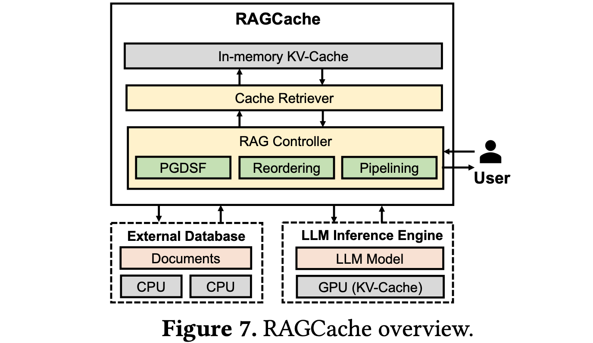

### RAGCache【仓储员】
> **仓储员**：像大型物流中心一样，把常用知识放在最容易取的货架上。懂得把经常用的包裹放在门口，把不常用的放在后仓，让取货效率最大化。
>

* 发表时间：2024.04.18
* 论文名称：[RAGCache: Efficient Knowledge Caching for Retrieval-Augmented Generation](https://arxiv.org/abs/2404.12457)
* 论文地址：[https://arxiv.org/abs/2404.12457](https://arxiv.org/abs/2404.12457)

#### 一、论文动机

- **RAG 技术**：通过结合外部知识库，提升了大语言模型（LLM）的性能，但在长序列生成时存在显著的延迟和效率挑战。
- **现有优化方案**：主要关注 LLM 推理加速，未能充分利用 RAG 系统的特点。
  - **性能瓶颈**：RAG 系统的主要瓶颈在于 LLM 生成步骤，外部知识文档的注入显著延长了处理序列。
  - **访问模式**：检索请求高度集中，少数热门文档占据了大部分请求，为缓存优化提供了依据。
  - **优化空间**：通过缓存文档的中间计算状态，可以显著降低计算开销.

#### 二、论文思路

- **知识树结构**：设计了一种树状结构来组织缓存的文档状态，有效处理文档检索的顺序敏感性问题。
- **前缀感知的贪心双重大小频率 (PGDSF) 替换策略**：综合考虑文档顺序、key-value 张量的大小、访问频率和时间的新近性，确保最有价值的文档状态留在缓存中.
- **多层缓存**：实现跨 GPU 和主机内存的分层缓存系统，利用 GPU 内存的速度和主机内存的容量.
- **动态推测流水线**：通过动态推测流水线重叠向量检索和 LLM 推理，最小化空闲时间，显著减少端到端延迟.

#### 三、实验设计与结果

- **与 vLLM+Faiss 相比**：首个 token 生成时间 (TTFT) 最高减少 4 倍，吞吐量最高提升 2.1 倍.
- **与 SGLang 相比**：TTFT 最高减少 3.5 倍，吞吐量最高提升 1.8 倍.

#### 四、论文创新点

1. **知识树结构**：设计了一种树状结构来组织缓存的文档状态，有效处理 RAG 系统中文档检索的顺序敏感性问题。例如，对于不同的文档序列（如 \([D1, D3]\) 和 \([D2, D3]\)），尽管文档 \(D3\) 在两个序列中都出现，但由于前面文档的不同，其 key-value 张量在各自序列中的值是不同的。知识树结构能够高效管理这些变化，确保快速检索的同时保持文档顺序.
2. **前缀感知的贪心双重大小频率 (PGDSF) 替换策略**：引入了一种复杂的缓存替换策略，综合考虑了多个因素，包括文档顺序、key-value 张量的大小、访问频率和访问时间的新近性。这种策略确保最有价值的文档状态能够留在缓存中，最大化命中率并最小化重复计算.
3. **多层缓存系统**：实现了一个跨 GPU 和主机内存的分层缓存系统，允许高效利用更快但容量有限的 GPU 内存，同时利用主机内存的更大容量来存储较少访问的状态。例如，频繁访问的文档状态可能存储在 GPU 内存中以实现快速访问，而不常用的状态则保存在主机内存中.这种分层方法同时优化了速度和容量.
4. **动态推测流水线**：通过动态推测流水线重叠向量检索和 LLM 推理的能力，随着向量搜索的进行，RAGCache 将中期结果发送给 LLM 进行推测生成。如果检索到的文档发生变化，系统会适应性地启动新的推测生成。这种方法最小化了空闲时间，显著减少了端到端延迟.

#### 五、论文总结

RAGCache是一种为RAG量身定制的新型多级动态缓存系统，它将检索到的知识的中间状态组织在知识树中，并在GPU和主机内存层次结构中进行缓存。RAGCache提出了一种考虑到LLM推理特征和RAG检索模式的替换策略。它还动态地重叠检索和推理步骤，以最小化端到端延迟。

## 致谢

* 参考：[https://mp.weixin.qq.com/s/EOf51zoycmUCKkIo8rPsZw](https://mp.weixin.qq.com/s/EOf51zoycmUCKkIo8rPsZw)