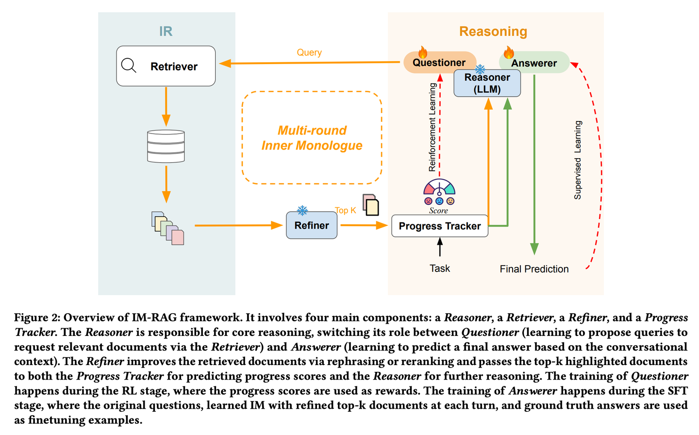

### IM-RAG【自言自语】
> **自言自语**：遇到问题时会在心里盘算"我需要查什么资料"、"这个信息够不够"，通过不断的内心对话来完善答案，这种"独白"能力像人类专家一样，能够逐步深入思考并解决复杂问题。
>

* 发表时间：2024.05.15
* 论文名称：[IM-RAG: Multi-Round Retrieval-Augmented Generation Through Learning Inner Monologues](https://arxiv.org/abs/2405.13021)
* 论文地址：[https://arxiv.org/abs/2405.13021](https://arxiv.org/abs/2405.13021)

#### 一、论文动机

- **RAG方法的局限性**：尽管RAG能够利用外部知识和LLM输出来增强生成质量，但在与不同能力的IR系统集成、多轮检索的可解释性以及端到端优化机制方面仍存在挑战.
- **内部独白的概念**：IM-RAG通过学习内部独白来连接IR系统与LLM，支持多轮检索增强生成，使LLM能够更好地进行推理和生成.

#### 二、论文思路

- **核心组件**：
  - **推理器（Reasoner）**：负责主要的推理任务，根据对话上下文生成查询或提供最终答案.
  - **检索器（Retriever）**：根据推理器的查询从数据库中检索相关文档.
  - **精炼器（Refiner）**：对检索到的文档进行重排序和改写，以提高信息的相关性.
  - **进度跟踪器（Progress Tracker）**：通过打分系统跟踪任务进展，为强化学习提供反馈.
- **多轮交互过程**：推理器在不同阶段切换角色，生成查询或提供答案，检索器和精炼器协同工作，逐步收集和精炼信息，直到推理器认为信息足够齐全，最终生成答案.

- 学习过程
  - **强化学习（RL）阶段**：推理器在生成查询时使用进度跟踪器的分数作为反馈，帮助优化查询策略.
  - **监督微调（SFT）阶段**：推理器在提供最终答案时基于对话和相关文档生成预测，并进一步利用真实答案微调模型.

- 工作流程

当用户提出复杂问题时，IM-RAG的核心组件推理器首先尝试回答。如果当前信息不足以得出答案，推理器将生成查询并交由检索器去知识库查找相关信息。检索到的文档经过精炼器优化后传回推理器，后者检查信息是否足够充分。若信息不足，则继续迭代生成新的查询并再次检索。整个流程持续数轮，直到推理器认为信息足够齐全，最终提供最终答案。

#### 三、实验设计与结果

- **性能提升**：在HotPotQA数据集上的实验结果表明，IM-RAG在多步推理任务中达到了最先进的性能，展现出更高的灵活性和可解释性.
- **优势**：通过多轮交互式检索和内部独白机制，IM-RAG能够更有效地进行复杂推理，生成更准确和可解释的内容.

#### 四、论文创新点

- **创新性**：IM-RAG通过内部独白机制将LLM和IR系统紧密结合，实现了高效的多轮检索和生成，提升了RAG系统的推理能力和可解释性.
- **应用前景**：该方法在多轮对话和复杂推理任务中具有广泛的应用潜力，能够为用户提供更准确和可解释的生成内容.

#### 五、论文总结

IM-RAG通过学习内部独白（Inner Monologues）来连接IR系统与LLMs，从而支持多轮检索增强生成。该方法将信息检索系统与大型语言模型相整合，通过学习内心独白来支持多轮检索增强生成。在内心独白过程中，大型语言模型充当核心推理模型，它既可以通过检索器提出查询以收集更多信息，也可以基于对话上下文提供最终答案。我们还引入了一个优化器，它能对检索器的输出进行改进，有效地弥合推理器与能力各异的信息检索模块之间的差距，并促进多轮通信。整个内心独白过程通过强化学习（RL）进行优化，在此过程中还引入了一个进展跟踪器来提供中间步骤奖励，并且答案预测会通过监督微调（SFT）进一步单独优化。

## 致谢

* 参考：[https://mp.weixin.qq.com/s/O6cNeBAT5f_nQM5hRaQUnw](https://mp.weixin.qq.com/s/O6cNeBAT5f_nQM5hRaQUnw)
