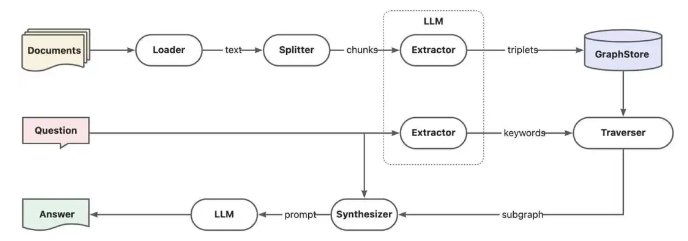
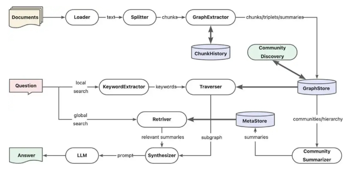

# AntGroup-GraphRAG【百家之长】
> **百家之长**：汇集行业百家之长，擅用多种方式快速定位信息，既能提供精准检索，又能理解自然语言查询，让复杂的知识检索变得既经济又高效。
>

* 发表时间：2024.05.16
* Github 地址：[https://github.com/eosphoros-ai/DB-GPT](https://github.com/eosphoros-ai/DB-GPT)

## 一、论文动机

- **GraphRAG框架**：GraphRAG是一种结合图数据库和大型语言模型（LLM）的检索增强生成框架，用于提升问答系统的性能.
- **微软GraphRAG**：微软的GraphRAG项目通过图社区摘要来改进问答质量，但存在图索引构建成本较高的问题.
- **朴素GraphRAG的局限性**：依赖于查询中的关键词信息，对于总结性查询效果不佳，容易出现“当前知识库不足以回答你的问题”的情况.

## 二、论文思路

- **朴素GraphRAG 改进思路**：
  
1. **混合RAG**：通过多路召回方式综合向量索引与图索引的优势，提升整体问答质量。HybridRAG[4]论文正是采用此方式，大致提升了若干个百分点的性能，但是上下文精度性能出现回退，主要是因为多路检索的知识无法对齐导致，这也是多系统混合检索的原生问题。
2. **融合索引**：直接将向量索引集成到图数据库内部，提供知识图谱上的向量搜索能力，实现知识图谱子图甚至原始文档的相似性检索，避免多系统知识召回的数据不一致问题。例如Neo4jVector[5]，另外TuGraph[6]也即将在下个版本提供向量索引能力支持。
3. **社区摘要**：基于图社区算法将知识图谱划分为若干社区子图，并提取社区子图摘要，总结性查询会根据社区摘要的内容进行回答，这也是微软GraphRAG中的关键设计。

- **社区摘要增强链路**

1. **文本块记忆**：知识抽取阶段一次性完成图结构抽取和元素（点/边）总结，并引入文本块记忆能力，解决跨文本块的引用信息抽取问题。
2. **图社区摘要**：知识抽取阶段一次性完成图结构抽取和元素（点/边）总结，并引入文本块记忆能力，解决跨文本块的引用信息抽取问题。
3. **多路搜索召回**：不区分全局搜索与本地搜索，通过多路搜索同时提供查询相关的摘要与明细上下文。

> 社区摘要增强的GraphRAG链路

- 实现细节
  
1. **社区发现**：使用Leiden算法等进行社区划分，支持从不同层次洞察知识图谱.
2. **社区摘要**：将社区子图数据提供给LLM进行总结，引导LLM保留关键信息.
3. **保存摘要**：将社区摘要存储在向量数据库中，提供检索能力.

## 三、实验设计与结果

- **索引性能**：DB-GPT GraphRAG的索引阶段token开销只有微软方案的一半左右.
- **查询性能**：全局搜索性能有明显提升，得益于社区摘要的相似性召回.

## 四、论文创新点

1. **社区摘要增强**
   1. **图社区划分与摘要提取**：通过图社区发现算法（如Leiden算法）将知识图谱划分为多个社区子图，并为每个社区提取摘要信息。这种方法能够更好地总结和理解知识图谱的整体结构和主题，从而提高总结性查询的问答质量.
   2. **社区摘要的相似性召回**：在查询时，利用社区摘要进行相似性召回，而不是依赖于传统的关键词匹配。这使得系统能够更准确地理解用户的查询意图，并提供更相关的答案.
2. **多路搜索召回**
   1. **全局搜索与本地搜索的整合**：不区分全局搜索与本地搜索，通过多路搜索同时提供查询相关的摘要与明细上下文。这种整合方式提高了搜索的灵活性和准确性，能够更好地满足不同类型的查询需求.
   2. **混合检索策略**：结合全局搜索和本地搜索的优势，避免了单一检索方式的局限性，提高了整体的检索效果.
3. **文本块记忆能力**
   1. **跨文本块引用信息抽取**：在知识抽取阶段引入文本块记忆能力，解决了跨文本块的引用信息抽取问题。这使得系统能够更准确地识别和利用上下文关联信息，提高知识抽取的精度和效率.
4. **显著降低token开销**
   1. **优化索引构建过程**：通过在知识抽取和社区总结阶段的优化方法，显著降低了图索引构建时的token开销，使得DB-GPT GraphRAG的索引阶段token开销只有微软方案的一半左右.这种优化不仅提高了系统的性能，还降低了资源消耗.

## 五、论文总结

蚂蚁TuGraph团队基于DB-GPT构建的开源GraphRAG框架，兼容了向量、图谱、全文等多种知识库索引底座，支持低成本的知识抽取、文档结构图谱、图社区摘要与混合检索以解决QFS问答问题。另外也提供了关键词、向量和自然语言等多样化的检索能力支持。

## 致谢

- https://mp.weixin.qq.com/s/LfhAY91JejRm_A6sY6akNA