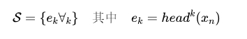

### MRAG【八爪鱼】
> **八爪鱼**：不是只长一个脑袋死磕问题，而是像章鱼一样长出多个触角，每个触角负责抓取一个角度。简单说，这就是AI版的"一心多用"。
>

* 发表时间：2024.06.07
* 论文名称：[Multi-Head RAG: Solving Multi-Aspect Problems with LLMs](https://arxiv.org/abs/2406.05085)
* 论文地址：[https://arxiv.org/abs/2406.05085](https://arxiv.org/abs/2406.05085)
* Github 地址：[https://github.com/spcl/MRAG](https://github.com/spcl/MRAG)

#### 一、论文动机

- **RAG的挑战**：现有的RAG方法主要关注单一方面查询的文档检索，忽略了需要同时检索多个不同内容文档的多方面查询。这导致在处理复杂查询时，RAG系统的性能受限.
- **MRAG的目标**：通过利用Transformer解码器的多头注意力层的激活，生成多维度嵌入，更好地表示文档和查询的各个方面，从而提高检索的准确性和相关性.

#### 二、论文思路

研究方法包括以下几点：

- **解码器架构**：

输入是一个包含n个token的文本块，每个注意力头h对第i个token的输出定义为：

其中：

这些输出组合形成第i个多头注意块的输出：

其中，矩阵 $W_a$ 是将所有注意力头的输出组合起来的线性层。

- **标准RAG公式**：

假设一个包含n个token的文本块作为输入文本块，该块的嵌入是通过最后一个解码器块的前馈层生成的激活向量：
 

- **多头RAG公式**：

MRAG的关键思想是使用最后一个注意力层的激活向量而不是最后一个前馈层的激活向量：

即最后一个token的所有注意力头的输出.

- **MRAG管道概述**：
  - **数据准备**：使用选定的基于解码器的嵌入模型创建多面MRAG文本嵌入及其对应的文档或文本块.
  - **查询执行**：首先生成输入查询的多面嵌入，然后在数据存储中找到最近的多面嵌入及其对应的文本块.

#### 三、实验设计与结果

- 实验设计
  - **数据集生成**：
    - 选择概念上不同的文档类别，主要是公开可用的维基百科文章，共25个类别，每类50篇文档。每个文档的概览部分用于嵌入.
    - 生成涉及多个方面的查询，涵盖1到20个方面.
  - **指标设计**：
    - 设计了一套新的指标来评估RAG方案支持多面性的能力，主要包括检索成功率、类别检索成功率和加权检索成功率.
- 结果分析
  - **绝对检索性能**：
    - MRAG在检索成功率方面显著优于标准RAG，平均精确文档匹配的成功率提高了超过10%，类别匹配的成功率提高了超过25%.
  - **相对性能提升**：
    - MRAG在不同数量的方面和不同的嵌入模型上的相对加权性能提升表明，它在所有情况下都优于标准RAG，平均提升10-20%.
  - **与融合RAG的结合**：
    - MRAG与融合RAG结合后，性能进一步提升，但计算成本和延迟也相应增加.
  - **真实工作场景负载**：
    - 在合成法律文件和分析化工厂事故原因的真实世界工作负载中，MRAG表现出优于其他方案的优势.

#### 四、论文总结

本文提出的MRAG方案通过利用Transformer解码器块的多头注意力层的激活，显著提高了复杂多方面查询的检索准确性。实验结果表明，MRAG在检索成功率和类别检索成功率方面均优于现有的RAG基线。此外，MRAG还具有成本低、计算效率高和易于集成等优点。本文的研究为进一步改进LLMs和RAG系统提供了新的思路和方法.

## 致谢

* 参考：[https://mp.weixin.qq.com/s/WFYnF5UDlmwYsWz_BMtIYA](https://mp.weixin.qq.com/s/WFYnF5UDlmwYsWz_BMtIYA)