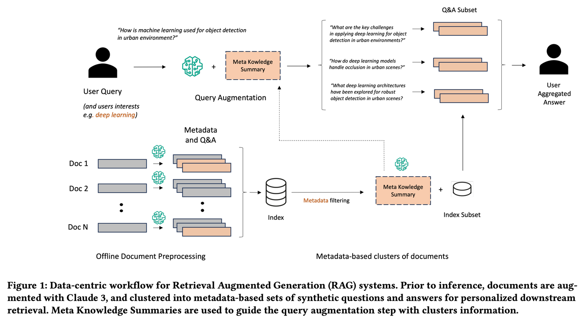

### Meta-Knowledge-RAG【学者】
> **学者**：像个学术界的资深研究员，不仅收集资料，还会主动思考问题，为每份文档做批注和总结，甚至预先设想可能的问题。它会把相关的知识点串联起来，形成知识网络，让查询变得更有深度和广度，就像有一个学者在帮你做研究综述。
>

* 发表时间：2024.08.16
* 论文名称：[Meta Knowledge for Retrieval Augmented Large Language Models](https://arxiv.org/abs/2408.09017)
* 论文地址：[https://arxiv.org/abs/2408.09017](https://arxiv.org/abs/2408.09017)
* Github 地址：

#### 一、论文动机

- **RAG技术的重要性**：RAG通过整合与上下文相关、时效性强或领域知识，生成用户想要的正确答案，已成为减少模型幻觉的有效解决方案。
- **实际应用中的问题**：
  - 知识库文档可能包含大量噪声。
  - 缺乏人工标注的信息或相关性标签。
  - 对长文档进行分块无法保留整个文档的语义上下文。
  - 用户查询通常较短、模糊，可能存在词汇不匹配。
  - 相关信息可能分布在多个文档中，跨知识库的高级推理仍未得到有效解决。

#### 二、论文思路

- **MK-RAG工作流程**：引入了“准备（Prepare）-重写（rewrite）-检索（retrieve）-读取（read）”（PR3）的工作流程。
  - **准备**：每个文档都由LLM处理，生成针对用户特征定制的自定义元数据和问答对。
  - **重写**：通过查询增强解锁新的知识库推理能力。
  - **检索**：利用元数据和问答对进行检索。
  - **读取**：生成最终答案。

- 方法细节
  - **元数据生成**：使用Claude 3 Haiku的思维链（CoT）提示生成元数据。
  - **合成问答生成**：生成合成的问答对，用于检索。
  - **元知识摘要生成**：生成元知识摘要（MK摘要），用于用户查询的动态扩充。
  - **查询和检索的增强生成**：利用MK摘要对用户查询进行动态扩充，提升检索器的跨文档推理能力。

#### 三、实验设计与结果

- **数据集**：使用arXiv API整理的2024年的2000篇研究论文的数据集。
- **评估指标**：
  - 召回率（Recall）
  - 精度（Precision）
  - 特异性（Specificity）
  - 广度（Breadth）
  - 深度（Depth）
  - 相关性（Relevancy）
- **测评结果**：
  - 新框架在所有指标上均有显著提升。
  - 特别是在广度和深度上，MK摘要提供了额外信息，显著提升了性能。
  - 新方法在处理2000篇研究论文时成本效益显著，仅需20美元。

#### 四、论文总结

Meta-Knowledge-RAG（MK Summary）引入了一种新颖的以数据为中心的 RAG 工作流程，将传统的 “检索-读取” 系统转变为更先进的 “准备-重写-检索-读取” 框架，以实现对知识库的更高领域专家级理解。我们的方法依赖于为每个文档生成元数据和合成的问题与答案以及为基于元数据的文档集群引入元知识摘要的新概念。所提出的创新实现了个性化的用户查询增强和跨知识库的深度信息检索。

## 致谢

* 参考：[https://mp.weixin.qq.com/s/JqT1wteHC43h2cPlXmPOFg](https://mp.weixin.qq.com/s/JqT1wteHC43h2cPlXmPOFg)
