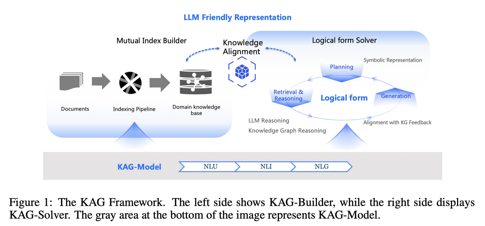

### KAG【逻辑大师】
> **逻辑大师**：不光靠感觉找相似的答案，还得讲究知识间的因果关系。像个严谨的数学老师，不仅要知道答案是什么，还得解释清楚这答案是怎么一步步推导出来的。
>

* 发表时间：2024.11.10
* 论文名称：[KAG: Boosting LLMs in Professional Domains via Knowledge Augmented Generation](https://arxiv.org/abs/2409.13731)
* 论文地址：[https://arxiv.org/abs/2409.13731](https://arxiv.org/abs/2409.13731)
* Github 地址：[https://github.com/OpenSPG/KAG](https://github.com/OpenSPG/KAG)

#### 一、论文动机

尽管大语言模型（LLM）展现出强大的语言理解与生成能力，但在垂直领域应用时面临以下挑战：

1. **缺乏严谨推理能力**：LLM 在处理复杂问题时容易出现逻辑错误或答案不一致。
2. **事实和逻辑错误**：LLM 在生成内容时可能引入错误信息，尤其是在处理专业领域知识时。
3. **幻觉问题**：即使引入外部知识库（如 RAG 技术），LLM 仍可能产生误导性或错误的输出。
4. **专业知识服务的高要求**：垂直领域需要准确、逻辑严谨且具备完整上下文的知识服务。

#### 二、论文思路

- KAG 框架概述

KAG 框架通过以下五个关键方面增强 LLM 和知识图谱的结合：

1. **LLM 友好的知识表示（LLM-Friendly Knowledge Representation）**：提出了 LLMFriSPG 框架，支持无模式（schema-free）和有模式（schema-constrained）的知识表示，提升知识图谱对 LLM 的友好性。
2. **知识图谱与文本块的互索引（Mutual Indexing）**：构建知识图谱与原始文本块之间的双向索引，支持基于图结构的倒排索引和语义关联。
3. **逻辑形式引导的混合推理引擎（Logical-Form-Guided Hybrid Reasoning Engine）**：通过逻辑形式（Logical Form）将自然语言问题分解为可执行的符号表达式，结合知识图谱推理和文本检索。
4. **基于语义推理的知识对齐（Knowledge Alignment with Semantic Reasoning）**：通过语义关系（如同义词、上下位关系）对齐知识图谱中的碎片化知识，提升知识的标准化和连贯性。
5. **KAG 模型（KAG-Model）**：增强 LLM 的自然语言理解（NLU）、自然语言推理（NLI）和自然语言生成（NLG）能力，以支持框架中的各个模块。

-  方法细节

1. **LLM 友好的知识表示**。LLMFriSPG 框架通过深度文本上下文感知、动态属性和知识分层，支持从数据到信息再到知识的层次化表示。它结合了实体类型、事件类型、概念类型和逻辑规则，支持知识图谱的灵活构建和语义推理。
2. **互索引**。KAG 通过开放信息抽取（OpenIE）和语义对齐，构建知识图谱与文本块之间的互索引结构。该结构支持跨文档链接，通过实体和关系实现知识的语义关联。
3. **逻辑形式引导的混合推理引擎**。KAG 的推理引擎通过逻辑形式将问题分解为多个子问题，并利用知识图谱和文本检索进行混合推理。逻辑形式支持精确匹配、文本检索、数值计算和语义推理等多种操作。
4. **知识对齐**。KAG 通过语义关系（如同义词、上下位关系）对知识图谱中的知识进行对齐，提升知识的标准化和连贯性。这一过程包括实体消歧、概念链接和语义关系补全。
5. **KAG 模型**。KAG 模型通过增强 LLM 的 NLU、NLI 和 NLG 能力，支持框架中的各个模块。实验表明，KAG 模型在自然语言理解、语义推理和文本生成任务中显著优于基线模型。

#### 三、实验设计与结果

KAG 在多个多跳问答数据集（如 HotpotQA、2WikiMultiHopQA 和 MuSiQue）上进行了评估，结果表明其性能显著优于现有的 RAG 方法。具体而言，KAG 在 HotpotQA 上的 F1 分数相对提升了 19.6%，在 2Wiki 上提升了 33.5%。

KAG 已成功应用于蚂蚁集团的两个专业领域问答场景：

1. 电子政务问答和电子健康问答。
   1. 在电子政务场景中，KAG 的准确率从传统的 66% 提升至 91.6%；
   2. 在电子健康场景中，KAG 的准确率超过 80%，在某些指标解读任务中达到 93%。

#### 四、论文总结

RAG中向量相似性与知识推理的相关性之间的差距，以及对知识逻辑（如数值、时间关系、专家规则等）不敏感阻碍了专业知识服务的有效性。KAG的设计目的是充分利用知识图谱（KG）和向量检索的优势来应对上述挑战，并通过五个关键方面双向增强大型语言模型（LLM）和知识图谱来提高生成和推理性能：（1）对LLM友好的知识表示，（2）知识图谱与原始块之间的相互索引，（3）逻辑形式引导的混合推理引擎，（4）与语义推理的知识对齐，（5）KAG的模型能力增强。

## 致谢

* [https://mp.weixin.qq.com/s/oOzFBHS_B7FST6YKynD1GA](https://mp.weixin.qq.com/s/oOzFBHS_B7FST6YKynD1GA)