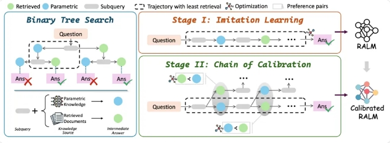
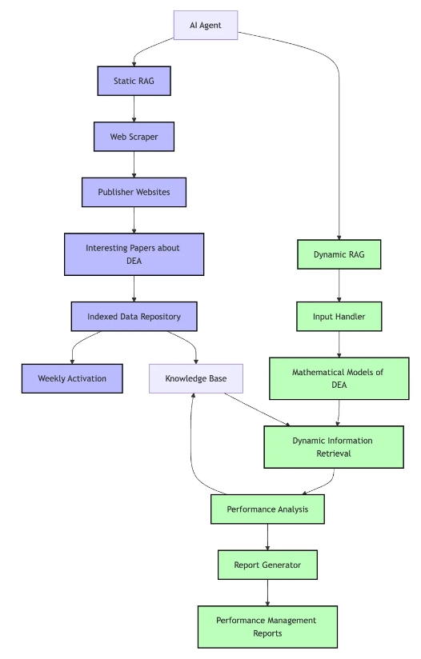
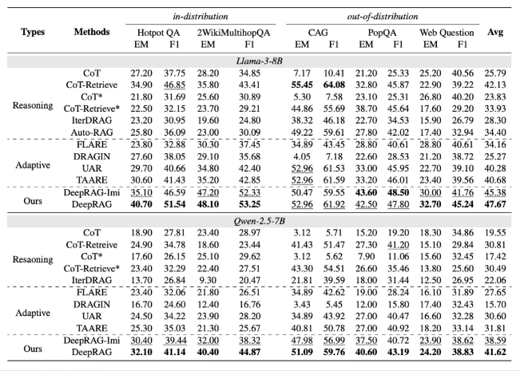

### DeepRAG 【智能检索决策专家】
> 【智能检索决策专家】：帮助大语言模型（LLM）在面对复杂问题时，能够像人类一样智能地决定何时需要检索外部知识，何时依赖自身知识进行推理，从而提升回答的准确性和效率。

* 发表时间：2024.11.03
* 论文名称：[DeepRAG: Thinking to Retrieval Step by Step for Large Language Models](https://arxiv.org/pdf/2502.01142)
* 论文地址：[https://arxiv.org/pdf/2502.01142](https://arxiv.org/pdf/2502.01142)
* Github 地址：

#### 一、论文动机

**传统RAG的困境**：检索增强生成（RAG）是解决大语言模型幻觉问题的重要技术，但现有RAG方法存在两个核心痛点：

- 问题一：**任务分解无效：问题拆解不合理，导致盲目检索和缺乏决策机制。**
- 问题二：**过度检索：检索过多无关信息，增加噪音，反而降低回答准确率。**

这种问题本质上是因为现有RAG缺乏“智能检索决策”能力——而DeepRAG正是为了解决这一痛点而生。

#### 二、论文思路

DeepRAG的核心思想很简单——让大模型像人一样，在每一步决策是否需要检索，而不是机械地调用外部知识库。

##### 2.1 马尔可夫决策过程（MDP）

马尔可夫决策过程（MDP）：DeepRAG将检索增强推理建模为MDP，让系统在每个推理步骤动态决定是否需要检索，从而优化检索效率和答案质量。

- 如果大模型“知道”答案，就直接用参数化知识推理。
- 如果大模型“不确定”，才触发检索，并精准选择最相关的信息。
- 这个决策是动态的，不会一开始就把所有问题都丢给检索系统。

这一机制让DeepRAG能够更精准地控制检索过程，减少不必要的噪音。

##### 2.2 逐步查询

逐步查询：采用逐步查询方式，分阶段检索，避免一次性检索带来的信息冗余和干扰。

##### 2.3 智能决策

智能决策：允许LLM自己决定是靠“已有知识”回答还是“去外部找答案”，减少检索冗余。

#### 三、实验设计与结果

DeepRAG实测提升准确率21.99%

- **准确率提升**：DeepRAG在多个基准数据集上准确率提升21.99%。
- **检索效率提升**：检索效率提升35.7%，减少了外部知识库的调用次数。
- **噪音减少**：由于逐步检索，噪音减少了40%，答案更加聚焦。

#### 四、论文总结

DeepRAG通过引入智能检索决策机制，解决了传统RAG的痛点，显著提升了大语言模型的准确率和检索效率。它不仅是一个技术突破，也为未来RAG技术的发展提供了一个全新的起点。

## 致谢

* [https://mp.weixin.qq.com/s/uQ6JSB5NWAOiVC4uTCnvGw](https://mp.weixin.qq.com/s/uQ6JSB5NWAOiVC4uTCnvGw)