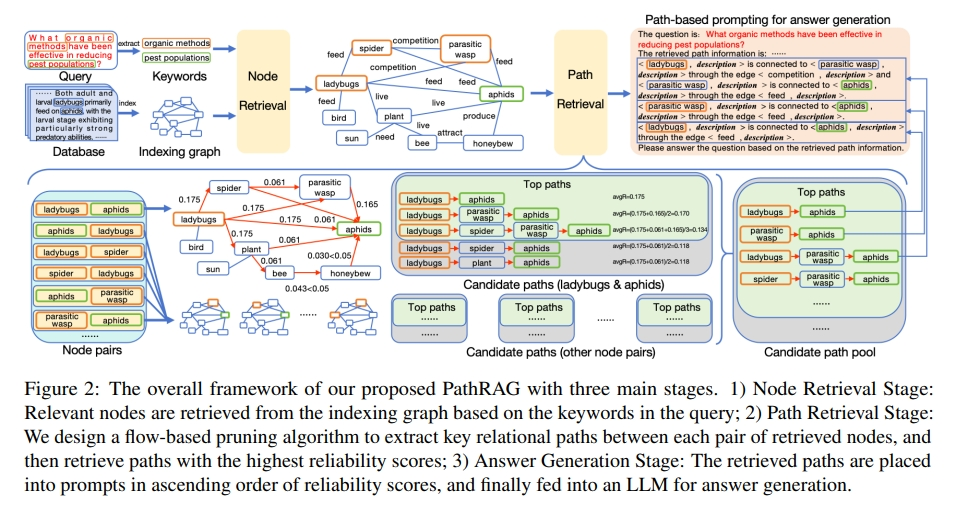
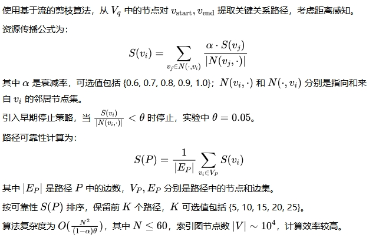
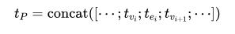
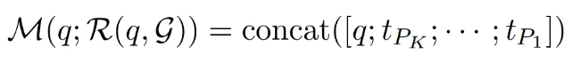
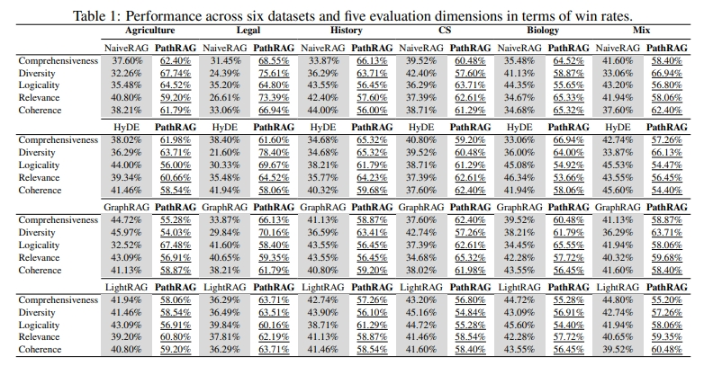

### PathRAG：通过图剪枝的方法优化Graph-based RAG的性能方法浅析

> 【关系路径探索者”（Relational Path Explorer）】：

* 发表时间：2025.03.10
* 论文名称：[PathRAG: Pruning Graph-based Retrieval Augmented Generation with Relational Paths](https://arxiv.org/abs/2502.14902)
* 论文地址：[https://arxiv.org/abs/2502.14902](https://arxiv.org/abs/2502.14902)
* Github 地址：https://github.com/BUPT-GAMMA/PathRAG

#### 一、论文动机

在自然语言处理领域，基于图的检索增强生成（Graph-based RAG）方法在处理复杂关系数据时具有重要价值。

然而，现有的基于图的检索增强生成（Graph-based RAG）方法存在一些不足：

- GraphRAG方法：通过社区检测算法对图进行分割并聚合信息时，可能会引入大量冗余信息，无法有效利用复杂的关系路径；
- LightRAG方法：虽然采用双阶段检索框架，从局部和全局级别检索相关信息，提高了检索效率，但仍然可能包含不必要的信息。

为了解决这些问题，PathRAG应运而生，旨在通过检索索引图中的关键关系路径来减少噪声并优化LLM提示，从而提高生成答案的质量。

#### 二、论文思路

PathRAG的核心创新在于基于流的剪枝算法和路径为基础的提示策略，其方法论分为三个主要阶段：

1. **节点检索阶段**：从用户查询中使用LLM提取关键词，然后通过密集向量匹配（使用余弦相似度）检索相关节点，将节点和关键词编码为嵌入，从而检索到一定数量的相关节点。
2. **路径检索阶段**：设计了一种基于流的剪枝算法，提取每对检索节点之间的关键关系路径，然后检索可靠性得分最高的路径；
3. **答案生成阶段**：检索到的路径按照可靠性得分升序排列放入提示中，最后输入到大型语言模型中进行答案生成。

##### 2.1 节点检索阶段

从用户查询 q 中使用 LLM 提取关键词，记为 $K_q$。

通过密集向量匹配（使用余弦相似度）检索相关节点，将节点和关键词编码为嵌入 $X_V$ 和 $X_q$。

检索 N 个相关节点，N 可选值包括 {10, 20, 30, 40, 50, 60}，结果子集为 $V_q⊆V$，其中 V 是索引图的节点集。

##### 2.2 路径检索阶段

##### 2.2 答案生成阶段

将选定路径转化为文本形式，路径文本通过连接节点和边块生成：

按可靠性升序排列路径，提示为：

这种排序策略解决了“中间丢失”问题，确保 LLM 关注最相关信息（LLM使用 “GPT-4o-mini” 作为所有 LLM 组件，索引图与 GraphRAG相同。）。

#### 三、实验设计与结果

实验结果表明，PathRAG在减少冗余信息和提高生成答案质量方面表现出色。与GraphRAG和LightRAG相比，PathRAG能够更好地捕捉节点之间的关系，生成的答案更具准确性和相关性。其基于流的剪枝算法和路径提示策略有效地减少了噪声，使得LLM能够更专注于关键信息，从而提升了整体性能。

#### 四、论文总结

PathRAG作为一种新型的Graph-based RAG方法，通过其独特的基于流的剪枝算法和路径提示策略，在处理复杂关系数据时展现出了显著的优势。它不仅减少了冗余信息，提高了生成答案的质量，还为自然语言处理领域中关系数据的处理提供了一种新的思路和方法。未来，PathRAG有望在更多实际应用场景中发挥重要作用，进一步推动自然语言处理技术的发展。
