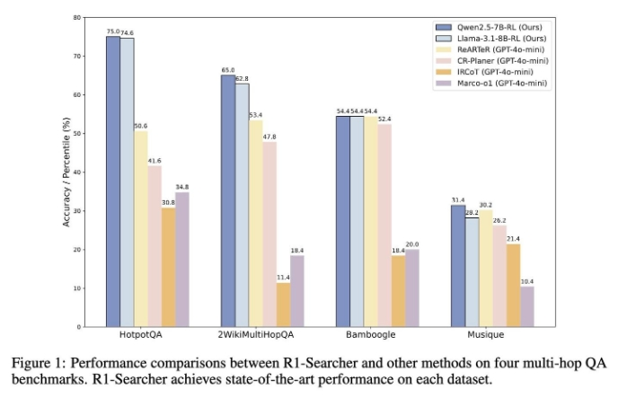
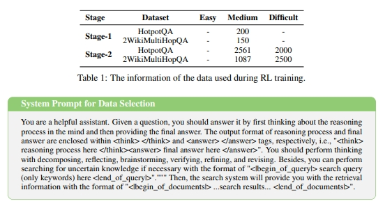
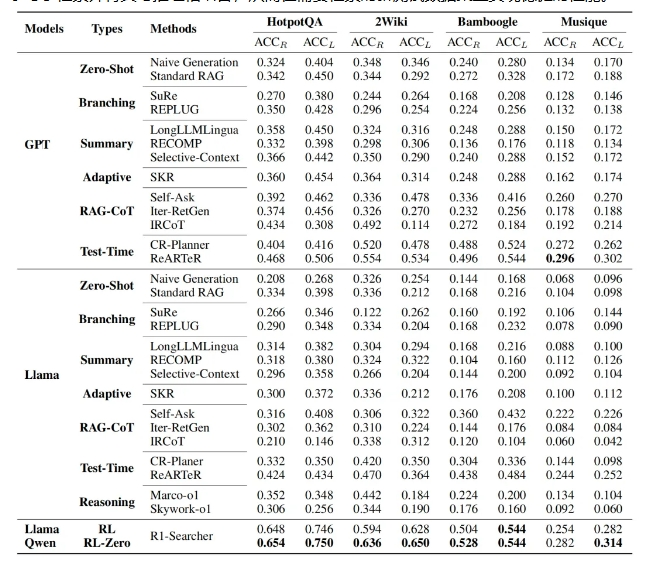
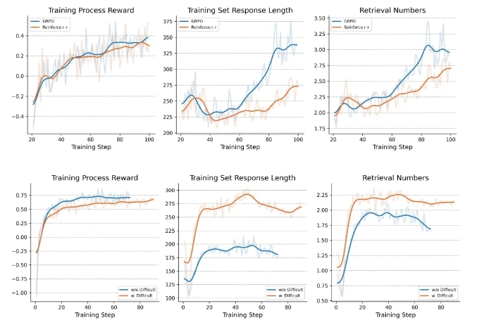

### R1-Searcher: 推理与搜索结合，用强化学习打破LLMs推理知识局限！
> 【检索增强者”（Search-Enhancer）】：R1-searcher 是一种利用强化学习来提升大型语言模型 (LLMs) 搜索能力的方法。它主要解决了LLMs在面对需要大量外部知识，尤其是多跳问题和时效性问题时，缺乏必要知识的问题。**R1-searcher通过两阶段的、基于结果监督的强化学习，让模型学会在推理过程中调用网络搜索，以获取外部信息**。

* 发表时间：2025.03.10
* 论文名称：[R1-Searcher: Incentivizing the Search Capability in LLMs via Reinforcement Learning](https://arxiv.org/pdf/2503.05592 )
* 论文地址：[https://arxiv.org/pdf/2503.05592](https://arxiv.org/pdf/2503.05592 )
* Github 地址：https://github.com/SsmallSong/R1-Searcher
* 模型：
  * Qwen-2.5-7B-Base-RAG-RL: https://huggingface.co/XXsongLALA/Qwen-2.5-7B-base-RAG-RL
  * Llama-3.1-8B-Instruct-RAG-RL: https://huggingface.co/XXsongLALA/Llama-3.1-8B-instruct-RAG-RL
* 训练数据：https://huggingface.co/datasets/XXsongLALA/RAG-RL-Hotpotqa-with-2wiki

#### 一、论文动机

现有的大型推理模型（LRMs）和大型语言模型（LLMs）在复杂推理任务中表现出色，但它**们主要依赖内部知识来解决问题。这种依赖在处理时效性强、知识密集型问题或涉及私有信息时显得不足，容易导致不准确性和幻觉现象**。

为了解决这一问题，研究者提出了R1-Searcher，一种基于强化学习（RL）的两阶段方法，旨在增强LLMs的搜索能力，使其能够在推理过程中自主调用外部搜索系统以获取额外知识。

#### 二、论文思路

R1-Searcher框架通过以下方法实现：

##### 2.1 **两阶段强化学习方法**

- **第一阶段**：训练模型有效利用外部检索系统。奖励由检索奖励（retrieval-reward）和格式奖励（format-reward）组成，鼓励模型学会调用工具的格式。
- **第二阶段**：训练模型在推理过程中整合检索以准确解答问题。检索奖励被替换为答案奖励（answer-reward），基于标准答案和预测答案的F1-Score，鼓励模型正确调用工具解决问题。

##### 2.2 **改进的Reinforce++算法**

另外，R1-Searcher框架 对Reinforce++算法进行了修改以适应检索增强生成场景。

- 目标：**让模型在面对不确定性时能够自主获取外部知识，从而有效整合推理和检索**。

为了无缝整合检索到的文档并确保模型优化的合理性，R1-Searcher框架 对原始算法进行了两项改进：RAG-based Rollout和Retrieval Mask-based Loss Calculation：

- **RAG-based Rollout**：
  - 思路：通过特定标签<begin_of_query>...<end_of_query>引导模型在生成过程中调用外部检索系统。即捕捉到模型需要进行检索时，推理暂停并进行检索。检索到的文档被封装在<begin_of_documents>...<end_of_documents>标签中，并整合到模型的推理过程中。
  - 优点：**这种方法确保检索无缝融入推理过程，使模型能够基于检索到的文档继续推理，而不被打断**。
- **Retrieval Mask-based Loss Calculation**：
  - 动机：当模型执行检索时，检索到的文档作为环境观察的一部分被整合到推理过程中。然而，模型并不需要自主生成这些文档。
  - 思路：为了减少环境的影响，R1-Searcher 将<begin_of_documents>...<end_of_documents>指定为特殊标记，并在训练中对其进行掩码处理。这可以防止这些外部标记影响损失计算，确保检索到的文档不会干扰模型的内在推理和生成过程。

#### 三、实验设计与结果

R1-Searcher在多个任务上展示了显著的性能提升：

1. **多跳问答任务**：
   - 在HotpotQA上性能提升48.2%。
   - 在2WikiMultiHopQA上性能提升21.7%。
   - 在Bamboogle上性能提升4.0%（LLM-as-Judge）。

2. **无需冷启动**：
   - 从基础LLM开始进行RL学习，无需冷启动，且在多数领域内和领域外的数据集上获得最佳性能，甚至超过闭源的LLM（如GPT-4o-mini）。

3. **泛化能力**：
   - 仅使用8148个样本进行RL训练，模型不仅在领域内数据集表现出色，还在领域外数据集（如Musique和Bamboogle）上展示了强大的泛化能力。

4. **联网搜索能力**：
   - 在Bamboogle任务上进行联网搜索测试，性能提升显著，表明模型能够适应在线搜索场景。

#### 四、论文总结

R1-Searcher通过强化学习方法显著提升了LLMs在推理过程中的检索能力，解决了现有模型在处理知识密集型问题时的局限性。该方法无需冷启动，具有强大的泛化能力，并在多跳问答任务中取得了显著的性能提升。R1-Searcher为未来LLMs的推理能力提升提供了新的思路，特别是在结合外部知识和检索能力方面。

#### 五、对比分析

- GRPO和Reinforce++算法的比较

GRPO的生成solution更长和检索频率更高。GRPO在领域外测试数据集（如Bamboogle）上也展现出更好的性能；而Reinforce++在领域内测试集（如HotpotQA和2Wiki）上表现更优。

- RL和SFT的比较

RL在领域内和领域外的测试集上均优于SFT。SFT能够帮助模型生成检索查询，但这些查询的时机和相关性不如通过RL训练生成的查询。

- Reward的设计对训练的影响

基于F1的答案奖励能够产生更长的回答长度和更优的最终结果；基于EM的奖励在训练过程中导致回答长度较短，并且在测试时表现不如基于CEM或F1的奖励；基于CEM的奖励会生成带有不必要信息的偏长的answer。

- 数据难度分布和数据多样性对训练的影响

使用混合数据集训练的模型在检索次数和生成回答长度上都有所增加，并且在测试集上取得了更高的分数；训练数据中混入较高难度的数据可以在领域内和领域外的测试集上均取得更好的效果。

#### 六、R1-searcher 的使用场景

R1-searcher适用于以下场景:

- **知识密集型任务**:需要大量外部知识才能解决的问题，例如:
  - **问答任务**:复杂的多跳问答，需要从多个来源提取信息才能找到答案。
  - **时效性问题**:需要最新信息的任务，例如事件追踪、新闻摘要等。
- **需要可解释性的任务**:通过搜索过程，模型可以提供其答案的依据，提高可解释性。
- **希望提升LLMs准确率的任务**:尤其是在知识范围有限或需要更新知识的情况下，搜索可以显著提高准确率。
- **通用问答**:在没有充分训练数据的特定领域,通过检索可以有效补充知识，提高回答质量。

总而言之，R1-searcher适用于任何需要LLM 利用外部信息来增强其推理能力和知识范围的场景。它通过强化学习驱动模型自主学习，使其具备更强的搜索能力和更可靠的答案生成能力。

#### 七、R1-searcher 的不足

- **数据依赖性**：虽然 R1-Searcher 展现出良好的泛化能力，但训练数据的分布和难度仍然对模型性能有显著影响，如何进一步优化数据选择和课程学习策略以提升模型性能仍有待研究。
- **模型规模限制**：当前的实验主要在 7B 参数的模型上进行，未来需要进一步扩展到更大规模的模型（如 32B 或更大），以更全面地评估 R1-Searcher 在更大模型上的效果。
- **奖励函数设计**：虽然两阶段奖励机制有效，但更精细化的奖励函数设计，例如考虑检索结果的相关性、多样性等因素，可能会进一步提升模型性能。
- **在线搜索的效率和成本**：尽管 R1-Searcher 能够应用于在线搜索，但使用 Google API 等在线搜索服务可能涉及效率和成本问题，如何更高效、经济地利用在线搜索资源仍需进一步探索。

## 致谢

- RAG碰上RL？超越RAG！：推理与搜索结合，用强化学习打破LLMs推理知识局限！  https://mp.weixin.qq.com/s/Cb_cfRwEsM1bOG8QwnQOcg  
- 爱可可 AI 前沿推介   https://zhuanlan.zhihu.com/p/29325562670

