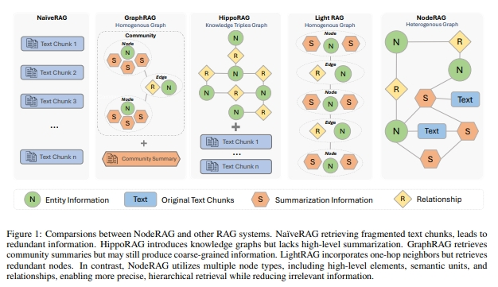
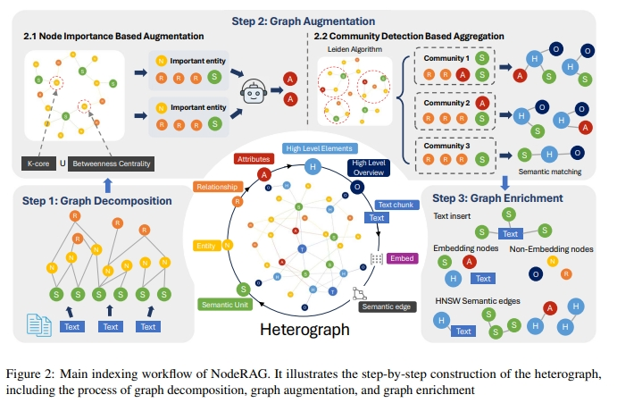
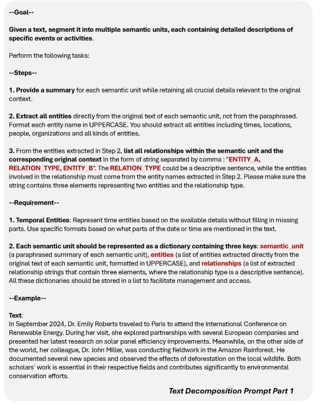
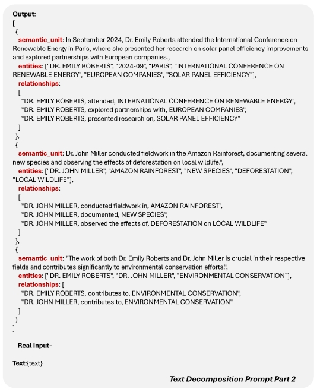
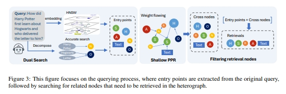
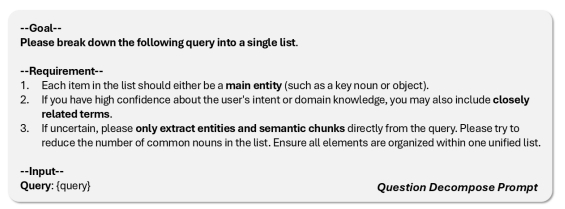
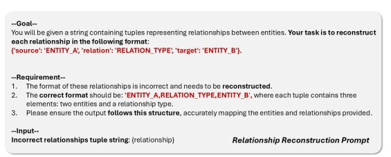

### NodeRAG：基于异构图的RAG系统优化方案
> 【（NodeRAG）】：

* 发表时间：2025.04.15
* 论文名称：[NodeRAG:Structuring Graph-based RAG with Heterogeneous Nodes](https://arxiv.org/pdf/2503.05592)
* 论文地址：[https://arxiv.org/pdf/2503.05592](https://arxiv.org/pdf/2503.05592)
* Github 地址：https://github.com/Terry-Xu-666/NodeRAG
* 模型：

#### 一、论文动机

随着大规模语言模型（LLM）的快速发展， **检索增强生成（RAG）**  作为一种关键技术，被广泛应用于需要外部知识支持的场景中。RAG通过结合外部语料库与LLM的生成能力，实现了事实性、上下文相关的高质量输出。

然而，传统的RAG方法在处理**多跳推理**和**总结性查询**时存在明显不足，主要问题在于**对数据结构的利用不足**和**缺乏对文本语义的高层理解**。

为了解决这些问题，研究者提出了多种基于图结构的RAG方法，如**GraphRAG**、**LightRAG**等。这些方法通过构建图结构来增强信息的组织和检索能力。然而，现有图结构的设计往往不够精细，导致**检索不一致**、**冗余信息多**等问题。

- **朴素RAG**，这种方法通常是作为所有现有RAG系统的标准基线。它首先将输入文档分割成几个文本块，并利用文本嵌入将它们编码进向量空间。然后基于查询表示的相似性检索相关文本块。
- **Hyde** 作为传统RAG系统的改进方法，首先生成“假设性”的文本以捕捉查询的本质。然后使用生成的文本来从大型语料库中检索相关文档，在嵌入空间中使用向量相似性。该方法在前端修改输入查询，而不改变文本块或其嵌入。
- **GraphRAG** 首先将输入文本分割成块，并提取其中的实体和关系，形成图结构。然后将这个图划分为多个不同级别的社区。在查询时，GraphRAG识别出问题中的相关实体，并通过参考这些相应的社区摘要来合成答案。与传统的RAG方法相比，GraphRAG提供了对整个文档更结构化、更高层次的理解。
- **LightRAG** 是一种基于GraphRAG的改进方法，旨在通过双层检索在最小化计算开销的同时增强检索信息的全面性。这导致检索效率更高，并且与GraphRAG相比，在效果和速度之间实现了更好的平衡。

- NaïveRAG检索的是碎片化的文本片段，这会导致信息重复
- HippoRAG引入了知识图谱，但缺乏对高级别的总结；
- GraphRAG检索的是社区总结，但仍然可能产生粗粒度的信息；
- LightRAG结合了一跳邻居，但检索出的节点存在冗余。

这些方法导致检索方法中的不一致性（分离局部和全局检索），并导致粗粒度检索，即不加区分地检索一个实体包括所有相关内容。

所以，最近的工作，NodeRAG《NodeRAG:Structuring Graph-based RAG with Heterogeneous Nodes》（https://arxiv.org/pdf/2504.11544）利用多种节点类型，包括高级元素、语义单元和关系，从而能够实现更精确、层次化的检索，同时减少无关信息。

#### 二、论文思路

##### 2.1 异构图Heterograph的定义

NodeRAG引入了 **异构图（Heterograph）** ，包含七种节点类型：

- **实体（N）** ：代表具体对象。
- **关系（R）** ：连接实体之间的语义关系。
- **语义单元（S）** ：作为局部摘要，代表独立事件单元。
- **属性（A）** ：描述实体的特征。
- **高层元素（H）** ：总结社区的核心信息。
- **高层概览（O）** ：提供标题或关键词。
- **文本（T）** ：原始文本块。

这种结构不仅保留了原始语料库中的信息，还通过LLM提取了**关键属性和高层发现**，从而扩展了信息的语义边界。

每个节点类型都有特定的功能和角色，例如实体和关系节点用于连接语义单元，属性节点用于表示实体的特征，高层元素节点用于总结社区的核心信息等。**这种异构图结构使得NodeRAG能够实现更细粒度的检索和理解，从而提高整体性能**。

##### 2.2 图分解（Graph Decomposition）

NodeRAG首先将原始文本块分解为三个主要节点类型：

- **语义单元（S）** ：作为局部摘要，代表独立事件单元。
- **实体（N）** ：代表具体对象。
- **关系（R）** ：连接实体之间的语义关系。

这些节点通过LLM进行语义解析，并构建初始的异构图。

这里构造的prompt如下：

具体构造的实例如下：

##### 2.3 图增强（Graph Augmentation）

- **基于节点重要性的增强**：通过LLM处理关键实体及其关联的语义单元和关系，生成属性摘要。具体方法是**使用K-core分解和介数中心性来识别重要节点，然后利用LLM对这些节点进行处理，生成属性节点并添加到图中**；
- **基于社区检测的聚合**：使用Leiden算法对图进行社区检测，将图划分为多个紧密相连的社区。然后在每个社区内使用LLM提取高层元素，建立这些元素与社区内其他节点的语义连接。

##### 2.4 图丰富（Graph Enrichment）

在图增强的基础上，进一步插入原始文本块和嵌入向量，并使用HNSW算法增强图的语义边，生成的增强异构图。

具体的，**将原始文本块以语义单元的形式插入到图中，并与相关的语义单元建立连接；对图中的某些节点进行嵌入处理**，特别是那些包含丰富信息的节点（如文本、属性、语义单元、高层次元素），以便于高效的向量相似性搜索；**引入HNSW算法生成的语义密集边，以增强图中节点之间的语义相似性连接**。

##### 2.5 图搜索（Graph Searching）

应用双搜索机制来识别异构图内的入口点。随后，采用浅层个性化PageRank（PPR）算法来提取交叉节点。然后过滤入口点节点和交叉节点的组合，以产生最终的检索结果。

首先，针对query进行分解，对应的prompt如下：

其次，双搜索结合了标题节点的精确匹配和丰富信息节点的向量相似性搜索，以在异构图G中识别入口点。给定一个查询，大模型（LLM）提取实体Nq并将查询嵌入到向量(q)中，如果一个节点通过逐字字符串匹配与提取的实体之一相匹配，精确匹配函数M(v∗,v)就会返回真值。此外，如果一个节点基于HNSW算法在相似度排名中位于与q最相似的top-k个节点之中，相似度排名函数R(q,v,k)也会返回真值。

最后，浅层个性化PageRank（PPR）通过模拟从一个入口点集开始的偏置随机游走，在异构图G中识别相关节点。 在这里使用浅层PPR，限制迭代次数t以确保相关性保持在入口点的邻域内。这种提前停止策略防止过度扩散到图的遥远或不相关部分，而是专注于入口点附近的多跳节点。

对应的prompt如下：

## 致谢

- 技术动态 | 图结构增强的GraphRAG方案：NodeRAG实现思路解读   https://mp.weixin.qq.com/s/YtJ1X8iHFgucf3IskmmWdg

