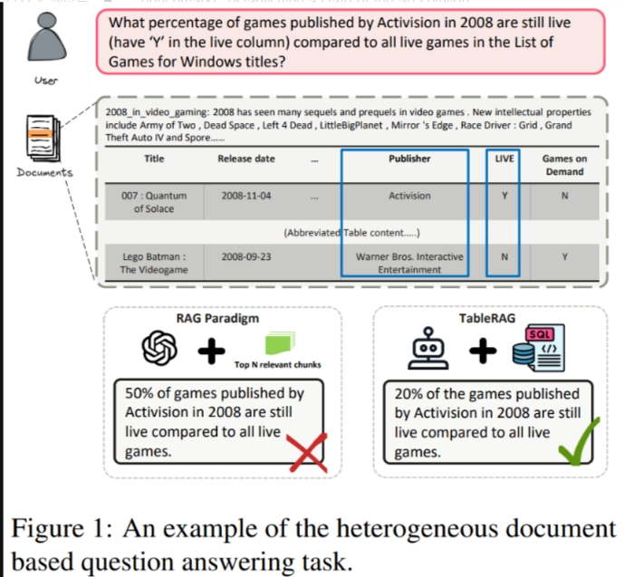
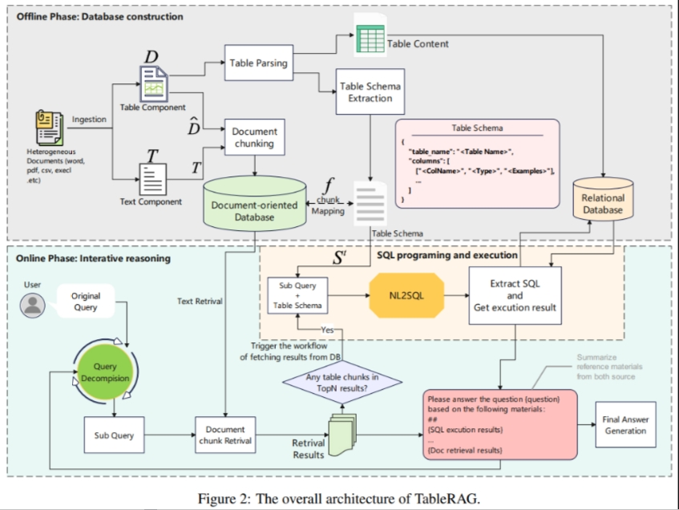

### TableRAG: A Retrieval Augmented Generation Framework for Heterogeneous Document Reasoning
> 【（TableRAG）】：

* 发表时间：2025.06.12
* 论文名称：[TableRAG: A Retrieval Augmented Generation Framework for Heterogeneous Document Reasoning](https://arxiv.org/abs/2506.10380)
* 论文地址：[https://arxiv.org/abs/2506.10380](https://arxiv.org/abs/2506.10380)
* Github 地址：
* 模型：

#### 一、论文动机

- **现有RAG方法在异构文档问答中的局限性**： 现有的检索增强生成（RAG）方法在处理包含文本和表格的异构文档时，存在结构信息丢失和缺乏全局视图的问题。
- **结构信息丢失**： 将表格扁平化并进行分块破坏了表格的内在结构，导致信息丢失或引入不相关的上下文，从而影响下游LLM的性能。
- **缺乏全局视图**： 由于文档被分割成片段，RAG系统难以处理需要跨整个表格进行整体理解的多跳全局查询，例如聚合、数学计算等。

#### 二、论文思路

TableRAG是一种用于异构文档问答的新型RAG框架，它**通过结合文本检索和SQL执行，有效地解决了现有RAG方法在处理包含文本和表格的文档时存在的结构信息丢失和缺乏全局视图的问题**。

该框架通过离线数据库构建和在线迭代推理两个阶段，实现了对异构信息的有效整合和利用，并在多个基准测试中取得了显著的性能提升，为异构文档问答领域的研究提供了新的思路。

#### 三、具体的解决方案

- **TableRAG框架**： 提出了一种混合框架，它统一了文本理解和对表格数据的复杂操作。
- **离线数据库构建**： 构建文本知识库和表格模式数据库。
- **在线迭代推理**： 通过上下文敏感的查询分解、文本检索、SQL编程和执行以及组合中间答案生成四个步骤进行迭代推理。

#### 四、核心思路步骤

- **离线阶段**：
  - **表格提取**： 从异构文档中提取结构化组件，形成表格集合。
  - **知识库构建**： 构建文本知识库（包含原始文本和表格的Markdown渲染形式）和表格模式数据库（包含表格的schema描述）。
  - **表格数据导入**： 将表格导入到关系数据库（如MySQL）。

- **在线阶段**：
  - **上下文敏感的查询分解**： 识别查询中文本和表格各自的角色，将复杂查询分解为子查询。
  - **文本检索**： 使用向量召回和语义重排序相结合的方式，从文本知识库中检索相关文本片段。
  - **SQL编程和执行**： 如果子查询涉及表格数据，则生成并执行SQL查询，从关系数据库中获取结果。
  - **中间答案生成**： 结合SQL执行结果和文本检索结果，进行交叉验证，并根据证据效用自适应地加权每个来源的可靠性，从而生成中间答案。
  - **迭代推理**： 重复上述步骤，直到查询分解模块确定不再需要子查询，最终生成最终答案。

#### 五、优势

- 性能提升： 在HeteQA和公共基准测试中，TableRAG始终优于现有的基线方法，建立了异构文档问答的新state-of-the-art。
- 结构信息保持： 通过SQL接口与表格交互，保持了表格结构的完整性。
- 全局视图： 能够处理需要跨整个表格进行整体理解的多跳全局查询。
- 计算效率： 使用SQL进行精确的符号执行，提高了计算效率和推理保真度。
- 可解释性： 迭代推理过程清晰可解释。
- 通用性： 架构通用，与多种LLM backbone兼容。

#### 六、结论和观点

- 结构信息丢失和缺乏全局视图是现有RAG方法在异构文档问答中的两个关键限制。
- TableRAG通过统一文本理解和表格操作，有效地解决了这些限制。
- SQL作为表格数据的接口，能够实现精确的符号执行，并提高计算效率。
- 上下文敏感的查询分解和选择性的SQL执行是TableRAG的关键组成部分。
- HeteQA是一个用于评估多跳异构推理能力的新基准测试。
- TableRAG的有效性与底层LLM的能力密切相关。
- 未来的工作可以扩展HeteQA到多语言环境，从而扩大评估框架的适用性和鲁棒性。

## 致谢

- 技术动态 | 图结构增强的GraphRAG方案：NodeRAG实现思路解读   https://mp.weixin.qq.com/s/YtJ1X8iHFgucf3IskmmWdg

