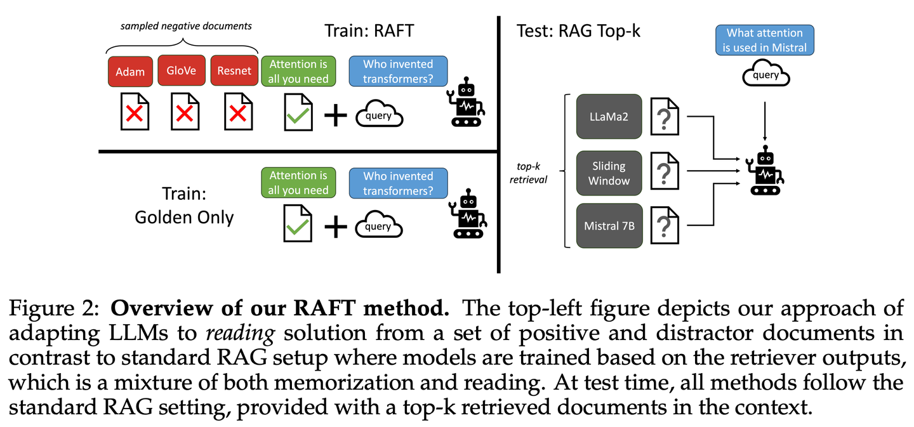
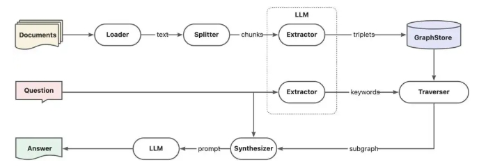
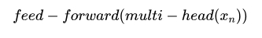
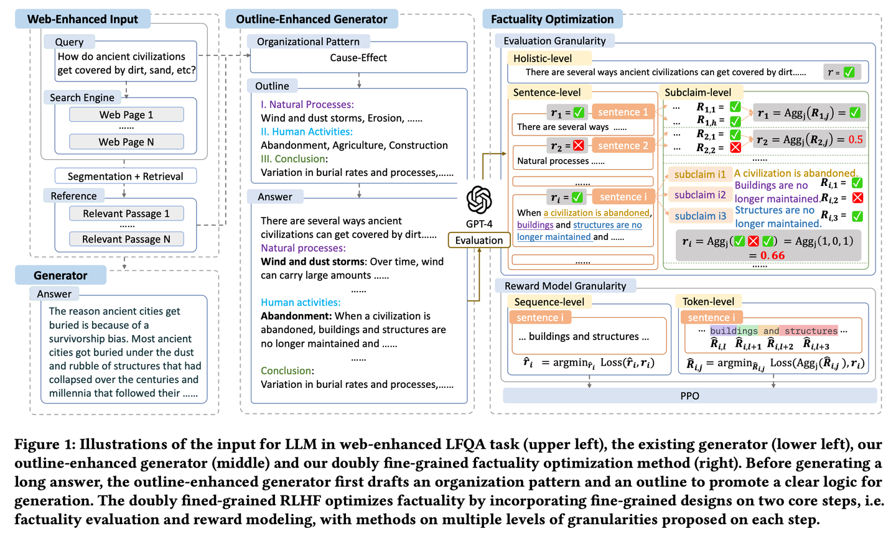
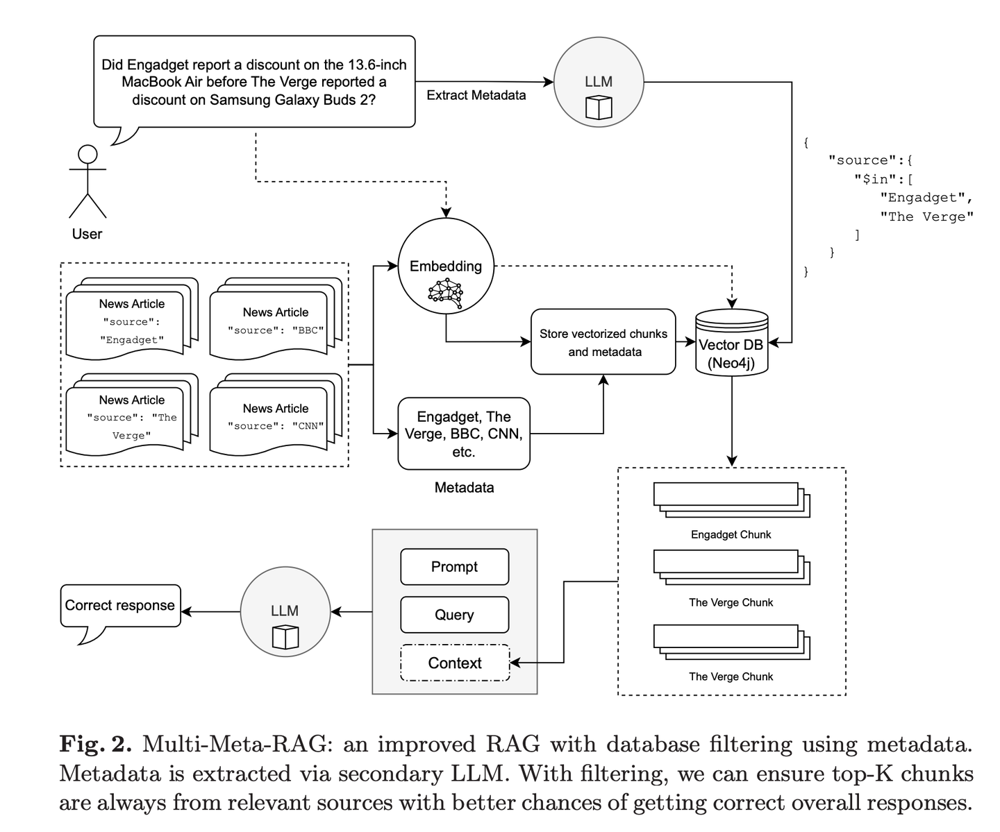
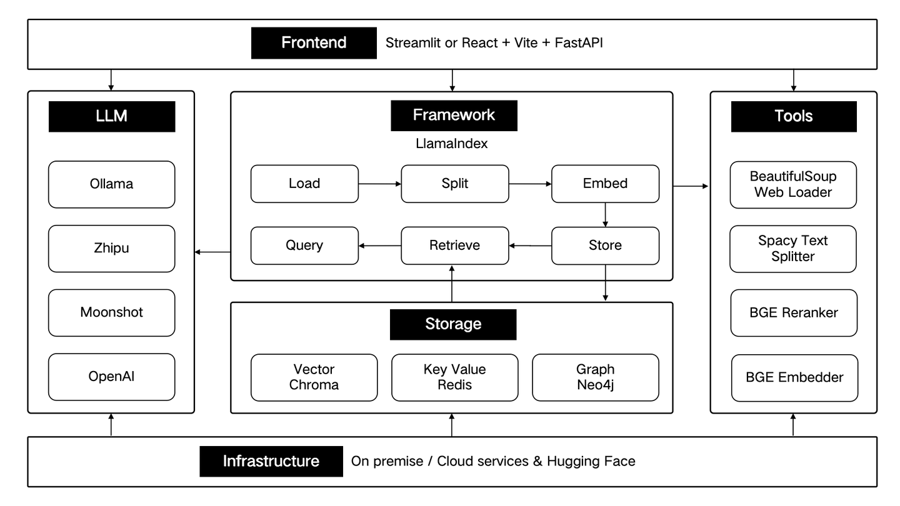

# RAG 论文学习笔记

- [RAG 论文学习笔记](#rag-论文学习笔记)
  - [2024.01](#202401)
    - [GraphReader【图解专家】](#graphreader图解专家)
      - [一、论文动机](#一论文动机)
      - [二、论文思路](#二论文思路)
      - [三、论文创新点](#三论文创新点)
      - [四、结论](#四结论)
    - [MM-RAG【多面手】](#mm-rag多面手)
      - [一、论文动机](#一论文动机-1)
      - [二、论文思路](#二论文思路-1)
      - [三、论文总结](#三论文总结)
    - [CRAG【自我校正】](#crag自我校正)
      - [一、论文动机](#一论文动机-2)
      - [二、论文思路](#二论文思路-2)
      - [三、优势与不足](#三优势与不足)
      - [总结](#总结)
    - [RAPTOR【分层归纳】](#raptor分层归纳)
      - [一、论文动机](#一论文动机-3)
      - [二、论文思路](#二论文思路-3)
        - [2.1 RAPTOR检索树的构建过程](#21-raptor检索树的构建过程)
        - [2.2 RAPTOR的检索过程](#22-raptor的检索过程)
      - [三、论文创新点](#三论文创新点-1)
      - [四、论文总结](#四论文总结)
  - [2024.02](#202402)
    - [T-RAG【私人顾问】](#t-rag私人顾问)
      - [一、论文动机](#一论文动机-4)
      - [二、论文思路](#二论文思路-4)
      - [三、论文创新点](#三论文创新点-2)
      - [四、论文总结](#四论文总结-1)
  - [2024.03](#202403)
    - [RAT【思考者】](#rat思考者)
      - [一、论文动机](#一论文动机-5)
      - [二、论文思路](#二论文思路-5)
      - [三、论文创新点](#三论文创新点-3)
      - [四、论文总结](#四论文总结-2)
    - [RAFT【开卷高手】](#raft开卷高手)
      - [一、论文动机](#一论文动机-6)
      - [二、论文思路](#二论文思路-6)
      - [三、实验设计与结果](#三实验设计与结果)
      - [四、论文创新点](#四论文创新点)
      - [五、论文总结](#五论文总结)
    - [Adaptive-RAG【因材施教】](#adaptive-rag因材施教)
      - [一、论文动机](#一论文动机-7)
      - [二、论文思路](#二论文思路-7)
      - [三、实验设计与结果](#三实验设计与结果-1)
      - [四、论文创新点](#四论文创新点-1)
      - [五、论文总结](#五论文总结-1)
    - [HippoRAG【海马体】](#hipporag海马体)
      - [一、论文动机](#一论文动机-8)
      - [二、论文思路](#二论文思路-8)
      - [三、实验设计与结果](#三实验设计与结果-2)
      - [四、论文创新点](#四论文创新点-2)
      - [五、论文总结](#五论文总结-2)
    - [RAE【智能编辑】](#rae智能编辑)
      - [一、论文动机](#一论文动机-9)
      - [二、论文思路](#二论文思路-9)
      - [三、实验设计与结果](#三实验设计与结果-3)
      - [四、论文创新点](#四论文创新点-3)
      - [五、论文总结](#五论文总结-3)
  - [2024.04](#202404)
    - [RAGCache【仓储员】](#ragcache仓储员)
      - [一、论文动机](#一论文动机-10)
      - [二、论文思路](#二论文思路-10)
      - [三、实验设计与结果](#三实验设计与结果-4)
      - [四、论文创新点](#四论文创新点-4)
      - [五、论文总结](#五论文总结-4)
    - [GraphRAG【社区摘要】](#graphrag社区摘要)
      - [一、论文动机](#一论文动机-11)
      - [二、论文思路](#二论文思路-11)
      - [三、实验设计与结果](#三实验设计与结果-5)
      - [四、论文创新点](#四论文创新点-5)
      - [五、论文总结](#五论文总结-5)
  - [2024.05](#202405)
    - [R4【编排大师】](#r4编排大师)
      - [一、论文动机](#一论文动机-12)
      - [二、论文思路](#二论文思路-12)
      - [三、实验设计与结果](#三实验设计与结果-6)
      - [四、论文创新点](#四论文创新点-6)
      - [五、论文总结](#五论文总结-6)
    - [IM-RAG【自言自语】](#im-rag自言自语)
      - [一、论文动机](#一论文动机-13)
      - [二、论文思路](#二论文思路-13)
      - [三、实验设计与结果](#三实验设计与结果-7)
      - [四、论文创新点](#四论文创新点-7)
      - [五、论文总结](#五论文总结-7)
    - [AntGroup-GraphRAG【百家之长】](#antgroup-graphrag百家之长)
      - [一、论文动机](#一论文动机-14)
      - [二、论文思路](#二论文思路-14)
      - [三、实验设计与结果](#三实验设计与结果-8)
      - [四、论文创新点](#四论文创新点-8)
      - [五、论文总结](#五论文总结-8)
    - [Kotaemon【乐高】](#kotaemon乐高)
      - [一、论文动机](#一论文动机-15)
      - [二、kotaemon的主要特点](#二kotaemon的主要特点)
      - [三、论文总结](#三论文总结-1)
    - [FlashRAG【百宝箱】](#flashrag百宝箱)
      - [一、论文动机](#一论文动机-16)
      - [二、论文思路](#二论文思路-15)
      - [三、实验设计与结果](#三实验设计与结果-9)
      - [四、论文创新点](#四论文创新点-9)
      - [五、论文总结](#五论文总结-9)
    - [GRAG【侦探】](#grag侦探)
      - [一、论文动机](#一论文动机-17)
      - [二、论文思路](#二论文思路-16)
      - [三、实验设计与结果](#三实验设计与结果-10)
      - [四、论文总结](#四论文总结-3)
    - [Camel-GraphRAG【左右开弓】](#camel-graphrag左右开弓)
      - [一、论文动机](#一论文动机-18)
      - [二、论文思路](#二论文思路-17)
      - [三、论文总结](#三论文总结-2)
    - [G-RAG【串门神器】](#g-rag串门神器)
      - [一、论文动机](#一论文动机-19)
      - [二、论文思路](#二论文思路-18)
      - [三、实验设计与结果](#三实验设计与结果-11)
      - [四、论文创新点](#四论文创新点-10)
      - [五、论文总结](#五论文总结-10)
    - [LLM-Graph-Builder【搬运工】](#llm-graph-builder搬运工)
      - [一、论文动机](#一论文动机-20)
      - [二、论文思路](#二论文思路-19)
      - [三、论文总结](#三论文总结-3)
  - [2024.06](#202406)
    - [MRAG【八爪鱼】](#mrag八爪鱼)
      - [一、论文动机](#一论文动机-21)
      - [二、论文思路](#二论文思路-20)
      - [三、实验设计与结果](#三实验设计与结果-12)
      - [四、论文总结](#四论文总结-4)
    - [PlanRAG【战略家】](#planrag战略家)
      - [一、论文动机](#一论文动机-22)
      - [二、论文思路](#二论文思路-21)
      - [三、实验设计与结果](#三实验设计与结果-13)
      - [四、论文总结](#四论文总结-5)
    - [FoRAG【作家】](#forag作家)
      - [一、论文动机](#一论文动机-23)
      - [二、论文思路](#二论文思路-22)
      - [三、实验设计与结果](#三实验设计与结果-14)
      - [四、论文总结](#四论文总结-6)
    - [Multi-Meta-RAG【元筛选器】](#multi-meta-rag元筛选器)
      - [一、论文动机](#一论文动机-24)
      - [二、论文思路](#二论文思路-23)
      - [三、实验设计与结果](#三实验设计与结果-15)
      - [四、论文总结](#四论文总结-7)
  - [2024.07](#202407)
    - [RankRAG【全能选手】](#rankrag全能选手)
      - [一、论文动机](#一论文动机-25)
      - [二、论文思路](#二论文思路-24)
      - [三、实验设计与结果](#三实验设计与结果-16)
      - [四、论文创新点](#四论文创新点-11)
      - [五、论文总结](#五论文总结-11)
    - [GraphRAG-Local-UI【改装师】](#graphrag-local-ui改装师)
      - [一、论文动机](#一论文动机-26)
      - [二、论文思路](#二论文思路-25)
      - [三、论文总结](#三论文总结-4)
    - [ThinkRAG【小秘书】](#thinkrag小秘书)
      - [一、论文动机](#一论文动机-27)
      - [二、模型支持](#二模型支持)
      - [三、系统特点](#三系统特点)
      - [四、快速开始](#四快速开始)
      - [五、使用指南](#五使用指南)
      - [六、技术架构](#六技术架构)
      - [七、总结](#七总结)
    - [Nano-GraphRAG【轻装上阵】](#nano-graphrag轻装上阵)
      - [一、论文动机](#一论文动机-28)
      - [二、论文思路](#二论文思路-26)
      - [三、安装与使用](#三安装与使用)
      - [四、高级功能](#四高级功能)
      - [五、结论](#五结论)
  - [2024.08](#202408)
    - [RAGFlow-GraphRAG【导航员】](#ragflow-graphrag导航员)
      - [一、论文动机](#一论文动机-29)
      - [二、GraphRAG与HippoRAG的对比](#二graphrag与hipporag的对比)
      - [三、GraphRAG的简化与优势](#三graphrag的简化与优势)
      - [四、RAGFlow对GraphRAG的改进](#四ragflow对graphrag的改进)
      - [五、论文总结](#五论文总结-12)
    - [Medical-Graph-RAG【数字医生】](#medical-graph-rag数字医生)
      - [一、论文动机](#一论文动机-30)
      - [二、论文思路](#二论文思路-27)
      - [三、实验设计与结果](#三实验设计与结果-17)
      - [四、论文创新点](#四论文创新点-12)
      - [五、论文总结](#五论文总结-13)
      - [六、不足与反思](#六不足与反思)
      - [七、关键问题及回答](#七关键问题及回答)
    - [HybridRAG【中医合方】](#hybridrag中医合方)
      - [一、论文动机](#一论文动机-31)
      - [二、论文思路](#二论文思路-28)
      - [三、实验设计与结果](#三实验设计与结果-18)
      - [四、论文总结](#四论文总结-8)
    - [W-RAG【进化搜索】](#w-rag进化搜索)
      - [一、论文动机](#一论文动机-32)
      - [二、论文思路](#二论文思路-29)
      - [三、实验设计与结果](#三实验设计与结果-19)
      - [四、论文创新点](#四论文创新点-13)
      - [五、论文总结](#五论文总结-14)
    - [RAGChecker【质检员】](#ragchecker质检员)
      - [一、论文动机](#一论文动机-33)
      - [二、论文思路](#二论文思路-30)
      - [三、实验设计与结果](#三实验设计与结果-20)
      - [四、使用RAGChecker](#四使用ragchecker)
      - [五、论文总结](#五论文总结-15)
    - [Meta-Knowledge-RAG【学者】](#meta-knowledge-rag学者)
      - [一、论文动机](#一论文动机-34)
      - [二、论文思路](#二论文思路-31)
      - [三、实验设计与结果](#三实验设计与结果-21)
      - [四、论文总结](#四论文总结-9)
    - [CommunityKG-RAG【社群探索】](#communitykg-rag社群探索)
      - [一、论文动机](#一论文动机-35)
      - [二、论文思路](#二论文思路-32)
      - [三、实验设计与结果](#三实验设计与结果-22)
      - [四、论文总结](#四论文总结-10)
    - [TC-RAG【记忆术士】](#tc-rag记忆术士)
      - [一、论文动机](#一论文动机-36)
      - [二、论文思路](#二论文思路-33)
      - [三、实验设计与结果](#三实验设计与结果-23)
      - [四、论文总结](#四论文总结-11)
    - [RAGLAB【竞技场】](#raglab竞技场)
      - [一、论文动机](#一论文动机-37)
      - [二、论文思路](#二论文思路-34)
      - [三、实验设计与结果](#三实验设计与结果-24)
      - [四、论文总结](#四论文总结-12)
  - [2024.09](#202409)
    - [MemoRAG【过目不忘】](#memorag过目不忘)
      - [一、论文动机](#一论文动机-38)
      - [二、论文思路](#二论文思路-35)
      - [三、实验设计与结果](#三实验设计与结果-25)
      - [四、论文总结](#四论文总结-13)
    - [OP-RAG【注意力管理】](#op-rag注意力管理)
      - [一、论文动机](#一论文动机-39)
      - [二、论文思路](#二论文思路-36)
      - [三、实验设计与结果](#三实验设计与结果-26)
      - [四、论文总结](#四论文总结-14)
    - [AgentRE【智能抽取】](#agentre智能抽取)
      - [一、论文动机](#一论文动机-40)
      - [二、论文思路](#二论文思路-37)
      - [三、实验设计与结果](#三实验设计与结果-27)
      - [四、论文总结](#四论文总结-15)
    - [iText2KG【建筑师】](#itext2kg建筑师)
      - [一、论文动机](#一论文动机-41)
      - [二、论文思路](#二论文思路-38)
      - [三、实验设计与结果](#三实验设计与结果-28)
      - [四、论文总结](#四论文总结-16)
    - [GraphInsight【图谱解读】](#graphinsight图谱解读)
      - [一、论文动机](#一论文动机-42)
      - [二、论文思路](#二论文思路-39)
      - [三、实验设计与结果](#三实验设计与结果-29)
      - [四、论文创新点](#四论文创新点-14)
      - [五、论文总结](#五论文总结-16)
    - [LA-RAG【方言通】](#la-rag方言通)
      - [一、论文动机](#一论文动机-43)
      - [二、论文思路](#二论文思路-40)
      - [三、实验设计与结果](#三实验设计与结果-30)
      - [四、论文总结](#四论文总结-17)
    - [SFR-RAG【精简检索】](#sfr-rag精简检索)
      - [一、论文动机](#一论文动机-44)
      - [二、论文思路](#二论文思路-41)
      - [三、实验设计与结果](#三实验设计与结果-31)
      - [四、论文总结](#四论文总结-18)
    - [FlexRAG【压缩专家】](#flexrag压缩专家)
      - [一、论文动机](#一论文动机-45)
      - [二、论文思路](#二论文思路-42)
      - [三、实验设计与结果](#三实验设计与结果-32)
      - [四、论文总结](#四论文总结-19)
    - [CoTKR【图谱翻译】](#cotkr图谱翻译)
      - [一、论文动机](#一论文动机-46)
      - [二、论文思路](#二论文思路-43)
      - [三、实验设计与结果](#三实验设计与结果-33)
      - [四、论文总结](#四论文总结-20)
  - [2024.10](#202410)
    - [Open-RAG【智囊团】](#open-rag智囊团)

## 2024.01

### GraphReader【图解专家】

> **图解专家**：像个善于制作思维导图的导师，将冗长的文本转化为清晰的知识网络，让AI能够像沿着地图探索一样，轻松找到答案需要的各个关键点，有效克服了处理长文本时的"迷路"问题。

* 发表时间：2024.01.20
* 论文名称：GraphReader: Building Graph-based Agent to Enhance Long-Context Abilities of Large Language Models
* 论文地址：https://arxiv.org/abs/2406.14550  

#### 一、论文动机
  
**LLMs面临的一个主要限制是上下文窗口大小和内存使用的局限性，这使得它们难以有效处理长上下文。**为了解决这一问题，研究人员探索了多种方法，包括改进模型结构、引入检索增强机制以及利用代理进行复杂推理。然而，这些方法各自存在一定的局限性，如训练成本增加、忽略细节信息或决策机制不够灵活。

#### 二、论文思路

- **目标**：通过构建图结构并采用自主代理探索策略，GraphReader能够在有限的上下文窗口内捕捉长距离依赖关系，从而实现对冗长文档的有效处理。

GraphReader的操作分为三个阶段：

- **图构建**：文档被划分为多个块，每个块被总结为原子事实，并从中抽取关键元素形成节点；节点之间根据共享的关键元素建立链接。
- **图探索**：智能体按照合理规划选择起始节点，并通过检查相邻节点来遍历整个图结构；在此过程中，智能体会记录支持性事实以备后续分析。
- **答案推理**：编译来自不同智能体的笔记，使用思维链推理生成针对给定问题的答案。


#### 三、论文创新点

- 将长文本分割成离散块，并提取关键元素和原子事实；
- 使用这些组件构建一个能够反映文本内部关系的图结构；
- 智能体根据预定义函数和逐步理性计划，在图中导航并收集必要信息；
- 整个过程包括做笔记和反思，确保最终答案的准确性和完整性。

#### 四、结论

GraphReader通过将长文本组织成图结构并利用智能体探索，成功克服了传统LLMs处理长文本时的障碍，提供了更为有效的解决方案。这项研究为长上下文处理树立了新的标杆，并为未来的进一步发展奠定了坚实的基础。

### MM-RAG【多面手】

> **多面手**：就像一个能同时精通视觉、听觉和语言的全能选手，不仅能理解不同形式的信息，还能在它们之间自如切换和关联。通过对各种信息的综合理解，它能在推荐、助手、媒体等多个领域提供更智能、更自然的服务。
>

* 时间：2024.01.22

#### 一、论文动机

- **多模态理解**：通过理解图像、音频、视频和文本等不同模态，AI系统可以解决以前难以解决的问题。
- **对比学习**：用于训练高质量的多模态嵌入，通过比较正负样本对来学习跨模态的语义表示。例如，CLIP模型通过对比学习在图像和文本之间建立了强大的关联

#### 二、论文思路

- **定义**：MM-RAG是一种将大型语言模型（如GPT-3）与使用对比学习嵌入的多模态检索器相结合的技术。
- **多模态嵌入空间**：将不同格式的数据（图片、音频、视频、文本）编码到同一语义嵌入空间中，使得可以通过嵌入相似性进行跨模态搜索。在文本生成过程中，模型会将检索到的不同格式的数据（图片、音频、视频、文本）作为额外上下文，指导其完成更具体且连贯的输出。

> 举个栗子：用户可以通过一张图片检索相关的文本描述，或者通过文本查询找到相关的图片、音频或视频内容.


为了使MM-RAG能够在实际应用中大规模部署，文章提出了一个包含三个主要组件的解决方案：

- **对比训练多模态模型**：例如CLIP，用于将不同模态的数据编码到共享的向量空间中。
- **高效向量数据库**：例如Weaviate，它能够处理数十亿个嵌入并执行快速的向量相似性搜索。
- **用户查询接口**：允许用户提交查询，并即时从数据库中检索跨模态的相关结果。

这套系统不仅支持高效的多模态搜索，还为构建大规模的MM-RAG生产环境提供了基础架构。

#### 三、论文总结

MM-RAG代表了语言生成模型的一个重要进步，它通过整合来自多种模态的信息，提高了生成内容的质量。借助对比学习和向量数据库的力量，这项技术正逐步从实验室走向实际应用，为用户提供更为丰富和准确的语言交互体验。随着技术的不断发展，我们正迎来一个多模态智能的新时代。

### CRAG【自我校正】
> **自我校正**：像个经验丰富的编辑，先用简单快速的方式筛选初步资料，再通过网络搜索扩充信息，最后通过拆解重组的方式，确保最终呈现的内容既准确又可靠。就像是给RAG装上了一个质量控制系统，让它产出的内容更值得信赖。
>

* 发表时间：2024.01.29
* 论文名称：Corrective Retrieval Augmented Generation
* 论文地址：[https://arxiv.org/abs/2401.15884](https://arxiv.org/abs/2401.15884)
* Github 地址：[https://github.com/HuskyInSalt/CRAG](https://github.com/HuskyInSalt/CRAG)

#### 一、论文动机

传统RAG的局限性：**传统的检索增强生成（RAG）方法在信息检索过程中存在局限性，如缺乏对检索文档与问题相关性的评估，导致生成内容可能不准确或包含无关信息**.

#### 二、论文思路

- **检索评估器**：CRAG使用一个轻量级的T5-large模型作为检索评估器，评估检索到的文档与问题之间的相关性，并给出三种结果：正确、错误、模棱两可.
  - 正确：使用知识细化算法对检索到的信息进行处理和精炼.
  - 错误：利用网络搜索引擎获取更相关的信息.
  - 模棱两可：结合使用知识细化算法和网络搜索引擎，获取更多信息来完善答案.
- **知识精炼算法**：先将文档细分为细小的知识单元，利用检索评估器为每个知识单元计算相关性评分，筛除评分较低的单元，剩下的单元重新组合构建成完整的内部知识体系.


#### 三、优势与不足

- 优势：CRAG通过自我校正检索结果，增强了生成文本的鲁棒性，模型结构轻量级，推理速度快.
- 不足：需要根据具体问题和需求调整相关性分数的阈值，以在信息检索的准确性和全面性之间取得平衡.

#### 总结

文章强调了CRAG在提升信息检索与生成质量方面的潜力，并展示了其在自然语言处理领域的理论和实践意义，为提升语言模型在复杂知识密集型任务中的表现提供了新的思路和方法.

### RAPTOR【分层归纳】
> **分层归纳**：像个善于组织的图书管理员，将文档内容自下而上地整理成树状结构，让信息检索能在不同层级间灵活穿梭，既能看到整体概要，又能深入细节。
>

* 发表时间：2024.01.31
* 论文名称：[RAPTOR: Recursive Abstractive Processing for Tree-Organized Retrieval](https://arxiv.org/abs/2401.18059)
* 论文地址：[https://arxiv.org/abs/2401.18059](https://arxiv.org/abs/2401.18059)
* Github 项目：[https://github.com/parthsarthi03/raptor](https://github.com/parthsarthi03/raptor)

#### 一、论文动机

传统的RAG方法通常**仅从检索语料库中提取短的连续文本块，这限制了模型对整个文档上下文的整体理解能力**。

#### 二、论文思路

RAPTOR（Recursive Abstractive Processing for Tree-Organized Retrieval）旨在通过递归处理、聚类和总结文本块，构建具有不同抽象级别的树形结构，从而改进长文档信息的整合与检索效率。


##### 2.1 RAPTOR检索树的构建过程

1. **文本切片**：首先对文本进行合理的切片处理，选择合适的切片算法.
2. **递归聚类与总结**：根据语义embedding递归地对文本块进行聚类，并生成这些聚类的文本摘要.采用软聚类方法，允许文本块跨多个聚类，并使用高斯混合模型（GMMs）和UMAP技术进行降维，以优化文本聚类效果.
3. **树形模型构建**：通过递归的向量分析，精准地对文本块进行聚类，并提炼出这些聚类的核心摘要，自下而上地构建出一个结构化的树形模型.相近的节点形成兄弟关系，父节点承载整个集群的概要性文本信息.

##### 2.2 RAPTOR的检索过程

1. **深度检索树**：从树的根级别开始，根据与查询向量的余弦相似度逐层检索top-k节点，直到达到叶节点，最后将所有选定节点的文本连接起来形成检索到的上下文.
2. **广度检索树**：将整个树压缩成单一层，然后根据与查询向量的余弦相似度评估所有层的节点，直到达到设定阈值.

#### 三、论文创新点

1. 树状结构的构建
   1. **递归嵌入与聚类**：RAPTOR通过递归的方式对文本块进行嵌入和聚类，生成不同层次的文本摘要，构建出具有不同总结级别的树形结构。这种递归嵌入与聚类的方法使得模型能够逐步细化文本信息的粒度，捕捉到不同层次上的关键信息，为后续的文本分析和应用奠定了坚实的基础.
   2. **软聚类与降维技术**：采用软聚类方法，允许文本块跨多个聚类，基于高斯混合模型（GMMs）和UMAP技术进行降维。这种软聚类与降维技术的结合，能够更好地捕捉文本数据的复杂结构和关系，优化文本聚类效果，提高模型对文本信息的理解和处理能力.
2. 检索过程的优化
   1. **深度与广度检索树**：提出了基于深度检索树（树遍历）和广度检索树（折叠树）的两种检索方式。深度检索树从树的根级别开始逐层检索，广度检索树将整个树压缩成单一层进行评估。这两种检索方式为不同场景下的信息检索提供了灵活的选择，能够根据具体需求和查询向量的相似度，高效地检索到相关的信息.
   2. **多级信息整合**：在推理时，RAPTOR模型能够从构建的树中整合不同抽象级别的长文档中的信息。这种多级信息整合的方式，使得模型在生成答案时能够综合考虑不同层次上的文本内容，提高生成结果的准确性和可靠性.
3. 性能提升
   1. **显著提高准确度**：与传统的检索增强型语言模型相比，RAPTOR在性能和绝对准确度上提高了20%。这一显著的性能提升，证明了RAPTOR模型在信息检索与生成任务中的有效性，展示了其在处理长文本和复杂文档方面的优势.

#### 四、论文总结

RAPTOR模型通过其独特的树状结构构建、优化的检索过程以及显著的性能提升，为检索增强生成领域带来了新的创新和突破，为处理长文本和复杂文档提供了更高效、更准确的方法.

## 2024.02

### T-RAG【私人顾问】

> **私人顾问**：像个熟悉组织架构的内部顾问，善于利用树状结构组织信息，在保护隐私的同时，高效且经济地提供本地化服务。
>

* 发表时间：2024.02.12
* 论文名称：[T-RAG: Lessons from the LLM Trenches](https://arxiv.org/abs/2402.07483)
* 论文地址：https://arxiv.org/abs/2402.07483

#### 一、论文动机

- **数据隐私与安全性**：在处理私营企业文档的问答任务时，数据的安全性和稳健性至关重要。由于文档的敏感性，使用公共API上的专有LLM模型存在数据泄露的风险，因此需要使用可以在本地部署的开源模型.
- **现有挑战**：有限的计算资源和较小的训练数据集也带来了挑战，同时需要确保对用户查询的可靠和准确的响应，这增加了部署强大应用程序的复杂性.

#### 二、论文思路

- **架构设计**：T-RAG将RAG架构与经过微调的开源LLM（如Llama-2 7B模型）相结合，使用源自组织文档的指令数据集进行训练，以生成响应.
- **实体树与向量数据库**：T-RAG结合了实体树和向量数据库进行上下文检索。实体树存储有关组织实体及其层次结构的信息，而向量数据库用于搜索相关文档块.
- **工作流程**：

1. 解析用户查询，识别与组织内实体名称相对应的关键字.
2. 从实体树中提取相关实体的详细信息，并将其转换为文本陈述，提供有关实体及其在组织层次结构中的位置的信息.
3. 将这些信息与从向量数据库检索的文档块合并，构建上下文.
4. 经过微调的LLM根据提供的上下文生成响应.

#### 三、论文创新点

- **实体树的利用**：通过实体树增强上下文检索，使得模型能够获得有关实体及其在组织内层次定位的相关信息，从而提高回答的准确性和相关性.
- **数据隐私保护**：使用本地部署的开源模型，避免了数据泄露的风险，同时解决了推理延迟、令牌使用成本以及区域和地理可用性问题.
- **评估指标**：引入了Correct-Verbose评估指标，用于评估生成的响应质量，不仅考虑答案的正确性，还考虑包含超出原始问题范围的其他相关信息.

#### 四、论文总结

T-RAG（树状检索增强生成）结合RAG与微调的开源LLM，使用树结构来表示组织内的实体层次结构增强上下文，利用本地托管的开源模型来解决数据隐私问题，同时解决推理延迟、令牌使用成本以及区域和地理可用性问题。


## 2024.03

### RAT【思考者】

> **思考者**：像个善于反思的导师，不是一次性得出结论，而是先有初步想法，然后利用检索到的相关信息，不断审视和完善每一步推理过程，让思维链条更加严密可靠。
>

* 发表时间：2024.03.08
* 论文名称：[RAT: Retrieval Augmented Thoughts Elicit Context-Aware Reasoning in Long-Horizon Generation](https://arxiv.org/abs/2403.05313)
* 论文地址：https://arxiv.org/abs/2403.05313
* Github 项目：[https://github.com/CraftJarvis/RAT](https://github.com/CraftJarvis/RAT)

#### 一、论文动机

- **幻觉问题**：在生成式AI应用中，语言模型常常会产生幻觉，即生成与事实不符的内容，影响输出的准确性.
- **效率与准确性的平衡**：应用开发者需要在效率和准确性之间找到平衡点，RAT提供了一种解决方法，能够在不牺牲太多效率的情况下提高准确性.

#### 二、论文思路

- **结合CoT和RAG**：RAT是检索增强型思考的简称，通过结合思维链提示和检索增强生成，解决长视野推理和生成任务.
- **工作流程**：
  1. **第一步**：由大型语言模型（LLM）生成初始的Zero-Shot思维链提示，将每个中间思考步骤作为查询进行信息检索，根据检索到的信息修正或细化CoT步骤.
  2. **第二步**：使用修改后的CoT步骤和检索到的上下文生成最终响应或解决方案，提供全面且事实上准确的答案.
- **逐步推理**：RAT是一种渐进的方法，LLM会根据CoT逐步产生响应，类似于人类的推理过程.

#### 三、论文创新点

- **Long-Horizon推理**：RAT在复杂的预测建模和规划算法中表现出色，能够模拟和预测不同行动方案在未来较长时期内的后果，处理不确定性并适应变化.
- **任务表现**：在挑战性代码生成、数学推理、任务规划以及创意写作等方面，RAT均取得了显著的成果，超过了传统的CoT提示、RAG以及其他基线方法.
- **优势**：作为一种Zero-Shot提示方法，RAT能够在不进行额外训练的情况下提高生成内容的准确性和可靠性，减少幻觉现象.

#### 四、论文总结

RAT（Retrieval-Augmented Thoughts）通过结合思维链提示和检索增强生成，提供了一种有效的方法来解决生成式AI中的幻觉问题，提高输出内容的准确性和可靠性.

### RAFT【开卷高手】
> **开卷高手**：像个优秀的考生，不仅会找对参考资料，还能准确引用关键内容，并清晰地解释推理过程，让答案既有据可循又合情合理。
>

* 发表时间：2024.03.15
* 论文名称：[Adaptive-RAG: Learning to Adapt Retrieval-Augmented Large Language Models through Question Complexity](https://arxiv.org/abs/2403.14403)
* 论文链接：[https://arxiv.org/abs/2403.14403](https://arxiv.org/abs/2403.14403)
* Github 项目：[https://github.com/starsuzi/Adaptive-RAG](https://github.com/starsuzi/Adaptive-RAG)

#### 一、论文动机

- **领域适应挑战**：大语言模型在特定领域应用时，如何有效融入新信息是一个挑战。传统的RAG方法允许模型在生成答案时参考文档，但未能充分利用固定领域设置下的学习机会；而基于微调的方法可以学习文档中的普遍模式，但未能充分利用测试时的文档信息.
- **RAFT的目标**：结合RAG和微调的优势，提出一种新的训练策略，使模型在特定领域中更好地适应和生成准确的答案.

#### 二、论文思路

- **核心思想**：在训练过程中引入干扰文档，以提高模型在面对无关信息时的鲁棒性。模型不仅要学会从黄金文档中提取相关信息，还要学会忽略干扰文档.
- **思维链式响应**：训练时采用思维链式响应的方式，即模型在生成答案时不仅要引用相关文档中的正确序列，还要逐步展示其推理过程，提高模型的理解能力和解释性.
- **数据准备与训练**：构建一个包含问题、检索到的文档和正确答案的数据集，每条记录包含一个问题、一组检索到的文档（包括黄金文档和干扰文档）以及正确的答案.使用该数据集对模型进行微调.



#### 三、实验设计与结果
- **数据集**：使用PubMed（医学领域）、HotpotQA（多跳问答任务）和Gorilla（API文档）数据集进行实验.
- **实验设置**：设置不同的训练条件，包括不同数量的干扰文档和黄金文档，研究模型在不同训练条件下的表现.
- **结果分析**：实验结果显示，使用干扰文档进行训练的模型在所有数据集上都表现出更好的性能，尤其是在PubMed、HotpotQA和Gorilla数据集上均表现出色，证明了RAFT方法的有效性.

#### 四、论文创新点

- **模型鲁棒性提升**：通过引入干扰文档，RAFT有效提升了模型在面对无关信息时的鲁棒性，使模型在测试时表现出更强的适应能力.
- **思维链式响应的作用**：思维链式响应在训练过程中起到了关键作用，提高了模型的理解能力和解释性，尤其在复杂任务中表现更为出色.

#### 五、论文总结

RAFT旨在提高模型在特定领域内的“开卷”环境中回答问题的能力，通过训练模型忽略无关文档，并逐字引用相关文档中的正确序列来回答问题，结合思维链式响应，显著提升了模型的推理能力。

### Adaptive-RAG【因材施教】
> **因材施教**：面对不同难度的问题，它会智能地选择最合适的解答方式。简单问题直接回答，复杂问题则会查阅更多资料或分步骤推理，就像一个经验丰富的老师，懂得根据学生的具体问题调整教学方法。
>

* 发表时间：2024.03.21
* 论文名称：[Adaptive-RAG: Learning to Adapt Retrieval-Augmented Large Language Models through Question Complexity](https://arxiv.org/abs/2403.14403)
* 论文地址：[https://arxiv.org/abs/2403.14403](https://arxiv.org/abs/2403.14403)
* Github 项目：[https://github.com/starsuzi/Adaptive-RAG](https://github.com/starsuzi/Adaptive-RAG)

#### 一、论文动机

- **检索增强语言模型的局限性**：现有的检索增强语言模型（LLMs）在处理不同复杂度的查询时存在局限性。简单查询可能不需要复杂的检索过程，而复杂查询则需要多步推理和信息整合.
- **自适应策略的需求**：为了提高问答系统的效率和准确性，需要一种能够根据查询复杂性动态调整检索策略的方法.

#### 二、论文思路


- **核心思想**：使用一个小模型作为分类器，预测查询的复杂度，并根据预测结果选择合适的检索增强策略.
- **查询复杂度评估**：分类器将查询分为三类：简单查询（A）、中等复杂度查询（B）和复杂查询（C）.
- **自适应策略**：
  - 简单查询：使用非检索方法直接生成答案.
  - 中等复杂度查询：使用单步检索方法.
  - 复杂查询：使用多步检索方法.
- **训练策略**：自动构建训练数据集，通过不同检索增强策略的结果来确定查询的复杂度标签。例如，如果非检索策略能正确回答，则将查询标记为简单。此外，利用数据集的固有偏差来补充标签.

#### 三、实验设计与结果

- **数据集**：使用多个公开的单步和多步问答数据集，如SQuAD v1.1、Natural Questions、TriviaQA等.
- **模型比较**：与非检索、单步检索、多步检索以及现有的自适应检索方法（如Self-RAG）进行比较.
- **评估指标**：使用F1、EM、Accuracy等指标评估任务性能，同时考虑检索和生成步骤数、每个查询的平均回答时间等效率指标.
- **结果分析**：实验结果表明，Adaptive-RAG在有效性和效率上均优于现有的方法，特别是在处理复杂查询时，能够更有效地利用资源，提高答案的准确性.

#### 四、论文创新点

1. **自适应问答框架**：
   1. **动态策略选择**：提出了一种自适应的问答框架（Adaptive-RAG），能够根据查询的复杂度动态选择最合适的检索增强策略。这种动态选择机制使得系统能够灵活地应对不同复杂度的查询，而不是采用一种固定的处理方式.
   2. **平衡效率与准确性**：通过自适应地选择策略，能够在保持高准确性的同时提高系统的效率。对于简单查询，避免不必要的复杂处理；对于复杂查询，则提供足够的计算资源以确保准确回答.
2. **查询复杂度分类器**：
   1. **自动标注训练数据**：设计了一个分类器来预测查询的复杂度，并通过自动化的标注策略来构建训练数据集。这种方法利用模型的实际预测结果和数据集的固有偏差，无需人工标注，降低了数据准备的难度和成本.
   2. **多级复杂度识别**：将查询分为三个复杂度等级（简单、中等、复杂），能够更细致地识别不同类型的查询，从而为每种查询选择更合适的处理策略.
3. **综合策略融合**：
   1. **无检索、单步检索和多步检索的融合**：Adaptive-RAG框架能够在无检索、单步检索和多步检索之间无缝切换，根据查询的复杂度选择最合适的策略。这种融合使得系统能够充分利用各种策略的优势，提高整体的问答性能.

#### 五、论文总结

Adaptive-RAG根据查询的复杂程度动态选择最适合的检索增强策略，从最简单到最复杂的策略中动态地为LLM选择最合适的策略。这个选择过程通过一个小语言模型分类器来实现，预测查询的复杂性并自动收集标签以优化选择过程。这种方法提供了一种平衡的策略，能够在迭代式和单步检索增强型 LLMs 以及无检索方法之间无缝适应，以应对一系列查询复杂度。

### HippoRAG【海马体】
> **海马体**：像人脑海马体一样，把新旧知识巧妙编织成网。不是简单地堆积信息，而是让每条新知识都找到最恰当的归属。
>

* 发表时间：2024.03.23
* 论文名称：[HippoRAG: Neurobiologically Inspired Long-Term Memory for Large Language Models](https://arxiv.org/abs/2405.14831)
* 论文地址：[https://arxiv.org/abs/2405.14831](https://arxiv.org/abs/2405.14831)
* Github 项目：[https://github.com/OSU-NLP-Group/HippoRAG](https://github.com/OSU-NLP-Group/HippoRAG)

#### 一、论文动机

- **LLMs的局限性**：尽管大型语言模型（LLMs）在信息生成方面表现出色，但它们在信息检索上存在局限性，容易生成错误或虚假信息。

> 举个栗子：一位网友搜索“自制披萨的奶酪容易掉下来怎么办？”，AI Overviews 回答道：“往酱汁里添加约 1/8 杯的胶水即可。”它甚至还特意强调用无毒胶水。

- **RAG技术的挑战**：检索增强生成（RAG）技术通过检索外部知识来增强LLMs的能力，但在处理复杂问题时仍存在不足，如无法有效确认信息的真实性或进行多跳推理.

#### 二、论文思路


- **灵感来源**：HippoRAG的灵感来源于人脑的记忆机制，特别是海马体在记忆整合和多跳推理中的作用。该技术通过模仿人脑的三个主要记忆组件（大脑皮层、海马体和海马旁回）来增强LLMs的知识整合能力.
- **工作原理**：
  - **知识图谱（KG）**：类似于大脑皮层，负责从文本中提取信息并构建知识图谱.
  - **个性化PageRank（PPR）算法**：类似于海马体，用于在知识图谱中找到与查询最相关的部分.
  - **检索编码器**：类似于海马旁回，帮助将查询中的关键概念与知识图谱中的节点关联起来.
- **优势**：
  - **性能提升**：在多跳问题回答任务中，HippoRAG相较于传统RAG方法性能提升了3%到20%.
  - **成本效益**：单步检索的成本比迭代检索方法低10到30倍，速度也快6到13倍.
  - **新场景处理能力**：能够有效处理路径发现型多跳问题，即在没有明确路径的情况下探索不同信息源以构建答案.

#### 三、实验设计与结果

- **数据集**：使用MuSiQue和2WikiMultiHopQA等多跳问答数据集进行测试.
- **基线比较**：与BM25、Contriever、GTR、ColBERTv2等强基线方法进行比较.
- **评估指标**：使用召回率（R@2和R@5）和问答性能（EM和F1分数）进行评估.
- **结果**：HippoRAG在多跳问答任务中表现出色，显著优于现有RAG方法，并且在与IRCoT结合使用时进一步提升了性能.

#### 四、论文创新点

1. **模仿人脑记忆机制**
   1. **海马体记忆索引理论的启发**：HippoRAG通过模仿人脑海马体和大脑皮层的协同工作机制，将知识整合和记忆检索的过程与人类的记忆机制相结合。这种设计使得模型能够更有效地进行跨段落的信息整合和推理，类似于人类在面对复杂问题时的记忆联想和信息检索能力.
2. **单步多跳检索能力**
   1. **单步实现多跳推理**：HippoRAG能够在单步检索中完成多跳推理任务，这与传统的迭代检索方法（如IRCoT）相比，显著提高了检索效率。通过使用个性化PageRank（PPR）算法，HippoRAG能够在知识图谱中快速找到与查询相关的多个节点及其关联路径，从而在一次检索中完成多跳信息的整合.
3. **知识图谱与LLMs的协同工作**
   1. **无结构知识图谱的构建**：HippoRAG利用LLM将文本语料库转换为无结构的知识图谱，这种图谱能够存储大量的实体及其关系，为后续的检索和推理提供了丰富的信息基础。与传统的结构化知识图谱相比，无结构知识图谱在灵活性和扩展性方面具有优势.
   2. **知识图谱与LLMs的深度融合**：通过将知识图谱与LLMs相结合，HippoRAG不仅能够利用LLMs的语言理解和生成能力，还能借助知识图谱进行更有效的信息检索和整合。这种深度融合使得模型在处理复杂的知识整合任务时表现更为出色.
4. **显著的性能提升**
   1. **在多跳问答任务中的优越表现**：实验结果表明，HippoRAG在多跳问答任务中显著优于现有的RAG方法，性能提升了3%到20%。这表明其在理解和回答复杂问题时更加准确和高效.
   2. **成本和速度的优化**：与迭代检索方法相比，HippoRAG在成本和速度上都有显著优势，单步检索的成本比迭代检索低10到30倍，速度也快6到13倍。这使得HippoRAG在实际应用中更具可行性，尤其是在需要快速响应的场景中.
5. **解决复杂知识整合问题**
   1. **处理路径发现型多跳问题**：HippoRAG能够有效处理路径发现型多跳问题，即在没有明确路径的情况下，通过探索不同的信息源来构建答案。这在现实生活中具有广泛的应用前景，如科学文献综述、法律案例分析等需要复杂知识整合的场景.

#### 五、论文总结

- **结论**：HippoRAG通过模仿人脑记忆机制，有效地解决了LLMs在知识整合方面的局限性，为长期记忆在LLMs中的实现提供了一种有前景的解决方案.
- **局限性**：尽管HippoRAG在多跳问答任务中表现出色，但其在处理更复杂场景时仍有改进空间，例如进一步优化OpenIE和PPR算法的性能，以及提高其在更大规模数据集上的可扩展性.

### RAE【智能编辑】
> **智能编辑**：像个细心的新闻编辑，不仅会深入挖掘相关事实，还能通过连环推理找出容易被忽略的关键信息，同时懂得删减冗余内容，确保最终呈现的信息既准确又精炼，避免"说得天花乱坠却不靠谱"的问题。
>

* 发表时间：2024.03.28
* 论文名称：[Retrieval-enhanced Knowledge Editing in Language Models for Multi-Hop Question Answering](https://arxiv.org/abs/2403.19631)
* 论文地址：[https://arxiv.org/abs/2403.19631](https://arxiv.org/abs/2403.19631)
* Github 项目：[https://github.com/sycny/RAE](https://github.com/sycny/RAE)

#### 一、论文动机

- **问题背景**：LLMs在问答任务中表现出色，但在处理多跳问题时，需要更新和整合多个知识点。现有的模型编辑方法在处理这些复杂联系时存在困难，容易生成过时或不正确的回答.

#### 二、论文思路


- **核心概念**：RAE框架通过检索和编辑相结合的方法，增强LLMs在多跳问答中的表现.
- **关键组成部分**：
  1. **外部知识图谱**：存储编辑过的事实和未编辑的事实，为检索提供知识基础.
  2. **基于互信息的检索**：通过最大化问题和检索到的子图之间的互信息，识别与问题最相关的知识子图.
  3. **冗余知识剪枝**：使用编辑不确定性评估检索到的事实集，剪除冗余或不相关事实，提高编辑准确性.
  4. **上下文学习编辑**：结合经过剪枝的事实集和编辑模板，通过LLMs的上下文学习能力生成准确答案.
  5. **编辑模板**：指导LLMs如何结合问题和事实产生正确输出的特定提示结构.

#### 三、实验设计与结果

- **实验设置**：在不同大小的语言模型上进行评估，验证RAE在提供准确答案和更新知识方面的能力.
- **结果**：RAE在处理多跳问题时，相比于现有基线方法，显著提高了编辑后的模型输出的准确性.

#### 四、论文创新点

1. 检索增强型知识编辑框架
   1. **结合检索与编辑**：传统的知识编辑方法通常依赖于直接修改模型参数或知识库，而RAE框架通过检索增强的方式，结合了检索和编辑的优势。它首先通过检索获取与问题相关的知识，然后对这些知识进行编辑和整合，从而更好地适应多跳问答任务的需求.
   2. **多跳问题的针对性设计**：针对多跳问答任务中知识点之间复杂联系的特点，RAE框架专门设计了检索和编辑策略。通过链式事实的识别和冗余知识的剪枝，能够更准确地捕捉和整合与问题相关的多个知识点.
2. 基于互信息的检索方法
   1. **互信息最大化**：传统的检索方法多基于简单的相似性搜索，容易遗漏相关信息。RAE框架通过最大化问题和检索到的子图之间的互信息，能够更全面地识别与问题最相关的知识子图。这种方法利用了LLMs的推理能力，提高了检索的准确性和相关性.
   2. **链式事实识别**：通过链式事实的识别，RAE能够捕捉到知识点之间的逻辑关系和因果链，弥补了简单相似性搜索的不足，更好地支持多跳推理过程.
3. 冗余知识剪枝策略
   1. **编辑不确定性评估**：引入编辑不确定性来评估检索到的事实集，通过剪除冗余或不相关事实，提高了编辑的准确性和效率。这一策略有助于减少模型输出的不确定性，避免生成错误或不一致的答案.
   2. **提高编辑效率**：通过剪枝策略，RAE框架能够更高效地处理大量的检索结果，避免在不必要的信息上浪费计算资源，从而提高了整体的编辑效率.
4. 上下文学习编辑方法
   1. **结合编辑模板**：利用编辑模板指导LLMs如何结合问题和事实来产生正确的输出。这种特定的提示结构能够更好地引导模型进行上下文学习，生成准确且连贯的答案.
   2. **上下文学习能力的利用**：充分发挥LLMs的上下文学习能力，通过结合经过剪枝的事实集和问题上下文，生成更加准确和符合逻辑的答案.

#### 五、论文总结

- **优势**：RAE框架通过有效的检索和编辑策略，能够更好地处理多跳问答中的复杂知识联系，提高模型的回答准确性.
- **应用场景**：适用于需要实时知识更新和复杂知识整合的问答场景.

## 2024.04
### RAGCache【仓储员】
> **仓储员**：像大型物流中心一样，把常用知识放在最容易取的货架上。懂得把经常用的包裹放在门口，把不常用的放在后仓，让取货效率最大化。
>

* 发表时间：2024.04.18
* 论文名称：[RAGCache: Efficient Knowledge Caching for Retrieval-Augmented Generation](https://arxiv.org/abs/2404.12457)
* 论文地址：[https://arxiv.org/abs/2404.12457](https://arxiv.org/abs/2404.12457)

#### 一、论文动机

- **RAG 技术**：通过结合外部知识库，提升了大语言模型（LLM）的性能，但在长序列生成时存在显著的延迟和效率挑战。
- **现有优化方案**：主要关注 LLM 推理加速，未能充分利用 RAG 系统的特点。
  - **性能瓶颈**：RAG 系统的主要瓶颈在于 LLM 生成步骤，外部知识文档的注入显著延长了处理序列。
  - **访问模式**：检索请求高度集中，少数热门文档占据了大部分请求，为缓存优化提供了依据。
  - **优化空间**：通过缓存文档的中间计算状态，可以显著降低计算开销.

#### 二、论文思路


- **知识树结构**：设计了一种树状结构来组织缓存的文档状态，有效处理文档检索的顺序敏感性问题。
- **前缀感知的贪心双重大小频率 (PGDSF) 替换策略**：综合考虑文档顺序、key-value 张量的大小、访问频率和时间的新近性，确保最有价值的文档状态留在缓存中.
- **多层缓存**：实现跨 GPU 和主机内存的分层缓存系统，利用 GPU 内存的速度和主机内存的容量.
- **动态推测流水线**：通过动态推测流水线重叠向量检索和 LLM 推理，最小化空闲时间，显著减少端到端延迟.

#### 三、实验设计与结果

- **与 vLLM+Faiss 相比**：首个 token 生成时间 (TTFT) 最高减少 4 倍，吞吐量最高提升 2.1 倍.
- **与 SGLang 相比**：TTFT 最高减少 3.5 倍，吞吐量最高提升 1.8 倍.

#### 四、论文创新点

1. **知识树结构**：设计了一种树状结构来组织缓存的文档状态，有效处理 RAG 系统中文档检索的顺序敏感性问题。例如，对于不同的文档序列（如 \([D1, D3]\) 和 \([D2, D3]\)），尽管文档 \(D3\) 在两个序列中都出现，但由于前面文档的不同，其 key-value 张量在各自序列中的值是不同的。知识树结构能够高效管理这些变化，确保快速检索的同时保持文档顺序.
2. **前缀感知的贪心双重大小频率 (PGDSF) 替换策略**：引入了一种复杂的缓存替换策略，综合考虑了多个因素，包括文档顺序、key-value 张量的大小、访问频率和访问时间的新近性。这种策略确保最有价值的文档状态能够留在缓存中，最大化命中率并最小化重复计算.
3. **多层缓存系统**：实现了一个跨 GPU 和主机内存的分层缓存系统，允许高效利用更快但容量有限的 GPU 内存，同时利用主机内存的更大容量来存储较少访问的状态。例如，频繁访问的文档状态可能存储在 GPU 内存中以实现快速访问，而不常用的状态则保存在主机内存中.这种分层方法同时优化了速度和容量.
4. **动态推测流水线**：通过动态推测流水线重叠向量检索和 LLM 推理的能力，随着向量搜索的进行，RAGCache 将中期结果发送给 LLM 进行推测生成。如果检索到的文档发生变化，系统会适应性地启动新的推测生成。这种方法最小化了空闲时间，显著减少了端到端延迟.

#### 五、论文总结

RAGCache是一种为RAG量身定制的新型多级动态缓存系统，它将检索到的知识的中间状态组织在知识树中，并在GPU和主机内存层次结构中进行缓存。RAGCache提出了一种考虑到LLM推理特征和RAG检索模式的替换策略。它还动态地重叠检索和推理步骤，以最小化端到端延迟。

### GraphRAG【社区摘要】
> **社区摘要**：先把小区居民的关系网理清楚，再给每个邻里圈做个简介。有人问路时，各个邻里圈提供线索，最后整合成最完整的答案。
>

* 发表时间：2024.04.24
* 论文名称：[From Local to Global: A Graph RAG Approach to Query-Focused Summarization](https://arxiv.org/abs/2404.16130)
* 论文地址：[https://arxiv.org/abs/2404.12457](https://arxiv.org/abs/2404.12457)
* Github 项目：[https://github.com/microsoft/graphrag](https://github.com/microsoft/graphrag)

#### 一、论文动机

- **RAG的局限性**：传统的检索增强生成（RAG）方法适用于局部查询，即在特定文本区域内寻找答案，但对于需要对整个文本语料库进行全局理解的问题（如“数据集的主要主题是什么？”），RAG表现不佳.
- **查询聚焦摘要（QFS）的挑战**：现有的QFS方法在处理大规模文本时存在扩展性问题，无法有效处理RAG系统通常索引的大量文本.

#### 二、论文思路


- **核心思想**：结合知识图谱生成、检索增强生成（RAG）和查询聚焦摘要（QFS），通过构建基于LLM的知识图谱来支持对整个文本语料库的全局查询.
- **具体步骤**：
  
1. **构建知识图谱**：首先从源文档中提取实体和关系，构建一个实体知识图谱.
2. **社区检测**：使用社区检测算法（如Leiden算法）将图谱划分为多个紧密相关的社区.
3. **生成社区摘要**：为每个社区生成摘要，这些摘要在索引时和查询时都可以并行生成.
4. **回答查询**：对于每个查询，使用社区摘要生成部分响应，然后将所有部分响应汇总成最终的全局响应.

#### 三、实验设计与结果

- **数据集**：使用两个约100万token的数据集进行评估，一个是播客访谈的转录文本，另一个是新闻文章.
- **查询生成**：通过活动中心的方法自动生成全局理解问题，例如“哪些播客节目主要讨论技术政策和政府监管？”
- **评估指标**：使用LLM作为评估器，比较不同方法在全面性、多样性和赋能性（帮助读者理解和做出判断的能力）方面的表现.
- **结果**：Graph RAG在全面性和多样性方面显著优于传统的RAG方法，并且在资源消耗（token成本）方面也更为高效.

#### 四、论文创新点

1. **结合知识图谱与RAG**
   1. **知识图谱构建**：传统的RAG方法主要依赖于文本检索和生成，而这篇论文提出了一种结合知识图谱的方法。通过从源文档中提取实体和关系，构建一个实体知识图谱，使得系统能够更好地理解和组织文本中的信息.
   2. **社区检测与摘要生成**：利用社区检测算法将知识图谱划分为多个紧密相关的社区，并为每个社区生成摘要。这种方法不仅提高了对全局信息的理解能力，还为生成全面和多样化的答案提供了基础.
2. **全局查询处理能力**
   1. **全局查询聚焦**：传统的RAG方法在处理需要对整个文本语料库进行全局理解的问题时表现不佳。而Graph RAG通过构建知识图谱和社区摘要，能够有效地处理这类全局查询问题，生成更全面和多样化的答案.
   2. **多阶段回答生成**：在回答查询时，Graph RAG采用多阶段的方法，首先使用社区摘要生成部分响应，然后将所有部分响应汇总成最终的全局响应。这种分阶段的方法提高了生成答案的质量和效率.
3. **资源效率的提升**
   1. **降低token成本**：与传统的基于文本的全局摘要方法相比，Graph RAG在生成答案时所需的token数量大幅减少。例如，对于根级别的社区摘要，Graph RAG所需的token数量比传统的全局文本摘要方法减少了97%以上.
   2. **高效的社区划分**：通过社区检测算法，Graph RAG能够将知识图谱划分为多个层次的社区，使得在不同层次上生成摘要和回答查询变得更加高效.

#### 五、论文总结

GraphRAG分两个阶段构建基于图的文本索引：首先从源文档中推导出实体知识图，然后为所有紧密相关实体的组预生成社区摘要。给定一个问题，每个社区摘要用于生成部分响应，然后在向用户的最终响应中再次总结所有部分响应。

## 2024.05

### R4【编排大师】
> **编排大师**：像个排版高手，通过优化材料的顺序和呈现方式来提升输出质量，无需改动核心模型就能让内容更有条理，重点更突出。
>

* 发表时间：2024.05.04
* 论文名称：[R4: Reinforced Retriever-Reorder-Responder for Retrieval-Augmented Large Language Models](https://arxiv.org/abs/2405.02659)
* 论文地址：[https://arxiv.org/abs/2405.02659](https://arxiv.org/abs/2405.02659)

#### 一、论文动机

- **LLM的局限性**：尽管LLM在自然语言理解和生成方面取得了显著进展，但在处理长文本时仍面临挑战，尤其是在生成文本时可能会产生错误信息（即“幻觉”问题）.
- **现有方法的不足**：传统的检索增强方法通常不考虑检索文档与LLM之间的细粒度结构语义交互，这在处理长文档时会影响回答的准确性.

#### 二、论文思路


- **核心模块**：
  - **检索器（Retriever）**：使用Dense Passage Retriever（DPR）检索相关文档.
  - **重排序器（Reorder）**：通过图注意力学习和强化学习机制动态调整检索文档的顺序，以最大化回答质量的强化奖励.
  - **响应器（Responder）**：将查询和调整后的文档作为输入，生成回答.
- **文档顺序调整**：利用图注意力学习将检索文档动态调整到开始、中间和结束位置，以提高回答质量.
- **文档表示增强**：对于生成质量较差的回答，通过文档级别的梯度对抗学习来细化检索文档的表示.

#### 三、实验设计与结果

- **任务与数据集**：实验使用了3类任务5个数据集，包括生成式问答（Generative QA）、多项选择问答（Multi-choice QA）和对话（Dialogue）任务.
- **性能提升**：R4框架在知识密集型任务上的表现超过了多个强基线模型，如REALM、ICR、REPLUG、Selfmem、SELF-RAG、FILCO和LongLLMLingua.
- **鲁棒性**：R4框架对于不同的检索器和LLMs表现出良好的适应性，证明了其在不同文档数量下的鲁棒性.
- **文档数量的影响**：增加检索文档的数量可以提高模型性能，但性能提升随着检索文档数量的增加而减少.

#### 四、论文创新点

1. **增强检索器-重排序-响应器框架** 
   1. **传统RAG方法的改进**：传统的检索增强生成（RAG）方法通常采用简单的检索器-响应器架构，而R4框架引入了一个增强的重排序器模块，使得检索文档的顺序可以根据任务需求和模型反馈进行动态调整。这种改进使得模型能够更好地利用检索到的信息，提高生成回答的质量和准确性.
   2. **细粒度结构语义交互**：R4框架强调了检索文档与LLMs之间的细粒度结构语义交互的重要性，通过图注意力学习和强化学习机制，实现了对检索文档的精细排序和表示优化，从而更好地处理与事实知识相关的用户查询.
2. **图注意力学习与强化学习结合**
   1. **文档顺序动态调整**：利用图注意力学习将检索文档动态调整到开始、中间和结束位置，以最大化回答质量的强化奖励。这种动态调整机制能够根据不同的查询和文档内容，灵活地优化文档的输入顺序，提高模型的适应性和灵活性.
   2. **强化学习的应用**：通过强化学习机制，模型能够在训练过程中不断优化文档排序策略，以获得更高的回答质量奖励。这种结合图注意力学习和强化学习的方法，使得模型在处理长文档和复杂查询时，能够更有效地利用检索到的信息.
3. **文档表示增强**
   1. **梯度对抗学习**：对于生成质量较差的回答，通过文档级别的梯度对抗学习来细化检索文档的表示。这种文档表示增强方法能够帮助模型更好地理解文档内容，提高生成回答的准确性和一致性.
4. **适应性和鲁棒性**
   1. **不同检索器和LLMs的适应性**：R4框架对于不同的检索器和LLMs表现出良好的适应性，证明了其在不同文档数量下的鲁棒性。这种适应性使得R4框架能够在多种不同的应用场景和配置下，都能保持良好的性能.
   2. **检索文档数量的优化**：实验表明，增加检索文档的数量可以提高模型性能，但性能提升随着检索文档数量的增加而减少。这为实际应用中检索文档数量的选择提供了指导，有助于在性能和资源消耗之间取得平衡.

#### 五、论文总结

- **排序与优化的重要性**：R4通过动态调整文档顺序和优化文档表示，显著提高了LLM在处理长文档和知识密集型任务时的准确性和鲁棒性.
- **适应性与扩展性**：R4框架能够适应不同的检索器和LLMs，具有良好的扩展性和应用前景.

### IM-RAG【自言自语】
> **自言自语**：遇到问题时会在心里盘算"我需要查什么资料"、"这个信息够不够"，通过不断的内心对话来完善答案，这种"独白"能力像人类专家一样，能够逐步深入思考并解决复杂问题。
>

* 发表时间：2024.05.15
* 论文名称：[IM-RAG: Multi-Round Retrieval-Augmented Generation Through Learning Inner Monologues](https://arxiv.org/abs/2405.13021)
* 论文地址：[https://arxiv.org/abs/2405.13021](https://arxiv.org/abs/2405.13021)

#### 一、论文动机

- **RAG方法的局限性**：尽管RAG能够利用外部知识和LLM输出来增强生成质量，但在与不同能力的IR系统集成、多轮检索的可解释性以及端到端优化机制方面仍存在挑战.
- **内部独白的概念**：IM-RAG通过学习内部独白来连接IR系统与LLM，支持多轮检索增强生成，使LLM能够更好地进行推理和生成.

#### 二、论文思路


- **核心组件**：
  - **推理器（Reasoner）**：负责主要的推理任务，根据对话上下文生成查询或提供最终答案.
  - **检索器（Retriever）**：根据推理器的查询从数据库中检索相关文档.
  - **精炼器（Refiner）**：对检索到的文档进行重排序和改写，以提高信息的相关性.
  - **进度跟踪器（Progress Tracker）**：通过打分系统跟踪任务进展，为强化学习提供反馈.
- **多轮交互过程**：推理器在不同阶段切换角色，生成查询或提供答案，检索器和精炼器协同工作，逐步收集和精炼信息，直到推理器认为信息足够齐全，最终生成答案.

- 学习过程
  - **强化学习（RL）阶段**：推理器在生成查询时使用进度跟踪器的分数作为反馈，帮助优化查询策略.
  - **监督微调（SFT）阶段**：推理器在提供最终答案时基于对话和相关文档生成预测，并进一步利用真实答案微调模型.

- 工作流程

当用户提出复杂问题时，IM-RAG的核心组件推理器首先尝试回答。如果当前信息不足以得出答案，推理器将生成查询并交由检索器去知识库查找相关信息。检索到的文档经过精炼器优化后传回推理器，后者检查信息是否足够充分。若信息不足，则继续迭代生成新的查询并再次检索。整个流程持续数轮，直到推理器认为信息足够齐全，最终提供最终答案。

#### 三、实验设计与结果

- **性能提升**：在HotPotQA数据集上的实验结果表明，IM-RAG在多步推理任务中达到了最先进的性能，展现出更高的灵活性和可解释性.
- **优势**：通过多轮交互式检索和内部独白机制，IM-RAG能够更有效地进行复杂推理，生成更准确和可解释的内容.

#### 四、论文创新点

- **创新性**：IM-RAG通过内部独白机制将LLM和IR系统紧密结合，实现了高效的多轮检索和生成，提升了RAG系统的推理能力和可解释性.
- **应用前景**：该方法在多轮对话和复杂推理任务中具有广泛的应用潜力，能够为用户提供更准确和可解释的生成内容.

#### 五、论文总结

IM-RAG通过学习内部独白（Inner Monologues）来连接IR系统与LLMs，从而支持多轮检索增强生成。该方法将信息检索系统与大型语言模型相整合，通过学习内心独白来支持多轮检索增强生成。在内心独白过程中，大型语言模型充当核心推理模型，它既可以通过检索器提出查询以收集更多信息，也可以基于对话上下文提供最终答案。我们还引入了一个优化器，它能对检索器的输出进行改进，有效地弥合推理器与能力各异的信息检索模块之间的差距，并促进多轮通信。整个内心独白过程通过强化学习（RL）进行优化，在此过程中还引入了一个进展跟踪器来提供中间步骤奖励，并且答案预测会通过监督微调（SFT）进一步单独优化。

### AntGroup-GraphRAG【百家之长】
> **百家之长**：汇集行业百家之长，擅用多种方式快速定位信息，既能提供精准检索，又能理解自然语言查询，让复杂的知识检索变得既经济又高效。
>

* 发表时间：2024.05.16
* Github 地址：[https://github.com/eosphoros-ai/DB-GPT](https://github.com/eosphoros-ai/DB-GPT)

#### 一、论文动机

- **GraphRAG框架**：GraphRAG是一种结合图数据库和大型语言模型（LLM）的检索增强生成框架，用于提升问答系统的性能.
- **微软GraphRAG**：微软的GraphRAG项目通过图社区摘要来改进问答质量，但存在图索引构建成本较高的问题.
- **朴素GraphRAG的局限性**：依赖于查询中的关键词信息，对于总结性查询效果不佳，容易出现“当前知识库不足以回答你的问题”的情况.



#### 二、论文思路

- **朴素GraphRAG 改进思路**：
  
1. **混合RAG**：通过多路召回方式综合向量索引与图索引的优势，提升整体问答质量。HybridRAG[4]论文正是采用此方式，大致提升了若干个百分点的性能，但是上下文精度性能出现回退，主要是因为多路检索的知识无法对齐导致，这也是多系统混合检索的原生问题。
2. **融合索引**：直接将向量索引集成到图数据库内部，提供知识图谱上的向量搜索能力，实现知识图谱子图甚至原始文档的相似性检索，避免多系统知识召回的数据不一致问题。例如Neo4jVector[5]，另外TuGraph[6]也即将在下个版本提供向量索引能力支持。
3. **社区摘要**：基于图社区算法将知识图谱划分为若干社区子图，并提取社区子图摘要，总结性查询会根据社区摘要的内容进行回答，这也是微软GraphRAG中的关键设计。

- **社区摘要增强链路**

1. **文本块记忆**：知识抽取阶段一次性完成图结构抽取和元素（点/边）总结，并引入文本块记忆能力，解决跨文本块的引用信息抽取问题。
2. **图社区摘要**：知识抽取阶段一次性完成图结构抽取和元素（点/边）总结，并引入文本块记忆能力，解决跨文本块的引用信息抽取问题。
3. **多路搜索召回**：不区分全局搜索与本地搜索，通过多路搜索同时提供查询相关的摘要与明细上下文。


> 社区摘要增强的GraphRAG链路

- 实现细节
  
1. **社区发现**：使用Leiden算法等进行社区划分，支持从不同层次洞察知识图谱.
2. **社区摘要**：将社区子图数据提供给LLM进行总结，引导LLM保留关键信息.
3. **保存摘要**：将社区摘要存储在向量数据库中，提供检索能力.

#### 三、实验设计与结果

- **索引性能**：DB-GPT GraphRAG的索引阶段token开销只有微软方案的一半左右.
- **查询性能**：全局搜索性能有明显提升，得益于社区摘要的相似性召回.

#### 四、论文创新点

1. **社区摘要增强**
   1. **图社区划分与摘要提取**：通过图社区发现算法（如Leiden算法）将知识图谱划分为多个社区子图，并为每个社区提取摘要信息。这种方法能够更好地总结和理解知识图谱的整体结构和主题，从而提高总结性查询的问答质量.
   2. **社区摘要的相似性召回**：在查询时，利用社区摘要进行相似性召回，而不是依赖于传统的关键词匹配。这使得系统能够更准确地理解用户的查询意图，并提供更相关的答案.
2. **多路搜索召回**
   1. **全局搜索与本地搜索的整合**：不区分全局搜索与本地搜索，通过多路搜索同时提供查询相关的摘要与明细上下文。这种整合方式提高了搜索的灵活性和准确性，能够更好地满足不同类型的查询需求.
   2. **混合检索策略**：结合全局搜索和本地搜索的优势，避免了单一检索方式的局限性，提高了整体的检索效果.
3. **文本块记忆能力**
   1. **跨文本块引用信息抽取**：在知识抽取阶段引入文本块记忆能力，解决了跨文本块的引用信息抽取问题。这使得系统能够更准确地识别和利用上下文关联信息，提高知识抽取的精度和效率.
4. **显著降低token开销**
   1. **优化索引构建过程**：通过在知识抽取和社区总结阶段的优化方法，显著降低了图索引构建时的token开销，使得DB-GPT GraphRAG的索引阶段token开销只有微软方案的一半左右.这种优化不仅提高了系统的性能，还降低了资源消耗.

#### 五、论文总结

蚂蚁TuGraph团队基于DB-GPT构建的开源GraphRAG框架，兼容了向量、图谱、全文等多种知识库索引底座，支持低成本的知识抽取、文档结构图谱、图社区摘要与混合检索以解决QFS问答问题。另外也提供了关键词、向量和自然语言等多样化的检索能力支持。

### Kotaemon【乐高】
> **乐高**：一套现成的问答积木套装，既能直接拿来用，又能自由拆装改造。用户要用就用，开发要改就改，随心所欲不失章法。
>

* 发表时间：2024.05.15
* Github 地址：[https://github.com/Cinnamon/kotaemon](https://github.com/Cinnamon/kotaemon)

#### 一、论文动机

- **RAG（Retrieval-Augmented Generation）**：一种结合检索和生成的模型，通过检索相关文档来增强大型语言模型（LLM）的生成能力，从而提高问答系统的性能.
- **kotaemon**：一个开源的RAG UI工具，适用于最终用户和开发者，提供了丰富的功能和高度的可定制性.

#### 二、kotaemon的主要特点


1. **自托管文档问答Web UI**：允许用户自己托管文档问答界面，提供了完整的前端和后端集成解决方案.
2. **支持多用户登录**：可以组织私人或公共文件集合，支持协作和分享，适合团队使用.
3. **组织LLM和嵌入模型**：支持本地LLM和流行的API提供商，如OpenAI、Azure、Ollama、Groq等，提供了灵活的模型选择.
4. **混合RAG管道**：提供混合（全文和向量）检索器和重新排名，确保最佳的检索质量，提高了检索的准确性和效率.
5. **多模态问答支持**：支持在包含图表和表格的多个文档上进行问答，并支持多模态文档解析，扩展了问答系统的应用范围.
6. **高级引用与文档预览**：系统默认提供详细的引用以确保LLM答案的正确性，可以在浏览器内的PDF查看器中查看引用（包括相关分数）并高亮显示，提高了答案的可信度.
7. **支持复杂推理方法**：使用问题分解来回答复杂或多跳问题，支持基于Agent的推理，如ReAct、ReWOO和其他代理，增强了系统的推理能力.
8. **可配置的设置UI**：可以在UI上调整检索和生成过程中的大多数重要方面（包括提示），提供了高度的可定制性.
9. **可扩展性**：基于Gradio构建，用户可以自由定制或添加任何UI元素，同时支持多种文档索引和检索策略，提供了GraphRAG索引管道作为示例.

#### 三、论文总结

一个开源的干净且可定制的RAG UI，用于构建和定制自己的文档问答系统。既考虑了最终用户的需求，也考虑了开发者的需求。

### FlashRAG【百宝箱】
> **百宝箱**：把各路RAG神器打包成一个工具包，让研究者像挑选积木一样，随心所欲地搭建自己的检索模型。
>

* 发表时间：2024.05.22
* 论文名称：[FlashRAG: A Modular Toolkit for Efficient Retrieval-Augmented Generation Research](https://arxiv.org/abs/2405.13576)
* 论文地址：[https://arxiv.org/abs/2405.13576](https://arxiv.org/abs/2405.13576)
* Github 项目：[https://github.com/RUC-NLPIR/FlashRAG](https://github.com/RUC-NLPIR/FlashRAG)

#### 一、论文动机

- **RAG技术**：检索增强生成（RAG）技术通过利用外部知识库来缓解大型语言模型（LLM）中的幻觉问题，但缺乏标准化的实现框架，使得研究人员难以比较和评估不同的RAG方法.
- **现有工具包的局限性**：现有的RAG工具包如LangChain和LlamaIndex通常比较重量级且难以满足研究人员的个性化需求.

#### 二、论文思路


- **三个模块**：FlashRAG由环境模块、组件模块和管道模块组成.
  - **环境模块**：提供必要的数据集、超参数和评估指标.
  - **组件模块**：包括五个主要组件：判断器、检索器、排序器、精炼器和生成器.
  - **管道模块**：将各种组件组合在一起以实现完整的RAG过程，提供了多种预设的管道，方便用户快速搭建RAG流程.
- **组件模块详解**：
  1. **判断器（Judger）**：确定是否需要检索.
  2. **检索器（Retriever）**：支持多种检索方式，如稀疏检索和稠密检索，并支持自定义预取结果.
  3. **排序器（Reranker）**：优化检索结果的顺序，支持多种跨编码模型.
  4. **精炼器（Refiner）**：减少生成器的输入文本量并降低噪声，提供四种类型的精炼器供选择.
  5. **生成器（Generator）**：支持多种主流LLM加速库和编码解码模型.

#### 三、实验设计与结果


- **基准数据集**：收集并预处理了32个基准数据集，涵盖了RAG工作中使用的大部分数据集，所有数据集都已格式化为统一的JSONL结构.
- **语料库**：提供了方便的脚本来自动下载和预处理所需的Wikipedia版本，还提供了DPR提供的广泛使用的2018年12月20日的Wikipedia转储作为基础资源.
- **评估指标**：支持多种检索和生成方面的评估指标，包括召回率@k、精确度@k、F1@k、平均精度（MAP）、词级别F1分数、准确率、BLEU和ROUGE-L等.
- **实验设置**：使用最新的LLAMA3-8B-instruct作为生成器，E5-base-v2作为检索器，2018年12月的Wikipedia数据作为检索语料库，在六个常见数据集上进行实验.
- **主要结果**：与直接生成的基线相比，RAG方法有显著的改进。使用先进的检索器和生成器的标准RAG是一个强大的基线，在六个数据集上都表现良好.


- **不同方法的比较分析**：
  - **精炼器优化方法**：在多跳数据集上表现尤其出色，因为复杂问题导致文档检索的准确性降低，需要精炼器优化.
  - **生成器优化方法**：Ret-Robust使用带有lora模块的Llama2-13B模型，大大增强了生成器对检索文档的理解，优于其他无需训练的方法.
  - **适应性检索方法**：在需要多步推理的复杂数据集上比基线有显著的改进，但在简单任务上可能会带来更高的成本，但收益有限.

#### 四、论文创新点

- **广泛且可定制的模块化RAG框架**：提供了丰富的组件和预设的管道，方便用户快速搭建RAG流程.
- **预实现的先进RAG算法**：目前已实现12个先进的RAG方法.
- **全面的基准数据集**：目前收录32个基准数据集.
- **高效的RAG辅助脚本**：如下载维基百科、构建索引等.

#### 五、论文总结

FlashRAG是一个高效且模块化的开源工具包，旨在帮助研究人员在统一框架内重现现有的RAG方法并开发他们自己的RAG算法。我们的工具包实现了12种先进的RAG方法，并收集和整理了32个基准数据集。

### GRAG【侦探】
> **侦探**：不满足于表面线索，深入挖掘文本之间的关联网络，像破案一样追踪每条信息背后的真相，让答案更准确。
>

* 发表时间：2024.05.26
* 论文名称：[GRAG: Graph Retrieval-Augmented Generation](https://arxiv.org/abs/2405.16506)
* 论文地址：[https://arxiv.org/abs/2405.16506](https://arxiv.org/abs/2405.16506)
* Github 项目：[https://github.com/HuieL/GRAG](https://github.com/HuieL/GRAG)

#### 一、论文动机

- **RAG模型的局限性**：传统的RAG模型在处理复杂的图结构数据时，忽视了文本之间的联系和数据库的拓扑信息，导致性能瓶颈。例如，在处理科学文献时，仅基于文本相似性的检索方法无法充分利用文献之间的引用关系和主题结构.
- **GRAG模型的动机**：为了解决这一问题，GRAG模型通过考虑文献之间的引用网络和主题分布，将拓扑信息在检索阶段和生成阶段利用起来，提高生成式语言模型的生成质量和图场景下的上下文一致性.

#### 二、论文思路


GRAG模型由四个主要阶段组成，即k阶子图索引、图检索、软剪枝和生成:

1. **k阶子图索引**：对图中的每个节点及其周围的k阶邻居进行编码，并存储其图嵌入.
2. **图检索**：使用预训练语言模型（PLM）将查询转换为向量，并检索与查询最相关的前N个子图.
3. **软剪枝**：在检索到的子图结构中，对与查询不相关的节点和边进行软剪枝，以减少其对最终生成的影响.
4. **生成**：整合剪枝后的文本子图和原始查询，通过图神经网络（GNN）聚合子图内的信息，最后利用文本信息（text tokens）和子图信息（graph token）控制生成.

GRAG模型采用了一种双重提示策略，即硬提示和软提示。

- **硬提示**：将检索到的子图转换为层次化的文本描述，保留拓扑信息和语义细节.
- **软提示**：检索到的子图在剪枝过后通过GNN聚合文本和拓扑信息生成图token，随后用于引导大语言模型的生成过程.


#### 三、实验设计与结果

- **数据集**：在两个多跳推理基准（WebQSP和ExplaGraphs）上进行实验，数据集经过预处理将三元组集合转换为图.
- **结果**：GRAG方法在所有指标上均显著优于当前最先进的RAG方法和LLM基线。特别是在生成任务中，GRAG减少了虚假信息的生成，使用GRAG的LLM（即Llama-7b）在未进行微调的情况下，其性能超越了微调后的LLM，显著降低了训练成本.
- **性能指标**：
  - **WebQSP数据集**：GRAG方法的Hit@1指标显著高于其他方法.
  - **ExplaGraphs数据集**：GRAG方法的准确率表现出色.
- **检索效率与模型性能的权衡**：尽管通过编码子图的方式控制检索空间为 \|V\|（节点数量）个子图，检索更多的子图可以提供更全面的上下文信息以提升生成质量，但这同时也会增加计算开销和处理时间。实验表明，合理选择检索的子图数量可以平衡效率和性能.

#### 四、论文总结

传统RAG模型在处理复杂的图结构数据时忽视了文本之间的联系和数据库的拓扑信息，从而导致了性能瓶颈。GRAG通过强调子图结构的重要性，显著提升了检索和生成过程的性能并降低幻觉。

### Camel-GraphRAG【左右开弓】
> **左右开弓**：一只眼睛用Mistral扫描文本提取情报，另只眼睛用Neo4j编织关系网。查找时左右眼配合，既能找相似的，又能顺着线索图追踪，让搜索更全面精准。
>

* 发表时间：2024.05.27
* 论文名称：[CAMEL: Communicative Agents for "Mind" Exploration of Large Language Model Society](https://arxiv.org/abs/2303.17760)
* 论文地址：[https://arxiv.org/abs/2303.17760](https://arxiv.org/abs/2303.17760)
* Github 项目：[https://github.com/camel-ai/camel](https://github.com/camel-ai/camel)

#### 一、论文动机

- **RAG方法**：RAG结合了检索系统和生成模型，可以提供更精准和相关的答案。然而，传统的RAG方法在处理复杂查询时存在一些问题，如模型幻觉问题。
- **GraphRAG**：为了减缓这些问题，Mistral和CAMEL共同开发了GraphRAG，通过将知识图谱和向量检索结合，显著提高了检索的准确性和性能。

#### 二、论文思路


- 技术栈细节
  - **CAMEL**：作为一个多智能体系统框架，提供了知识图谱代理和聊天代理等功能，简化了工作流程。
  - **MistralAI**：提供了Mistral Large 2大语言模型和Mistral Embed嵌入模型。
  - **Neo4j**：提供了知识图谱数据库。
  - **Qdrant**：提供了向量数据库，存储文本嵌入并支持快速向量检索。
  - **Unstructured.io**：负责将非结构化数据转换为结构化格式，为RAG系统做好准备。
- GraphRAG的工作流程

1. **数据准备**：通过Unstructured.io将原始数据转换为适合处理的格式。
2. **知识提取和存储**：使用Mistral Large 2从数据源中提取有用的信息，构建知识图谱，并存储在Neo4j数据库中。
3. **向量生成和存储**：使用Mistral Embed将文本转换为向量表示，并存储在Qdrant向量数据库中。
4. **混合检索**：结合向量检索和知识图谱检索，通过CAMEL框架的智能体系统处理用户查询，提供更加准确和相关的答案。
5. **回答用户问题**：使用Agent生成回复。

#### 三、论文总结

Camel-GraphRAG依托Mistral模型提供支持，从给定的内容中提取知识并构建知识结构，然后将这些信息存储在 Neo4j图数据库中。随后采用一种混合方法，将向量检索与知识图谱检索相结合，来查询和探索所存储的知识。

### G-RAG【串门神器】
> **串门神器**：不再是单打独斗地查资料，而是给每个知识点都建立人际关系网。像个社交达人，不仅知道每个朋友的特长，还清楚谁和谁是酒肉朋友，找答案时直接顺藤摸瓜。
>

* 发表时间：2024.05.28
* 论文名称：[Don't Forget to Connect! Improving RAG with Graph-based Reranking](https://arxiv.org/abs/2405.18414)
* 论文地址：[https://arxiv.org/abs/2405.18414](https://arxiv.org/abs/2405.18414)

#### 一、论文动机

- **RAG系统的挑战**：传统的RAG方法在处理信息不全或上下文关联度较低的文档时，存在文档间连接利用不足的问题，导致过拟合和计算资源消耗增加，影响系统性能.
- **G-RAG的目标**：通过结合文档图和AMR图，改善现有重排序技术，减少过拟合并降低计算资源消耗，从而提高RAG系统的性能.

#### 二、论文思路


- **文档图的构建**：
   - 对每个问题-文档对，将问题和文档文本拼接后使用AMR BART解析生成AMR图.
   - 基于这些AMR图构建无向文档图，其中节点表示文档，边表示文档之间的共同概念.
   - 通过消息传递机制更新边特征.
- **节点特征的生成**：
   - 使用预训练语言模型对所有检索到的文档进行编码，得到初始节点表示.
   - 通过识别从“question”节点到其他节点的最短单源路径（SSSP），提取路径上的节点概念，构建AMR信息序列，并将其与文档文本拼接后再次编码，得到最终的节点特征.
- **边特征的生成**：
   - 计算文档之间的共同节点数和共同边数，作为边的特征，并进行归一化处理.
- **图神经网络的表示更新**：
   - 基于初始节点和边特征，使用图神经网络进行多轮迭代更新，通过聚合邻居节点的特征来更新每个节点的表示.
- **重排序得分和训练损失**：
   - 使用余弦相似度计算每个文档的重排序得分，并使用交叉熵损失函数和成对排名损失函数进行训练。成对排名损失函数能够更好地处理排名分数的平局情况.

#### 三、实验设计与结果

- 实验设计
  - **数据集**：
     - 使用自然问题（NQ）和TriviaQA数据集进行实验。NQ数据集包含来自Google搜索查询的文本块，而TQA数据集包含来自trivia和quiz-league网站的问答对.
  - **模型细节**：
     - 使用DPR进行文档检索，生成100个文档，并使用AMRBART解析每个问题-文档对生成AMR图.
     - 采用2层图卷积网络（GCN）作为GNN模型，隐藏维度从{8, 64, 128}中选择，dropout率从{0.1, 0.2, 0.4}中选择，学习率从{5e-5, 1e-4, 5e-4}中选择.
     - 使用AdamW优化器，学习率5e-5至1e-4，批量大小5，总训练步数50k，每10k步评估一次.
  - **评估指标**：
     - 使用平均倒数排名（MRR）、平均命中率@10（MHits@10）及其变体（MTRR和TMHits@10）评估重排序性能.
- 实验结果
  - **重排序性能**：
     - G-RAG方法在NQ和TQA数据集上的MRR和MHits@10指标上均优于现有方法。
     - 在NQ数据集上，G-RAG的MRR达到了27.3，而BART的MRR为25.7；在TQA数据集上，G-RAG的MHits@10达到了42.9，而BART的MHits@10为38.5.
  - **PaLM 2评估**：
     - 使用PaLM 2作为重排序器时，发现其在重排序任务中的表现不如G-RAG。这可能是由于PaLM 2生成的相关性得分中存在大量平局，导致排名效果不佳.
     - 使用提出的MTRR和TMHits@10指标进行评估，结果显示G-RAG方法显著提高了重排性能.
  - **不同嵌入模型的比较**：
     - 在相同设置下，Ember模型表现最佳，尤其是在引入超参数调优后，其MRR达到了28.9。其次是GTE和BGE，而BART-GST和BERT表现略低.

#### 四、论文创新点

1. 提出了一种基于文档图的重新排序器G-RAG，利用文档之间的连接信息提高RAG的性能，特别是在文档与问题上下文连接较弱的情况下.
2. 引入了新的评估指标MTRR和TMHits@10，更公平地评估各种排名场景，包括得分相同的排名情况.
3. 评估了PaLM 2作为重排序器的性能，发现即使使用最先进的预训练大型语言模型，重排序器模型设计在RAG中的重要性也不容忽视.
4. G-RAG在保持较小计算足迹的同时，优于现有的最先进方法.
5. 通过识别有助于重新排序器识别更相关文档的关键因素，而不是将所有AMR相关的标记都添加为节点级特征，从而提高了性能并避免了过拟合.

#### 五、论文总结

RAG 在处理文档与问题上下文的关系时仍存在挑战，当文档与问题的关联性不明显或仅包含部分信息时，模型可能无法有效利用这些文档。此外，如何合理推断文档之间的关联也是一个重要问题。 G-RAG实现了RAG检索器和阅读器之间基于图神经网络（GNN）的重排器。该方法结合了文档之间的连接信息和语义信息（通过抽象语义表示图），为 RAG 提供了基于上下文的排序器。

### LLM-Graph-Builder【搬运工】
> **搬运工**：给混乱的文字安个明白的家。不是简单地搬运，而是像个强迫症患者，把每个知识点都贴上标签，画上关系线，最后在Neo4j的数据库里盖起一座井井有序的知识大厦。
>

* 发表时间：2024.05.29
* Github 地址：[https://github.com/neo4j-labs/llm-graph-builder](https://github.com/neo4j-labs/llm-graph-builder)

#### 一、论文动机

- **知识图谱的重要性**：知识图谱能够将非结构化数据转换为结构化形式，便于存储和查询，对于对话系统和知识问答等应用具有重要意义.
- **LLM的应用**：利用大型语言模型（LLM）如OpenAI、Gemini、Llama3、Diffbot、Claude、Qwen等从非结构化数据中提取节点、关系及其属性，可以提高知识图谱的构建效率和质量.

#### 二、论文思路


1. **知识图谱创建**：使用LLMs将非结构化数据（如PDF、文档、文本、YouTube视频、网页等）转换为存储在Neo4j中的结构化知识图谱.
2. **提供Schema**：用户可以提供自定义的Schema或使用已有的Schema来生成知识图谱，增加了灵活性和可定制性.
3. **查看图表**：在Bloom中可以一次查看特定源或多个源的知识图谱，方便用户直观地理解和分析数据.
4. **AI聊天**：通过对话即可查询与Neo4j数据库中的数据进行交互，还可以提供来源的元数据，支持使用不同的RAG方法（如GraphRAG、Vector、Text2Cypher）进行知识问答.

#### 三、论文总结

Neo4j开源的基于LLM提取知识图谱的生成器，可以把非结构化数据转换成Neo4j中的知识图谱。利用大模型从非结构化数据中提取节点、关系及其属性。

## 2024.06

### MRAG【八爪鱼】
> **八爪鱼**：不是只长一个脑袋死磕问题，而是像章鱼一样长出多个触角，每个触角负责抓取一个角度。简单说，这就是AI版的"一心多用"。
>

* 发表时间：2024.06.07
* 论文名称：[Multi-Head RAG: Solving Multi-Aspect Problems with LLMs](https://arxiv.org/abs/2406.05085)
* 论文地址：[https://arxiv.org/abs/2406.05085](https://arxiv.org/abs/2406.05085)
* Github 地址：[https://github.com/spcl/MRAG](https://github.com/spcl/MRAG)

#### 一、论文动机

- **RAG的挑战**：现有的RAG方法主要关注单一方面查询的文档检索，忽略了需要同时检索多个不同内容文档的多方面查询。这导致在处理复杂查询时，RAG系统的性能受限.
- **MRAG的目标**：通过利用Transformer解码器的多头注意力层的激活，生成多维度嵌入，更好地表示文档和查询的各个方面，从而提高检索的准确性和相关性.

#### 二、论文思路


研究方法包括以下几点：

- **解码器架构**：

输入是一个包含n个token的文本块，每个注意力头h对第i个token的输出定义为：


其中：


这些输出组合形成第i个多头注意块的输出：


其中，矩阵 $W_a$ 是将所有注意力头的输出组合起来的线性层。

- **标准RAG公式**：

假设一个包含n个token的文本块作为输入文本块，该块的嵌入是通过最后一个解码器块的前馈层生成的激活向量：
 


- **多头RAG公式**：

MRAG的关键思想是使用最后一个注意力层的激活向量而不是最后一个前馈层的激活向量：


即最后一个token的所有注意力头的输出.

- **MRAG管道概述**：
  - **数据准备**：使用选定的基于解码器的嵌入模型创建多面MRAG文本嵌入及其对应的文档或文本块.
  - **查询执行**：首先生成输入查询的多面嵌入，然后在数据存储中找到最近的多面嵌入及其对应的文本块.

#### 三、实验设计与结果

- 实验设计
  - **数据集生成**：
    - 选择概念上不同的文档类别，主要是公开可用的维基百科文章，共25个类别，每类50篇文档。每个文档的概览部分用于嵌入.
    - 生成涉及多个方面的查询，涵盖1到20个方面.
  - **指标设计**：
    - 设计了一套新的指标来评估RAG方案支持多面性的能力，主要包括检索成功率、类别检索成功率和加权检索成功率.
- 结果分析
  - **绝对检索性能**：
    - MRAG在检索成功率方面显著优于标准RAG，平均精确文档匹配的成功率提高了超过10%，类别匹配的成功率提高了超过25%.
  - **相对性能提升**：
    - MRAG在不同数量的方面和不同的嵌入模型上的相对加权性能提升表明，它在所有情况下都优于标准RAG，平均提升10-20%.
  - **与融合RAG的结合**：
    - MRAG与融合RAG结合后，性能进一步提升，但计算成本和延迟也相应增加.
  - **真实工作场景负载**：
    - 在合成法律文件和分析化工厂事故原因的真实世界工作负载中，MRAG表现出优于其他方案的优势.

#### 四、论文总结

本文提出的MRAG方案通过利用Transformer解码器块的多头注意力层的激活，显著提高了复杂多方面查询的检索准确性。实验结果表明，MRAG在检索成功率和类别检索成功率方面均优于现有的RAG基线。此外，MRAG还具有成本低、计算效率高和易于集成等优点。本文的研究为进一步改进LLMs和RAG系统提供了新的思路和方法.

### PlanRAG【战略家】
> **战略家**：先制定完整作战计划，再根据规则和数据分析局势，最后做出最佳战术决策。
>

* 发表时间：2024.06.18
* 论文名称：[PlanRAG: A Plan-then-Retrieval Augmented Generation for Generative Large Language Models as Decision Makers](https://arxiv.org/abs/2406.12430)
* 论文地址：[https://arxiv.org/abs/2406.12430](https://arxiv.org/abs/2406.12430)
* Github 地址：[https://github.com/myeon9h/PlanRAG](https://github.com/myeon9h/PlanRAG)

#### 一、论文动机

- **决策问答（Decision QA）任务**：定义为根据决策问题Q、业务规则R和数据库D，确定最佳决策。这种任务在商业环境中非常重要，但现有的RAG方法在处理这类任务时表现不佳，尤其是在制定决策计划方面.
- **DQA基准**：为了评估Decision QA，论文提出了一个包含两个场景（定位和构建）的基准DQA。这两个场景源自两款视频游戏（《欧陆风云IV》和《维多利亚3》），模拟了真实的商业环境.

#### 二、论文思路


- **规划步骤**：基于PlanRAG的语言模型首先生成决策计划，描述为决策所需执行的一系列数据分析任务.
- **检索与回答步骤**：语言模型不仅接收问题、业务规则和数据库模式，还接收初始计划作为输入，生成用于决策的数据分析查询，并从数据库中检索数据.
- **重新规划步骤**：当初始计划不足以解决决策问题时，进行重新规划。语言模型根据每次检索步骤的结果评估当前计划，并生成新的计划以进行进一步分析.

#### 三、实验设计与结果

- 实验设计
  - **实验设置**：论文实现了四种不同的决策型LM进行比较，包括基于单轮RAG的SingleRAG-LM、基于迭代RAG的IterRAG-LM、基于PlanRAG的PlanRAG-LM，以及无重新规划的PlanRAG-LM。所有实验在零样本和单次运行的设置下进行.
  - **数据库**：使用MySQL作为关系数据库管理系统（RDBMS），Neo4j作为图形数据库管理系统（GDBMS）.
  - **评估指标**：只有当决策者的答案在语义上与DQA上的真实最佳决策完全一致时，才被认为是正确的. 
- 结果与分析
  - **主要结果**：PlanRAG在定位场景中比最先进的迭代RAG方法提高了15.8%，在构建场景中提高了7.4%。这充分展示了PlanRAG在决策制定任务中的有效性.
  - **单次检索（SR）和多次检索（MR）问题**：PlanRAG在SR问题上的表现远超IterRAG-LM，而在MR问题上也有显著优势。这是因为PlanRAG通过规划步骤减少了理解问题难度的可能性，并根据计划执行多次检索.
  - **RDB和GDB的分析**：PlanRAG在两种数据库类型上都比其他LMs更有效。在建筑场景中，PlanRAG在GDB上的效果比在RDB上更好，因为建筑场景需要在GDB中进行更长的遍历来回答问题.
  - **错失数据查询率分析**：PlanRAG的遗漏率较低，分别为1.3%和21.8%，而IterRAG-LM的遗漏率较高，分别为3.3%和33.2%。这意味着PlanRAG能更有效地查询问题的关键数据.
  - **失败案例分析**：PlanRAG在两种场景下均显著降低了CAN和MIS错误，表明PlanRAG能更好地理解决策QA问题，并更有效地查询问题的关键数据.
  - **重新规划分析**：PlanRAG在Building场景中比在Locating场景中更频繁地重新规划，表明在Building场景中制定计划（无论是初始规划还是重新规划）时遇到更多困难.

#### 四、论文总结

PlanRAG通过结合规划、检索和重新规划步骤，显著提高了复杂决策问答任务的性能。实验结果表明，PlanRAG在定位和构建场景中均优于现有的RAG基线，特别是在减少理解问题难度和有效查询关键数据方面表现出色。PlanRAG为利用LLMs进行复杂数据分析的决策提供了一种有效的解决方案.

### FoRAG【作家】
> **作家**：先列写作大纲构思文章框架，再逐段扩充完善内容。同时还配备了一个"编辑"，通过仔细的事实核查和修改建议，帮助完善每个细节，确保作品的质量。
>

* 发表时间：2024.06.19
* 论文名称：[FoRAG: Factuality-optimized Retrieval Augmented Generation for Web-enhanced Long-form Question Answering](https://arxiv.org/abs/2406.13779)
* 论文地址：[https://arxiv.org/abs/2406.13779](https://arxiv.org/abs/2406.13779)

#### 一、论文动机

- **RAG的挑战**：尽管RAG通过结合大型语言模型（LLMs）和检索器，利用搜索引擎增强了长篇问答的质量，但生成的长形答案中存在两个关键问题：**事实性不足和逻辑清晰度不够**.
- **FoRAG的目标**：提出一种新颖的大纲增强生成器（outline-enhanced generator）和基于精心设计的事实性优化方法，以实现多面性答案的清晰逻辑生成，并提高答案的事实性.

#### 二、论文思路



1. **大纲增强生成器（Outline-Enhanced Generator）**：
   - **两阶段生成技术**：首先生成一个组织模式和大纲，以提高生成答案的逻辑清晰度。第一阶段，生成器使用大纲模板，根据用户查询和上下文草拟答案大纲。第二阶段基于生成的大纲扩展每个观点，构建最终答案.
   - **大纲阶段（Outline Stage）**：生成器根据问题和上下文，选择最合适的组织模式（如因果关系、比较对比等），然后输出一个包含关键点的大纲.
   - **扩展阶段（Expansion Stage）**：根据前一阶段生成的大纲，LLM扩展每个关键点，形成完整的答案.

2. **新颖的事实性优化方法**：
   - **双细粒度RLHF框架**：为了克服直接应用RLHF（Reinforcement Learning from Human Feedback）的困难，提出了一个双细粒度的RLHF框架。该框架通过在事实性评估和奖励建模两个核心步骤中引入细粒度设计，提供了更密集的奖励信号.
   - **细粒度评估**：三种评估粒度：
     - **整体性**：将整个答案作为一个单元进行评估.
     - **句子级别**：将答案分割成句子，并分别评估每个句子.
     - **子声明级别**：进一步将每个句子分解为多个子声明，并分别评估每个子声明.
   - **细粒度奖励建模**：两种奖励建模粒度：
     - **序列级别**：为每个序列学习单一的奖励，反映相应序列的事实性.
     - **标记级别**：为序列中的每个标记学习奖励，通过聚合所有标记级别的奖励来计算序列的奖励.
   - **PPO优化**：采用近端策略优化（PPO）方法来优化生成模型，通过最大化训练好的奖励模型提供的奖励.

#### 三、实验设计与结果

- **性能比较**：通过广泛的实验，验证了所提出的事实性优化RAG（FoRAG）方法在英文和中文基准测试中的优越性。特别是，当将该方法应用于Llama2-7B-chat时，得到的模型FoRAG-L-7B在连贯性、有用性和事实性这三个常用指标上超过了WebGPT-175B，而FoRAG-L-7B的参数数量仅为WebGPT-175B的1/24.
- **有无提纲增强和事实性优化的FoRAG变体的比较**：实验结果表明，提纲增强和事实性优化显著提高了生成答案的质量.
- **不同事实性优化技术的性能比较**：实验结果表明，双细粒度的RLHF框架在优化事实性方面优于传统的RLHF方法.

#### 四、论文总结

FoRAG提出了一种新颖的大纲增强生成器，在第一阶段生成器使用大纲模板，根据用户查询和上下文草拟答案大纲，第二阶段基于生成的大纲扩展每个观点，构建最终答案。同时提出一种基于精心设计的双精细粒度RLHF框架的事实性优化方法，通过在事实性评估和奖励建模两个核心步骤中引入细粒度设计，提供了更密集的奖励信号。

### Multi-Meta-RAG【元筛选器】
> **元筛选器**：像个经验丰富的资料管理员，通过多重筛选机制，从海量信息中精准定位最相关的内容。它不只看表面，还会深入分析文档的"身份标签"（元数据），确保找到的每份资料都真正对题。
>

* 发表时间：2024.06.19
* 论文名称：[Multi-Meta-RAG: Improving RAG for Multi-Hop Queries using Database Filtering with LLM-Extracted Metadata](https://arxiv.org/abs/2406.13213)
* 论文地址：[https://arxiv.org/abs/2406.13213](https://arxiv.org/abs/2406.13213)
* Github 地址：[https://github.com/mxpoliakov/multi-meta-rag](https://github.com/mxpoliakov/multi-meta-rag)

#### 一、论文动机

- **RAG的挑战**：传统的RAG方法在回答多跳问题时表现不佳，因为这些问题需要从多个信息源中提取并推理出答案。传统的RAG技术很难从多个文档中找到正确的信息片段，单一的向量很难召回出差异较大的信息源.
- **多跳问题**：多跳问题是指那些需要从多个信息源中提取并推理出答案的问题。例如，询问“Engadget在The Verge之前报道了13.6英寸MacBook Air的折扣吗？”这类问题需要从多个来源中提取信息并进行推理.

#### 二、论文思路



- **核心思想**：使用数据库过滤和LLM提取的元数据来提高文档选择的相关性。具体步骤如下：
  1. **问题分析**：使用一个辅助的LLM分析问题，提取出问题中的关键信息，如新闻来源或发布日期.
  2. **数据库过滤**：用提取的关键信息作为过滤条件，从数据库中找到最相关的文档片段.
  3. **生成答案**：基于过滤后的文档片段，生成最终的答案.

#### 三、实验设计与结果

- 实验设计
  - **基准测试数据集**：使用MultiHop-RAG基准测试数据集，该数据集包含了很多多跳查询的例子.
  - **评估指标**：评估文档片段的检索效果和LLM生成答案的准确性.
- 实验结果
  - **显著提升**：Multi-Meta-RAG在文档片段的检索和LLM生成答案的准确性上都有显著提升。具体表现为：
    - **文档检索**：能够更准确地从多个信息源中提取相关信息片段.
    - **答案生成**：生成的答案更准确，减少了错误信息的出现.

#### 四、论文总结

尽管存在一些局限性，Multi-Meta-RAG仍然是一个简单易懂且效果显著的方法，能够显著提高RAG在多跳查询中的表现。通过结合数据库过滤和LLM提取的元数据，Multi-Meta-RAG在多跳查询任务中表现出色，为RAG技术的发展提供了新的思路和方法.

## 2024.07

### RankRAG【全能选手】
> **全能选手**：通过一点特训就能当好"评委"和"选手"双重角色。像个天赋异禀的运动员，只需要少量指导就能在多个项目上超越专业选手，还能把看家本领都融会贯通。
>

* 发表时间：2024.07.02
* 论文名称：[RankRAG: Unifying Context Ranking with Retrieval-Augmented Generation in LLMs](https://arxiv.org/abs/2407.02485)
* 论文地址：[https://arxiv.org/abs/2407.02485](https://arxiv.org/abs/2406.02485)

#### 一、论文动机

- **RAG的挑战**：传统的RAG系统通常依赖于独立的检索和排名模型来从大规模文档集中提取相关信息，然后由语言模型生成答案。这种方法存在局限性，**如检索器的容量限制和顶层上下文的选择权衡，可能导致信息的遗漏或引入不相关的内容，从而影响生成的准确性**.

#### 二、论文思路


- **核心创新**：RankRAG通过指令微调单一的LLM，使其同时具备上下文排名和答案生成的双重功能。这种设计不仅简化了传统RAG系统中多模型的复杂性，还通过共享模型参数增强了上下文的相关性判断和信息的利用效率.
- **训练阶段**：
  1. **监着学习微调（SFT）**：基于多种高质量指令遵循数据集进行微调，提高模型对指令的遵循能力.
  2. **统一指令微调**：同时增强排名和生成能力，通过特定的任务设计（如问答对的相关性判断）训练模型识别和排列相关上下文.
- **推理阶段**：
  1. **检索**：使用检索器从文档集中检索出顶部N个上下文.
  2. **重排**：RankRAG模型重新排序这些上下文，只保留得分最高的k个上下文.
  3. **生成**：这些上下文被用作生成答案的输入.

#### 三、实验设计与结果

- 实验设计与数据集
  - **任务类型**：开放域问答（OpenQA）、事实验证和对话式问答（ConvQA）.
  - **数据集**：包括NQ、TriviaQA、HotpotQA、FEVER等，以及对话式问答数据集如Doc2Dial和TopiOCQA.
  - **基线模型**：包括不使用RAG的LLM（如InstructGPT和PaLM 2）以及使用检索增强的模型（如Atlas和Raven）.
  - **评估指标**：准确率（Accuracy）、精确匹配（Exact Match）和F1分数.
- 主要实验结果与分析
  - **性能提升**：RankRAG在多个知识密集型基准测试中表现出色，特别是在TriviaQA和HotpotQA数据集上，其性能显著优于Llama3-ChatQA-1.5和其他基线模型.
  - **跨领域适应能力**：在未经领域特定训练的情况下，RankRAG在生物医学领域的表现接近专门为该领域训练的模型，展示了其良好的泛化能力和跨领域适应性.
  - **数据效率**：RankRAG在训练中引入少量的排名数据即可实现显著的性能提升，数据效率高，降低了训练成本.

#### 四、论文创新点

- **统一的指令微调框架**：简化了训练流程，提高了模型的通用性，无需依赖独立的排名模型，减少了模型复杂性和运行时开销.
- **高性能**：在多个知识密集型任务和领域中，RankRAG均展现出优于现有RAG模型的性能，特别是在需要处理大量不相关信息的开放领域问答任务中，通过有效的上下文排名显著提高了答案的准确性和相关性.
- **跨领域适应能力**：在未经领域特定训练的情况下，RankRAG在生物医学领域的表现接近专门为该领域训练的模型，证明了其极佳的泛化能力和跨领域适应性，为未来在更多专业领域的应用提供了可能.

#### 五、论文总结

RankRAG的通过指令微调单一的LLM，使其同时具备上下文排名和答案生成的双重功能。通过在训练数据中加入少量排序数据，经过指令微调的大语言模型效果出奇地好，甚至超过了现有的专家排序模型，包括在大量排序数据上专门微调的相同大语言模型。这种设计不仅简化了传统RAG系统中多模型的复杂性，还通过共享模型参数增强了上下文的相关性判断和信息的利用效率。

### GraphRAG-Local-UI【改装师】
> **改装师**：把跑车改装成适合本地道路的实用车，加装了友好的仪表盘，让人人都能轻松驾驶。
>

* 发表时间：2024.07.14
* Github 项目：[https://github.com/severian42/GraphRAG-Local-UI](https://github.com/severian42/GraphRAG-Local-UI)

#### 一、论文动机

GraphRAG-Local-UI的工具，它是基于Microsoft的GraphRAG的本地化实现，提供了一个丰富的交互式用户界面生态系统。

#### 二、论文思路


- **功能亮点**：
  - **核心架构**：采用FastAPI构建的高效服务器（`api.py`），作为整个GraphRAG操作的大脑。
  - **索引与提示界面**：一个专为索引管理和提示调整设计的界面（`index_app.py`），基于Gradio，操作简便。
  - **本地模型集成**：支持本地大型语言模型（LM）和嵌入技术，与Ollama及OpenAI的API完美兼容。
  - **成本优化**：通过部署本地模型，摆脱对昂贵云服务模型的依赖，实现成本控制。
  - **用户交互体验**：设计友好的界面，简化数据管理、查询执行和结果可视化流程（主应用程序）。
  - **动态数据可视化**：利用Plotly技术，在二维或三维空间中动态展示您的知识图谱（主应用程序）。
  - **文件操作**：直接通过界面进行文件的上传、浏览、编辑和删除。
  - **设置定制**：通过用户界面轻松调整和管理GraphRAG配置。
  - **输出导航**：方便地浏览和检查索引结果和相关工件。
  - **日志跟踪**：实时记录日志，优化调试和监控过程。
  - **查询灵活性**：支持全局、局部和直接聊天查询，且可自定义参数（主应用程序）。
  - **可视化定制**：根据个人喜好调整图表布局、节点大小和颜色（主应用程序）。

- 功能详解

1. **核心架构**：
   - **FastAPI服务器**：作为整个GraphRAG操作的大脑，提供高效的API接口。

2. **索引与提示界面**：
   - **Gradio界面**：专为索引管理和提示调整设计，操作简便，用户可以轻松管理索引和调整提示。

3. **本地模型集成**：
   - **兼容性**：支持本地大型语言模型（LM）和嵌入技术，与Ollama及OpenAI的API完美兼容，减少对云服务的依赖。

4. **成本优化**：
   - **本地部署**：通过部署本地模型，实现成本控制，减少对昂贵云服务的依赖。

5. **用户交互体验**：
   - **友好界面**：设计友好的界面，简化数据管理、查询执行和结果可视化流程。

6. **动态数据可视化**：
   - **Plotly技术**：利用Plotly技术，在二维或三维空间中动态展示知识图谱。

7. **文件操作**：
   - **文件管理**：直接通过界面进行文件的上传、浏览、编辑和删除。

8. **设置定制**：
   - **配置管理**：通过用户界面轻松调整和管理GraphRAG配置。

9. **输出导航**：
   - **结果检查**：方便地浏览和检查索引结果和相关工件。

10. **日志跟踪**：
    - **实时记录**：实时记录日志，优化调试和监控过程。

11. **查询灵活性**：
    - **多种查询**：支持全局、局部和直接聊天查询，且可自定义参数。

12. **可视化定制**：
    - **个性化调整**：根据个人喜好调整图表布局、节点大小和颜色。

#### 三、论文总结

GraphRAG-Local-UI通过其丰富的交互式用户界面和本地模型集成，提供了一个高效、成本优化且用户友好的GraphRAG实现。开发团队正在不断改进和扩展其功能，使其成为一个更强大的工具，适用于各种知识密集型任务和应用场景.

### ThinkRAG【小秘书】
> **小秘书**：把庞大的知识体系浓缩成口袋版，像个随身携带的小秘书，不用大型设备就能随时帮你查找解答。
>

* 发表时间：2024.07.15
* Github 项目：[https://github.com/wzdavid/ThinkRAG](https://github.com/wzdavid/ThinkRAG)

#### 一、论文动机

ThinkRAG，一个开源的、可以在笔记本电脑上运行的本地知识库大模型检索增强生成系统。



#### 二、模型支持

- **LlamaIndex框架**：ThinkRAG基于LlamaIndex数据框架构建，支持所有LlamaIndex支持的模型。
- **模型选择**：
  - **OpenAI API**：支持OpenAI API以及所有兼容的LLM API，包括国内主流大模型厂商如智谱、月之暗面、深度求索等。
  - **Ollama**：支持本地化部署的大模型，如Llama、Gemma、GLM、Mistral、Phi、Llava等。
  - **嵌入模型和重排模型**：支持来自Hugging Face的大多数模型，主要选用BAAI的BGE系列模型。

#### 三、系统特点

- **完整应用**：LlamaIndex框架的完整应用。
- **本地文件存储**：开发模式支持本地文件存储，无需安装任何数据库。
- **无需GPU**：无需GPU支持，即可在笔记本电脑上运行。
- **本地部署**：支持本地部署的模型和离线使用。
- **定制优化**：为国内用户做了大量定制和优化，包括使用Spacy文本分割器处理中文字符、中文标题增强功能、中文提示词模板等。

#### 四、快速开始
1. **下载与安装**：
   - 从Github下载代码后，用pip安装所需组件：
     ```bash
     pip3 install -r requirements.txt
     ```
   - 若要离线运行系统，需从官网下载Ollama，并使用Ollama命令下载大模型。同时，从Hugging Face下载嵌入模型和重排模型到`localmodels`目录中。

2. **系统配置**：
   - 获取LLM服务商的API密钥，配置环境变量：
     ```python
     ZHIPU_API_KEY = ""
     MOONSHOT_API_KEY = ""
     DEEPSEEK_API_KEY = ""
     OPENAI_API_KEY = ""
     ```
   - 在`config.py`配置文件中删除不再使用的服务商，或添加兼容OpenAI API的其他服务商。
   - 默认以开发模式运行，使用本地文件存储。若要切换到生产模式，配置环境变量`THINKRAG_ENV = production`，并使用向量数据库Chroma和键值数据库Redis。

3. **运行系统**：
   - 在包含`app.py`文件的目录中运行以下命令：
     ```bash
     streamlit run app.py
     ```
   - 系统将在浏览器上自动打开`http://localhost:8501/`，展示应用界面。

#### 五、使用指南
1. **系统配置**：
   - 在用户界面配置大模型，包括Base URL和API密钥，选择具体模型。
   - 系统自动检测API和密钥是否可用，并显示当前选择的大模型实例。
   - 可以在用户界面上选择Ollama下载的模型。
   - 可以切换选择使用的嵌入模型和重排模型，并设置重排模型的参数。

2. **管理知识库**：
   - 支持上传PDF、DOCX、PPTX等文件，也支持上传网页URL。
   - 点击“Browse files”按钮选择文件，点击“Load”按钮加载，系统会对文件进行处理并保存到知识库中。
   - 可以输入或粘贴网页URL，获取网页信息并保存到知识库中。
   - 支持对知识库进行管理，分页列出所有文档，选择要删除的文档并删除。

3. **智能问答**：
   - 在左侧导航栏点击“Query”，进入智能问答页面。
   - 输入问题后，系统会对知识库进行检索并给出回答，采用混合检索和重排技术获取准确内容。
   - 例如，上传一个Word文档“大卫说流程.docx”，输入问题“流程有哪三个特征？”系统用时2.49秒，给出准确回答“流程具备目标性、重复性与过程性”，并列出2个相关文档。

#### 六、技术架构

- **开发模式**：
  - RAG框架：LlamaIndex
  - 前端框架：Streamlit
  - 嵌入模型：BAAI/bge-small-zh-v1.5
  - 重排模型：BAAI/bge-reranker-base
  - 文本分割器：SentenceSplitter
  - 对话存储：SimpleChatStore
  - 文档存储：SimpleDocumentStore
  - 索引存储：SimpleIndexStore
  - 向量存储：SimpleVectorStore

- **生产模式**：
  - RAG框架：LlamaIndex
  - 前端框架：Streamlit
  - 嵌入模型：BAAI/bge-large-zh-v1.5
  - 重排模型：BAAI/bge-reranker-large
  - 文本分割器：SpacyTextSplitter
  - 对话存储：Redis
  - 文档存储：Redis
  - 索引存储：Redis
  - 向量存储：Chroma

#### 七、总结

ThinkRAG大模型检索增强生成系统，可以轻松部署在笔记本电脑上，实现本地知识库智能问答。

### Nano-GraphRAG【轻装上阵】
> **轻装上阵**：像个轻装上阵的运动员，把繁复的装备都简化了，但保留了核心能力。
>

* 发表时间：2024.07.25
* Github 项目：[https://github.com/gusye1234/nano-graphrag](https://github.com/gusye1234/nano-graphrag)

#### 一、论文动机

- **背景**：微软提出的GraphRAG非常有效，但官方实现复杂，不易修改和定制。nano-graphrag是一个更简洁、易用且高度可定制的版本，保留了核心功能，同时提供了更友好的用户体验。

#### 二、论文思路

- **特点**：
  - **简洁性**：代码量仅为1100行（不包括测试和提示），是官方实现的紧凑高效替代品。
  - **易用性**：设计为轻量级、异步和完全类型化，适合希望将GraphRAG集成到项目中而不增加复杂性的开发者。
  - **可定制性**：提供了丰富的自定义选项，可以替换默认组件，如LLM函数、嵌入函数和存储组件。

#### 三、安装与使用
- **安装**：
  - 从PyPi安装：
    ```bash
    pip install nano-graphrag
    ```
  - 从源代码安装以获取最新功能：
    ```bash
    git clone https://github.com/yourusername/nano-graphrag.git
    cd nano-graphrag
    pip install -r requirements.txt
    pip install .
    ```

- **使用示例**：
  - **全局搜索**：
    ```python
    from nano_graphrag import GraphRAG, QueryParam

    graph_func = GraphRAG(working_dir="./dickens")
    with open("./book.txt") as f:
        graph_func.insert(f.read())

    # Perform global graphrag search
    print(graph_func.query("What are the top themes in this story?"))
    ```
  - **局部搜索**：
    ```python
    # Perform local graphrag search (I think is better and more scalable one)
    print(graph_func.query("What are the top themes in this story?", param=QueryParam(mode="local")))
    ```
  - **批量插入**：
    ```python
    graph_func.insert(["TEXT1", "TEXT2", ...])
    ```
  - **增量插入**：
    ```python
    with open("./book.txt") as f:
        book = f.read()
        half_len = len(book) // 2
        graph_func.insert(book[:half_len])
        graph_func.insert(book[half_len:])
    ```

#### 四、高级功能
- **自定义选项**：
  - **替换LLM函数**：可以自定义LLM函数，以使用不同的语言模型。
  - **替换嵌入函数**：可以自定义嵌入函数，以使用不同的嵌入技术。
  - **替换存储组件**：可以自定义存储组件，以使用不同的存储系统。

#### 五、结论
nano-graphrag通过其简洁性、易用性和可定制性，提供了一个高效、灵活的GraphRAG实现，适用于各种知识密集型任务和应用场景。开发团队将继续优化和扩展其功能，使其成为一个更强大的工具。

## 2024.08

### RAGFlow-GraphRAG【导航员】
> **导航员**：在问答的迷宫里开辟捷径，先画张地图把知识点都标好，重复的路标合并掉，还特地给地图瘦身，让问路的人不会绕远路。
>

* 发表时间：2024.08.02
* Github 项目：[https://github.com/infiniflow/ragflow](https://github.com/infiniflow/ragflow)

#### 一、论文动机

- **背景**：GraphRAG由微软开源，被视为下一代RAG，其在RAGFlow体系中是RAG 2.0的一个单元。RAG 2.0是一个以搜索为中心的端到端优化系统，分为数据抽取、预处理、索引与检索四个阶段，其中数据抽取和预处理是重点。
- **GraphRAG的重要性**：知识图谱对改进RAG效果至关重要，它能解决简单RAG只能找到与提问相似结果而未必是答案的问题，尤其在总结性问题等场景下，通过知识图谱聚合内容生成总结，可更好回答问题。此外，知识图谱还能为RAG返回结果添加更多上下文，使LLM产生更有解释性的回答。

#### 二、GraphRAG与HippoRAG的对比
- **离线处理阶段**：两者都先将用户文档送给LLM进行命名实体自动抽取。GraphRAG只抽取实体，用“相关”作为实体间联系，后续用社区检测算法和Graph Embedding（可选，采用Node2Vec）补全关系；HippoRAG则抽取整个三元组，之后利用现成知识图谱补全。
- **在线处理阶段**：GraphRAG将用户查询转成向量，找知识图谱中最接近节点，再根据节点所在社区及摘要信息返回给LLM，同时查询原文并归并结果；HippoRAG在查询阶段利用类似PageRank的随机游走算法在知识图谱上做子图遍历，确定LLM的上下文。两者都用到PageRank做子图遍历，原因是人类回忆过程和PageRank算法输出有相关性。

#### 三、GraphRAG的简化与优势


- **简化**：GraphRAG对知识图谱的抽象和构建做了简化，不要三元组和图抽象表达，使工程上推出标准产品可行性增加。
- **优势**：RAGFlow借鉴GraphRAG实现，在文档预处理阶段引入知识图谱构建作为可选项，服务于高级问答场景。

#### 四、RAGFlow对GraphRAG的改进

- **引入去重步骤**：原版GraphRAG直接用抽取的命名实体构建知识图谱，易因同义词实体影响结构。RAGFlow借鉴LLM能力去重，因LLM可视为超级大的知识图谱。
- **降低Token消耗**：GraphRAG工作原理需消耗大量Token，RAGFlow通过流程优化确保文档只提交LLM一次，避免无效消耗。未来还会提供类似Triplex的小模型解决方案降低成本。

#### 五、论文总结

RAGFlow借鉴了GraphRAG的实现，在文档预处理阶段，引入知识图谱构建作为可选项，服务于QFS问答场景，并引入了实体去重、Token优化等改进。

### Medical-Graph-RAG【数字医生】
> **数字医生**：像个经验丰富的医学顾问，用图谱把复杂的医疗知识整理得清清楚楚，诊断建议不是凭空想象，而是有理有据，让医生和患者都能看明白每个诊断背后的依据。
>

* 发表时间：2024.08.08
* 论文名称：[Medical Graph RAG: Towards Safe Medical Large Language Model via Graph Retrieval-Augmented Generation](https://arxiv.org/abs/2408.04187)
* 论文地址：[https://arxiv.org/abs/2408.04187](https://arxiv.org/abs/2408.04187)
* Github 地址：[https://github.com/SuperMedIntel/Medical-Graph-RAG](https://github.com/SuperMedIntel/Medical-Graph-RAG)

#### 一、论文动机

- **研究问题**：如何在医学领域中使用基于图的RAG框架来提高LLM生成基于证据的医疗响应的能力，特别是在处理私有医疗数据时的安全性和可靠性。
- **研究难点**：医学领域依赖庞大的知识库，这些知识难以适应LLM的有限上下文窗口；医学领域对术语系统的精确性和事实的确定性要求极高；验证医学响应的准确性对于非专家用户来说特别具有挑战性。

#### 二、论文思路


- **三元组图谱构建**：提出了一种独特的三元组图构建方法，将用户RAG数据与可信的医疗来源和受控词汇表连接起来，生成三元组[RAG数据, 来源, 定义]以构建用户文档的综合图。
  - **语义文档分块**：将大医学文档分割成符合LLM上下文限制的数据块，采用字符分离和主题语义分区的混合方法。
  - **实体提取**：从每个块中提取实体，生成包含名称、类型和上下文的结构化输出。
  - **三元组链接**：构建仓库图（RepoGraph），将用户RAG文档与可信来源和专业定义连接起来。
  - **关系链接**：识别RAG实体之间的关系，生成简洁的关系短语，指定源和目标实体及其关系描述。
- **U-Retrieval策略**：提出了一种独特的U-Retrieval策略，结合自上而下的精确检索和自下而上的响应细化，平衡全局上下文意识和检索效率。
  - **图标签化**：使用预定义的医学标签总结每个Meta-MedGraph，并迭代生成更抽象的标签摘要。
  - **U-Retrieval**：首先生成用户查询的标签摘要，并使用自上而下的方法检索最相关的图，然后自下而上地逐步整合更高层次的标签，直到生成最终答案。

#### 三、实验设计与结果

- 实验设计
  - **数据集**：使用了多个数据集，包括MIMIC-IV电子健康记录数据集、MedC-K生物医学学术论文和教科书数据集、FakeHealth和PubHealth公共卫生事实验证数据集，以及一个收集的多层次健康问答数据集DiverseHealth。
  - **实验设置**：比较了不同RAG方法在6种语言模型上的表现，包括Llama2、Llama3、Gemini-pro和GPT-4。使用Llama3-70B构建图，文本嵌入使用OpenAI的text-embedding-3-large模型。模型比较使用5次响应集成进行评估。
- 结果与分析
  - **多选题评估**：MedGraphRAG在健康和医学问答基准测试中显著提高了LLM的性能。与没有检索的基线相比，MedGraphRAG在事实检查和医学问答基准测试中分别平均提高了近10%和8%。与使用GraphRAG的基线相比，分别提高了约8%和5%。特别是在较小的LLMs（如Llama2-13B和Llama2-70B）中，MedGraphRAG表现出更显著的改进。
  - **长形式生成评估**：人类评估显示，MedGraphRAG在所有指标上均获得了更高的评分。特别是在引用精度（CP）、引用召回率（CR）和可理解性（Und.）方面，MedGraphRAG表现出显著优势，表明其响应更有可能得到准确来源的支持，并且更容易被理解和接受。
  - **消融研究**：通过消融研究验证了所提出模块的有效性。逐步添加Med-MetaGraph、三元组图构建和U-Retrieval模块后，性能逐渐提高。特别是将GraphRAG的图构建替换为三元组图构建后，性能显著提高。

#### 四、论文创新点

- **首次提出**：首次提出了专门应用于医学领域的基于图检索增强生成（RAG）框架，命名为MedGraphRAG。
- **独特的三元组图构建和U检索技术**：开发了独特的三元组图构建和U检索方法，使LLMs能够高效生成基于证据的响应。
- **超越现有方法**：在广泛的医学问答基准测试中，MedGraphRAG的表现优于现有的标准RAG和GraphRAG模型，并在多个医学语料库上设立了新的最先进（SOTA）水平。
- **人类评估验证**：通过人类评估验证，MedGraphRAG能够提供更可理解和基于证据的响应，特别是在复杂医学推理方面。
- **全面的比较**：在多个基准测试中，MedGraphRAG显著提高了LLMs的性能，特别是在健康事实检查和医学问答任务中。

#### 五、论文总结

- **性能提升**：MedGraphRAG通过其基于图的RAG框架，使用三元组图谱构建和U-Retrieval方法，增强了基于证据、上下文感知的响应。其在基准测试和人类评估中的强大表现表明了其确保复杂医学推理准确性的能力。
- **未来工作**：未来的工作将集中在实时数据更新和在实际临床数据上的验证，以确保MedGraphRAG能够利用最新的医学数据和研究成果，并在真实世界应用场景中发挥更大的作用。

#### 六、不足与反思
- **实时数据更新**：未来的工作将集中在实时数据更新和在实际临床数据上的验证，以确保MedGraphRAG能够利用最新的医学数据和研究成果，并在真实世界应用场景中发挥更大的作用。

#### 七、关键问题及回答
- **问题1**：MedGraphRAG在图谱构建方面有哪些独特的设计，这些设计如何提高其在医学领域的应用效果？
  - **三元组图构建**：通过生成三元组[RAG数据, 来源, 定义]来构建用户文档的综合图谱，确保生成的响应能够追溯到其来源和定义，提高了响应的可信度和可解释性。
  - **U-Retrieval**：结合自上而下的精确检索和自下而上的响应细化，平衡全局上下文意识和检索效率，使得LLM能够在保持高效的同时，获取全面的上下文信息，从而生成更准确和可靠的响应。
- **问题2**：MedGraphRAG在实验中表现如何，与其他方法相比有哪些优势？
  - **多选题评估**：在健康和医学问答基准测试中，MedGraphRAG显著提高了LLM的性能，特别是在较小的LLMs中表现出更显著的改进。
  - **长形式生成评估**：人类评估显示，MedGraphRAG在所有指标上均获得了更高的评分，特别是在引用精度、引用召回率和可理解性方面表现出显著优势。
  - **消融研究**：通过消融研究验证了所提出模块的有效性，逐步添加模块后性能逐渐提高。
- **问题3**：MedGraphRAG的未来工作方向是什么？
  - **实时数据更新**：未来的工作将集中在实时数据更新上，以确保MedGraphRAG能够利用最新的医学数据和研究成果。
  - **实际临床数据验证**：研究将在实际临床数据上进行验证，以进一步评估MedGraphRAG在真实世界应用场景中的性能和可靠性。

通过这些改进，MedGraphRAG有望在医学领域发挥更大的作用，提供更高质量和更可靠的医疗响应，从而改善患者的诊疗体验。

### HybridRAG【中医合方】
> **中医合方**：就像中医讲究的"合方"，单味药不如几味药合在一起效果好。向量数据库负责快速检索，知识图谱补充关系逻辑，两者优势互补。
>

* 发表时间：2024.08.09
* 论文名称：[HybridRAG: Integrating Knowledge Graphs and Vector Retrieval Augmented Generation for Efficient Information Extraction](https://arxiv.org/abs/2408.04948)
* 论文地址：[https://arxiv.org/abs/2408.04948](https://arxiv.org/abs/2408.04948)
* Github 地址：[https://github.com/tahmidmir/HyrbridRAG](https://github.com/tahmidmir/HyrbridRAG)

#### 一、论文动机

- **背景**：在金融领域，从非结构化文本数据（如财报电话会议记录）中提取和解释复杂信息对大型语言模型（LLMs）来说是一个挑战，尤其是当这些文档包含特定领域的术语和复杂格式时。
- **目的**：HybridRAG结合了GraphRAG和VectorRAG的优势，从向量数据库和知识图谱中检索上下文信息，以提供给LLMs，从而生成更准确的回答。

#### 二、论文思路

- **VectorRAG 工作流程**：
  - 从与外部文档相关的查询开始，这些文档不是LLM训练数据集的一部分。
  - 查询用于搜索外部存储库（如向量数据库或索引语料库），以检索包含有用信息的相关文档或段落。
  - 检索到的文档随后作为额外上下文反馈到LLM中，从而生成基于查询的响应。
  - 这确保了生成内容不仅基于内部训练数据，还结合了检索到的外部信息。


- **GraphRAG 工作流程**：
  - 利用知识图谱来增强NLP任务的性能，通过将知识图谱与RAG技术整合，GraphRAG能够基于从金融文档中提取的结构化信息生成更准确和上下文感知的回答。
  - **知识图谱构建**：
    - **知识提取**：从非结构化或半结构化数据中提取结构化信息，包括实体识别、关系提取和共指消解。
    - **知识改进**：通过移除冗余和填补信息空白来提高知识图谱的质量和完整性。
    - **知识融合**：结合来自多个源的信息，创建一个一致和统一的知识图谱。
  - **GraphRAG**：从用户输入的查询开始，查询用于搜索知识图谱以检索与查询相关的节点（实体）和边（关系）。然后从完整的知识图谱中提取包含这些相关节点和边的子图，以提供上下文。


- **HybridRAG 结合优势**：HybridRAG结合了VectorRAG和GraphRAG的优势，从向量数据库和知识图谱中检索上下文信息，以提供给LLMs，从而生成更准确的回答。

#### 三、实验设计与结果


- **实验结果**：
  - **忠实度**：GraphRAG和HybridRAG显示出更优越的性能，两者都达到了0.96的得分，而VectorRAG略低一些，得分为0.94。
  - **答案相关性得分**：HybridRAG以0.96的得分领先，其次是VectorRAG的0.91，GraphRAG的0.89。
  - **上下文精确度**：GraphRAG以0.96的得分最高，显著超过了VectorRAG的0.84和HybridRAG的0.79。然而，在**上下文召回率**方面，VectorRAG和HybridRAG都达到了完美的1分，而GraphRAG落后于0.85。

#### 四、论文总结

一种基于知识图谱RAG技术（GraphRAG）和VectorRAG技术相结合的新方法，称为HybridRAG，以增强从金融文档中提取信息的问答系统，该方法被证明能够生成准确且与上下文相关的答案。在检索和生成阶段，就检索准确性和答案生成而言，从向量数据库和知识图谱中检索上下文的HybridRAG优于传统的VectorRAG和GraphRAG。

### W-RAG【进化搜索】
> **进化搜索**：像个善于自我进化的搜索引擎，通过大模型对文章段落的评分来学习什么是好答案，逐步提升自己找到关键信息的能力。
>

* 发表时间：2024.08.15
* 论文名称：[W-RAG: Weakly Supervised Dense Retrieval in RAG for Open-domain Question Answering](https://arxiv.org/abs/2408.08444)
* 论文地址：[https://arxiv.org/abs/2408.08444](https://arxiv.org/abs/2408.08444)
* Github 地址：[https://github.com/jmnian/weak_label_for_rag](https://github.com/jmnian/weak_label_for_rag)

#### 一、论文动机

- **问题**：密集检索微调需要大量标注数据，耗费人力。
- **解决方案**：利用LLM的重排能力生成弱标记数据，用于训练检索的向量模型。

#### 二、论文思路

W-RAG方法，通过利用LLMs的排名能力为密集检索器创建弱标记数据，从而解决了稀缺的地面真实证据问题。


W-RAG过程分为三个阶段：

- Step 1: 通过BM25从证据语料库中检索相关段落

使用BM25算法从语料库中检索与问题相关的段落。

- Step 2: 使用LLM生成弱标签

1. 将查询（query）、段落（passage）、指令（instruction）和答案（answer）组装成提示（prompt）。
2. 通过大模型对提示生成答案。
3. 计算每个段落生成ground_truth_answer的概率，作为弱标签。
4. 使用log-likelihood来衡量每个候选段落的相关度分数。

- Step 3: 通过弱标签训练密集检索器

1. 使用获取到的查询、段落和相关度分数来训练密集检索器。
2. 选择两个密集检索器：DPR和ColBERT。

- 训练密集检索器

- **DPR**：使用双编码器架构，通过两个独立的BERT编码器将问题和段落映射到嵌入空间。
  - 训练方式：in-batch negative training，使用top 1的段落作为正样本，top 2-n的作为负样本。
  - 损失函数：\[ \text{loss} = -\log \frac{\exp(\alpha \cdot \text{sim}(q, s_1))}{\sum_{i=1}^n \exp(\alpha \cdot \text{sim}(q, s_i))} \]

- **ColBERT**：使用双编码器架构，通过共享的BERT模型独立编码问题和段落。
  - 训练数据构造：使用positive sample和hard negative sample。
  - 损失函数：\[ \text{loss} = -\log \frac{\max(\text{sim}(q, s_p))}{\max(\text{sim}(q, s_p)) + \max(\text{sim}(q, s_n))} \]

#### 三、实验设计与结果

- 实验设计
  - **数据集**：MSMARCO、QnA v2.1、NQ、SQuAD、WebQ，每个数据集选取5000个QA对和500,000个段落。
  - **模型**：
    - Generator: Llama3-8B-Instruct
    - Retriever: DPR (bert-base-uncased、Yibin-Lei/ReContriever)，ColBERT（bert-base-uncased）
  - **Baseline**：
    - RAG效果对比：Naive（直接用llama3作答）、GroundTruth（将ground-truth文档插入到prompt中作答）
    - 检索效果对比：无监督模型（BM25、ColBERT，Contriever，ReContrever）、基于GroundTruth训练的模型（DPR、ColBERT）
  - **评估指标**：
    - 检索：recall
    - 生成：F1、Rouge-L、BLEU-1
- 实验结果
  - **提升效果**：相比于naive方法，W-RAG在检索和问答上都有显著提升，接近于ground-truth方法。
  - **BM25与LLM的排序能力**：BM25在排序能力上与llama3-8B有显著差距。

#### 四、论文创新点

- **弱监督数据生成方法**
  - **背景**：传统的密集检索（Dense Retrieval）微调需要大量标注数据，这不仅耗费大量人力，而且成本高昂。
  - **创新点**：提出了一种利用大型语言模型（LLM）的重排能力来生成弱标记数据的方法。这种方法不需要人工标注，而是通过模型自动生成标注数据，大大降低了数据标注的成本和工作量。
- 1. **W-RAG框架**
  - **背景**：现有的RAG系统在开放域问答中面临检索和生成的挑战，尤其是在处理复杂问题时，检索的准确性和生成的答案质量有待提高。
  - **创新点**：提出了W-RAG（Weakly Supervised Dense Retrieval in RAG for Open-domain Question Answering），这是一个数据构造方法，通过三个阶段（检索、生成弱标签、训练密集检索器）来提升检索和生成的性能。具体步骤如下：
    1. **通过BM25从证据语料库中检索相关段落**：利用传统的BM25算法快速检索与问题相关的段落。
    2. **使用LLM生成弱标签**：将查询、段落、指令和答案组装成提示（prompt），通过LLM生成每个段落生成ground_truth_answer的概率，作为弱标签。
    3. **通过弱标签训练密集检索器**：使用获取到的查询、段落和相关度分数来训练密集检索器，提升检索的准确性和效率。

#### 五、论文总结

开放域问答中的弱监督密集检索技术，利用大型语言模型的排序能力为训练密集检索器创建弱标注数据。通过评估大型语言模型基于问题和每个段落生成正确答案的概率，对通过 BM25 检索到的前 K 个段落进行重新排序。排名最高的段落随后被用作密集检索的正训练示例。

### RAGChecker【质检员】
> **质检员**：不只简单地判断答案对错，而是会深入检查整个回答过程中的每个环节，从资料查找到最终答案生成，就像一个严格的考官，既给出详细的评分报告，还会指出具体哪里需要改进。
>

* 发表时间：2024.08.15
* 论文名称：[RAGChecker: A Fine-grained Framework for Diagnosing Retrieval-Augmented Generation](https://arxiv.org/abs/2408.08067)
* 论文地址：[https://arxiv.org/abs/2408.08067](https://arxiv.org/abs/2408.08067)
* Github 地址：[https://github.com/amazon-science/RAGChecker](https://github.com/amazon-science/RAGChecker)

#### 一、论文动机

- **RAG技术的重要性**：RAG技术通过将外部知识库和大型语言模型（LLM）内部知识无缝整合，大幅提升了AI系统的准确性和可靠性。
- **评估挑战**：现有的评估方法难以全面反映RAG系统的复杂性和实际表现，通常只能提供最终打分报告，缺乏细粒度的诊断信息。

#### 二、论文思路

- **目的**：RAGChecker为RAG系统提供细粒度、全面、可靠的诊断报告，并为进一步提升性能提供可操作的方向。
- **主要特点**：
  1. **细粒度评估**：采用基于声明（claim）级别的蕴含关系检查，而非简单的回复级别评估，提供更详细的系统性能分析。
  2. **全面的指标体系**：涵盖RAG系统各个方面性能的指标，包括忠实度、上下文利用率、噪声敏感度和幻觉等。
  3. **经过验证的有效性**：评估结果与人类判断有很强的相关性，表现超过其他现有评估指标，保证了评估结果的可信度和实用性。
  4. **可操作的洞察**：提供的诊断指标为改进RAG系统提供明确的方向指导，帮助研究人员和实践者开发更有效和可靠的AI应用。

#### 三、实验设计与结果

- **整体指标**：
  - **Precision（精确率）**：模型回答中正确陈述的比例。
  - **Recall（召回率）**：模型回答中包含的标准答案中陈述的比例。
  - **F1 score（F1分数）**：精确率和召回率的调和平均数，提供平衡的性能度量。
- **检索模块指标**：
  - **Context Precision（上下文精确率）**：在所有检索块中，包含至少一个标准答案陈述的块的比例。
  - **Claim Recall（陈述召回率）**：被检索块覆盖的标准答案陈述的比例。
- **生成模块指标**：
  - **Context Utilization（上下文利用率）**：评估生成模块如何有效利用从检索块中获取的相关信息来产生正确的陈述。
  - **Noise Sensitivity（噪音敏感度）**：衡量生成模块在回答中包含来自检索块的错误信息的倾向。
  - **Hallucination（幻觉）**：测量模型生成既不存在于检索块也不在标准答案中的信息的频率。
  - **Self-knowledge（模型内部知识）**：评估模型在未从检索块获得信息的情况下，正确回答问题的频率。
  - **Faithfulness（忠实度）**：衡量生成模块的响应与检索块提供的信息的一致程度。

#### 四、使用RAGChecker

- **环境设置**：安装RAGChecker及其依赖。
  ```bash
  pip install ragchecker
  python -m spacy download en_core_web_sm
  ```
- **准备数据**：将RAG系统的输出准备成特定的JSON格式，包括查询、标准答案、模型回答和检索的上下文。
- **运行评估**：
  - 使用命令行：
    ```bash
    ragchecker-cli \
        --input_path=examples/checking_inputs.json \
        --output_path=examples/checking_outputs.json
    ```
  - 使用Python代码：
    ```python
    from ragchecker import RAGResults, RAGChecker
    from ragchecker.metrics import all_metrics

    # 从JSON初始化RAGResults
    with open("examples/checking_inputs.json") as fp:
        rag_results = RAGResults.from_json(fp.read())

    # 设置评估器
    evaluator = RAGChecker()

    # 评估结果
    evaluator.evaluate(rag_results, all_metrics)
    print(rag_results)
    ```
- **分析结果**：RAGChecker输出json格式的文件，展示评估指标，帮助开发者了解RAG系统的各个方面表现。

#### 五、论文总结

RAGChecker 的诊断工具为 RAG 系统提供细粒度、全面、可靠的诊断报告，并为进一步提升性能，提供可操作的方向。它不仅能评估系统的整体表现，还能深入分析检索和生成两大核心模块的性能。

### Meta-Knowledge-RAG【学者】
> **学者**：像个学术界的资深研究员，不仅收集资料，还会主动思考问题，为每份文档做批注和总结，甚至预先设想可能的问题。它会把相关的知识点串联起来，形成知识网络，让查询变得更有深度和广度，就像有一个学者在帮你做研究综述。
>

* 发表时间：2024.08.16
* 论文名称：[Meta Knowledge for Retrieval Augmented Large Language Models](https://arxiv.org/abs/2408.09017)
* 论文地址：[https://arxiv.org/abs/2408.09017](https://arxiv.org/abs/2408.09017)
* Github 地址：

#### 一、论文动机

- **RAG技术的重要性**：RAG通过整合与上下文相关、时效性强或领域知识，生成用户想要的正确答案，已成为减少模型幻觉的有效解决方案。
- **实际应用中的问题**：
  - 知识库文档可能包含大量噪声。
  - 缺乏人工标注的信息或相关性标签。
  - 对长文档进行分块无法保留整个文档的语义上下文。
  - 用户查询通常较短、模糊，可能存在词汇不匹配。
  - 相关信息可能分布在多个文档中，跨知识库的高级推理仍未得到有效解决。

#### 二、论文思路

- **MK-RAG工作流程**：引入了“准备（Prepare）-重写（rewrite）-检索（retrieve）-读取（read）”（PR3）的工作流程。
  - **准备**：每个文档都由LLM处理，生成针对用户特征定制的自定义元数据和问答对。
  - **重写**：通过查询增强解锁新的知识库推理能力。
  - **检索**：利用元数据和问答对进行检索。
  - **读取**：生成最终答案。


- 方法细节
  - **元数据生成**：使用Claude 3 Haiku的思维链（CoT）提示生成元数据。
  - **合成问答生成**：生成合成的问答对，用于检索。
  - **元知识摘要生成**：生成元知识摘要（MK摘要），用于用户查询的动态扩充。
  - **查询和检索的增强生成**：利用MK摘要对用户查询进行动态扩充，提升检索器的跨文档推理能力。

#### 三、实验设计与结果

- **数据集**：使用arXiv API整理的2024年的2000篇研究论文的数据集。
- **评估指标**：
  - 召回率（Recall）
  - 精度（Precision）
  - 特异性（Specificity）
  - 广度（Breadth）
  - 深度（Depth）
  - 相关性（Relevancy）
- **测评结果**：
  - 新框架在所有指标上均有显著提升。
  - 特别是在广度和深度上，MK摘要提供了额外信息，显著提升了性能。
  - 新方法在处理2000篇研究论文时成本效益显著，仅需20美元。

#### 四、论文总结

Meta-Knowledge-RAG（MK Summary）引入了一种新颖的以数据为中心的 RAG 工作流程，将传统的 “检索-读取” 系统转变为更先进的 “准备-重写-检索-读取” 框架，以实现对知识库的更高领域专家级理解。我们的方法依赖于为每个文档生成元数据和合成的问题与答案以及为基于元数据的文档集群引入元知识摘要的新概念。所提出的创新实现了个性化的用户查询增强和跨知识库的深度信息检索。

### CommunityKG-RAG【社群探索】
> **社群探索**：像个熟悉社区关系网络的向导，善于利用知识间的关联和群组特征，在不需要特别学习的情况下，就能准确地找到相关信息，并验证其可靠性。
>

* 发表时间：2024.08.16
* 论文名称：[CommunityKG-RAG: Leveraging Community Structures in Knowledge Graphs for Advanced Retrieval-Augmented Generation in Fact-Checking](https://arxiv.org/abs/2408.08535)
* 论文地址：[https://arxiv.org/abs/2408.08535](https://arxiv.org/abs/2408.08535)
* Github 地址：

#### 一、论文动机

- **事实核查的重要性**：在数字化信息时代，错误信息的迅速传播对公共讨论和全球决策产生了深远的影响，使得事实核查变得尤为重要。
- **现有技术的局限性**：
  - 大型语言模型（LLMs）在理解和生成人类语言方面展现出巨大潜力，但在事实核查中的应用受限于训练数据的时效性和生成错误信息的倾向。
  - RAG系统通过结合LLMs的生成能力和外部数据检索来提高回答的准确性，但处理长文本和噪声信息仍面临挑战。
  - 知识图谱（KGs）以其结构化和语义丰富的特性，为复杂信息的封装和组织提供了有效框架，但如何将KGs的结构化知识与LLMs处理的非结构化文本有效结合，以及如何优化这些信息的检索，仍是一个未被充分解决的问题。

#### 二、论文思路


- **目标**：通过结合知识图谱中的社区结构和RAG系统，提升事实核查的准确性和相关信息检索的相关性，无需额外的训练即可适应新领域和查询。
- **工作流程**：
  1. **预处理**：从事实核查文章中构建一个全面的知识图谱，运用共指消解和实体关系提取等技术。
  2. **社区检测**：利用Louvain算法进行社区检测，识别出图中节点间相互连接更为紧密的社区。
  3. **节点嵌入**：为知识图谱中的每个节点分配BERT模型的词嵌入，以捕捉实体的语义信息。
  4. **社区嵌入**：计算社区的嵌入表示，通过Sentence-BERT模型实现，优化句子嵌入的质量。
  5. **社区检索**：根据声明与社区的相关性分数，选择排名最高的社区。
  6. **句子选择**：在这些顶级社区中，进一步筛选出与声明最相关的顶级句子，以供语言模型使用。
  7. **生成回答**：利用精选的社区和句子增强语言模型的生成过程，提供更准确、更丰富的事实核查回答。

#### 三、实验设计与结果

- **数据集**：使用MOCHEG数据集，包含从PolitiFact和Snopes等事实核查网站收集的15,601条标注了真实性标签的声明。
- **基线模型**：
  - No Retrieval：在没有上下文或检索的情况下生成答案。
  - Semantic Retrieval：使用语义相似性检索上下文，计算提示和上下文之间的余弦相似度。
  - KAPING：一个零样本RAG框架，基于输入文本和三元组之间的句子相似性进行检索。
- **实验设置**：
  - 使用LLaMa2 7B模型作为主要的大语言模型（LLM）。
  - 使用准确率作为衡量LLMs在验证声明时的性能指标。
  - 对于所有RAG系统，使用特定的提示格式，并配置生成过程中的参数，如温度、重复惩罚和新令牌的限制。
- **实验结果**：
  - CommunityKG-RAG的准确率达到了56.24%，远超其他基线方法（No Retrieval 39.79%，Semantic Retrieval 43.84%，KAPING 39.41%）。
  - 在不同基础语言模型上的性能表现：
    - LLaMa2 7B模型在应用CommunityKG-RAG后准确率提高了6.18%。
    - LLaMa3 8B模型在应用CommunityKG-RAG后准确率提高了3.21%。
  - 社区到句子选择阈值对事实核查准确性的影响：
    - 当句子选择阈值从25%增加到50%时，模型准确率略有下降。
    - 当句子选择阈值进一步增加到75%和100%时，模型的准确率逐渐提升，100%的句子选择阈值实现了最高的准确率。
  - 同时调整顶级社区选择和社区到句子选择阈值对事实核查准确性的综合影响：
    - 当阈值增加到75%时，模型性能略有下降。
    - 当阈值提升至100%时，模型的准确率显著提高。

#### 四、论文总结

CommunityKG-RAG是一种新颖的零样本框架，它将知识图谱中的社区结构与RAG系统相结合，以增强事实核查过程。CommunityKG-RAG能够在无需额外训练的情况下适应新的领域和查询，它利用知识图谱中社区结构的多跳性质，显著提高信息检索的准确性和相关性。

### TC-RAG【记忆术士】
> **记忆术士**：给LLM装了个带自动清理功能的大脑。就像我们解题，会把重要步骤写在草稿纸上，做完就划掉。它不是死记硬背，该记的记住，该忘的及时清空，像个会收拾房间的学霸。
>

* 发表时间：2024.08.17
* 论文名称：[TC-RAG: Turing-Complete RAG's Case study on Medical LLM Systems](https://arxiv.org/abs/2408.09199)
* 论文地址：[https://arxiv.org/abs/2408.09199](https://arxiv.org/abs/2408.09199)
* Github 地址：[https://github.com/Artessay/TC-RAG](https://github.com/Artessay/TC-RAG)

#### 一、论文动机

- **RAG技术的重要性**：RAG通过结合LLMs的生成能力和外部数据检索来提高回答的准确性，但在处理长文本和噪声信息时仍面临挑战。
- **现有RAG方法的局限性**：现有RAG方法忽视了系统状态变量的引入，这些变量对于确保自适应控制、检索停止和系统收敛至关重要。此外，现有方法不是图灵完备的，缺乏动态管理和监控检索过程的能力。

#### 二、论文思路


- **目标**：提出一个图灵完备的RAG系统，通过引入系统状态变量和内存堆栈系统，实现更高效、准确的知识检索。
- **关键组件**：
  - **内存堆栈系统**：监控中间状态，确保检索过程可靠地收敛到最佳结论。
  - **状态变量**：实时评估系统状态，决定是否继续、停止或改进检索过程。
  - **自适应检索**：根据模型的内部参数化知识决定是否检索以及检索什么，避免检索无关信息。

- **图灵完备的记忆栈定义**：
  - **记忆栈Tc**：包括状态集合S、动作集合A、记忆栈M、状态转移函数delta、初始状态s0、终止状态F和阈值sigma。
  - **复合操作**：定义了5个由push和pop组合而成的有意义的行为，包括思考、工具调用、反思、总结和结论。
- **状态变量**：
  - **条件困惑度**：计算大模型生成栈顶输出内容时的困惑度。
  - **不确定性**：计算输出栈顶信息的熵值。
  - **终止条件**：当状态变量小于阈值时，系统停止检索并输出最终答案。

#### 三、实验设计与结果

- **实验设置**：
  - **医学LLM模型**：使用海量数据持续预训练的医学LLM。
  - **医学工具库**：包括医学知识图谱、医学文档库、网页检索、百科检索和电子病历数据。
- **实验结果**：
  - **性能提升**：TC-RAG在多个真实世界的医疗数据集上显著优于现有基准方法，准确率平均提升了7.20%。
  - **噪声处理**：TC-RAG在弹出检索噪声、保留有效信息方面表现出色。
  - **消融实验**：验证了反思与总结动作的有效性以及状态变量引入的必要性。

#### 四、论文总结

通过引入图灵完备的系统来管理状态变量，从而实现更高效、准确的知识检索。通过利用具有自适应检索、推理和规划能力的记忆堆栈系统，TC-RAG不仅确保了检索过程的受控停止，还通过Push和Pop操作减轻了错误知识的积累。

### RAGLAB【竞技场】
> **竞技场**：让各种算法可以在相同的规则下进行公平竞争和比较，就像科学实验室里的标准化测试流程，确保每个新方法都能得到客观透明的评估。
>

* 发表时间：2024.08.21
* 论文名称：[RAGLAB: A Modular and Research-Oriented Unified Framework for Retrieval-Augmented Generation](https://arxiv.org/abs/2408.11381)
* 论文地址：[https://arxiv.org/abs/2408.11381](https://arxiv.org/abs/2408.11381)
* Github 地址：[https://github.com/fate-ubw/RAGLab](https://github.com/fate-ubw/RAGLab)

#### 一、论文动机

- **RAG技术的重要性**：RAG通过结合大型语言模型（LLMs）的生成能力和外部数据检索来提高回答的准确性，但在研究和开发过程中面临两大主要问题：
  - 许多已发表的成果要么不开源，要么难以搭建环境，导致研究人员不得不从零开始研发新算法。
  - 新的RAG算法不断涌现，但这些算法在基本组件和评估方法上不统一，难以准确评估改进效果。

#### 二、论文思路


- **目标**：提供一个面向研究人员的RAG工具包，用于对现有RAG算法进行公平比较，并简化新算法的开发流程。
- **整体架构**：RAGLAB的整体架构包括多个关键组件，如检索器、语料库、生成器、指令实验室、训练器、数据集和指标。
- **检索器**：
  - 整合了两个高性能的基于BERT的模型：Contriever和ColBERT。
  - 统一了不同检索器类的查询接口，方便用户在各种检索器之间无缝切换。
  - 设计了检索器服务器和客户端架构，实现高并发访问。
  - 实现了检索缓存机制，存储初始查询结果及其检索到的知识，提高查询效率。

- **语料库**：
  - 提供了两个版本的预处理维基百科语料库，基于DPR项目开源的2018年数据和FactScore开源的2023年数据。
  - 为ColBERT和Contriever模型预先构建了索引和嵌入。
  - 开源了所有处理脚本，方便研究人员直接下载预处理的维基百科语料库及其相应的索引和嵌入。

- **生成器**：
  - 集成了Huggingface Transformers和VLLM，兼容众多开源模型，提供稳定高效的推理性能。
  - 融入了量化和LoRA功能，支持在计算资源有限的情况下使用大型模型。
  - 开发了GPU管理模块，支持在指定GPU上精准分配多个生成器。
  - 支持闭源大型语言模型，如OpenAI模型，未来将扩展到Claude、Gemini和Azure等。

- **指令实验室**：
  - 设计了指令实验室模块，包括系统指令、任务指令和算法指令。
  - 允许用户从3个指令池中高效导入和组合所需的提示。
  - 用户可以在配置设置中调整参数，便于使用不同指令进行对比实验。

- **训练器**：
  - 集成了Accelerate和DeepSpeed库，提供全面且高效的微调能力。
  - 支持LoRA和QLoRA技术，使用户能够在计算资源有限的情况下微调大型模型。

#### 三、实验设计与结果

- **数据集和指标**：
  - 收集了10个广泛使用的测试数据集，涵盖5个不同任务。
  - 提供了3个经典指标（准确性、精确匹配、F1分数）和2个高级指标（FactScore和ALCE）。

#### 四、论文总结

新型RAG算法之间越来越缺乏全面和公平的比较，开源工具的高级抽象导致缺乏透明度，并限制了开发新算法和评估指标的能力。RAGLAB是一个模块化、研究导向的开源库，重现6种算法并构建全面研究生态。借助RAGLAB，我们在10个基准上公平对比6种算法，助力研究人员高效评估和创新算法。

## 2024.09

### MemoRAG【过目不忘】
> **过目不忘**：它不只是按需查找资料，而是已经把整个知识库都深入理解并记在心里。当你问问题时，它能快速从这个"超级大脑"中调取相关记忆，给出既准确又富有见地的答案，就像一个博学多识的专家。
>

* 发表时间：2024.09.01
* 论文名称：[MemoRAG: Moving Towards Next-Gen RAG Via Memory-Inspired Knowledge Discovery](https://arxiv.org/abs/2409.05591)
* 论文地址：[https://arxiv.org/abs/2408.05591](https://arxiv.org/abs/2408.05591)
* Github 地址：[https://github.com/qhjqhj00/MemoRAG](https://github.com/qhjqhj00/MemoRAG)

#### 一、论文动机

- **RAG模型的局限性**：传统的RAG模型通过结合外部知识库的实时检索和生成技术，显著提高了回答的准确性，但在处理长期信息和需要持续记忆的复杂场景中表现欠佳。

#### 二、论文思路


- **模型架构**：MemoRAG采用双系统架构，包括轻量但长距离的LLM形成的数据库全局记忆模块，以及复杂但表达能力强的LLM用于检索增强生成。
- **工作原理**：对于给定任务，记忆模块生成检索线索，这些线索基于数据库压缩表示生成，虽可能有错误细节，但能明确揭示任务信息需求。以这些线索为查询，从数据库中检索必要上下文，进而生成精确全面的答案。
- 方法细节
  - **生成线索**：利用记忆模型作为输入查询和相关数据库的语义桥梁，生成有助于检索的线索。
  - **检索相关文档**：以优化后的检索线索为依据，在数据库中搜索相关上下文。
  - **生成答案**：结合问题和相关上下文，采用生成模型生成最终回答。

#### 三、实验设计与结果

- 测试环境：在三个基准上使用三种不同的生成器（Llama3-8B-Instruct-8K、Phi-3-mini-128K、Mistral-7B-Instruct-v0.2-32K）进行测试。
- 性能表现：MemoRAG在各种数据集和查询类型上显著提升了标准RAG方法和其他基线的性能。

#### 四、论文总结

MemoRAG通过记忆模块实现对数据库的全局理解，并回忆与查询相关的线索，提升了检索的准确性和上下文丰富度，增强了在处理复杂任务、模糊信息需求以及非结构化知识时的表现，展示了在复杂推理和长文档任务中的巨大潜力，适用于多领域的实际应用。

### OP-RAG【注意力管理】
> **注意力管理**：就像看一本特别厚的书，你不可能把每个细节都记住，但懂得在关键章节做好标记的人才是高手。它不是漫无目的地看，而是像个资深读书人，边读边在重点处画下重点，需要的时候直接翻到标记页。
>

* 发表时间：2024.09.03
* 论文名称：[In Defense of RAG in the Era of Long-Context Language Models](https://arxiv.org/abs/2409.01666)
* 论文地址：[https://arxiv.org/abs/2409.01666](https://arxiv.org/abs/2409.01666)
* Github 地址：[https://github.com/qhjqhj00/MemoRAG](https://github.com/qhjqhj00/MemoRAG)

#### 一、论文动机

- **背景**：随着长文本LLM的出现，这些模型能处理更长的文本序列，RAG的吸引力似乎下降。然而，英伟达认为LLMs中的极长语境会导致对相关信息的关注度降低，并导致答案质量的潜在下降。

#### 二、论文思路


- **模型机制**：OP-RAG（顺序保留检索增强生成）机制，保持检索到的文本块在原文中的顺序，与传统RAG将检索到的文本块按相关性降序排列不同。
- **性能表现**：使用OP-RAG，随着检索块数量的增加，答案质量先上升，然后下降，形成倒U形曲线。与将整个上下文作为输入的长上下文LLM相比，OP-RAG可以用更少的标记获得更高的答案质量。

#### 三、实验设计与结果

- **实验设置**：在长文本问答任务中，OP-RAG的表现比传统的RAG和长文本LLM都要好。
- **关键数据**：特别是在使用Llama3.1-70B模型时，OP-RAG在只使用16K tokens的情况下，就达到了44.43的F1分数，而没有使用RAG的Llama3.1-70B，即使使用了128K tokens，也只得到了34.32的F1分数。

#### 四、论文总结

OP-RAG通过保持检索到的文本块的原始顺序，显著提高了RAG在长上下文问答应用中的性能，证明了在长上下文答案生成中，RAG仍然具有重要的价值和优势。

### AgentRE【智能抽取】
> **智能抽取**：像个善于观察人际关系的社会学家，不仅能记住关键信息，还会主动查证并深入思考，从而准确理解复杂的关系网络。即使面对错综复杂的关系，也能通过多角度分析，理清其中的脉络，避免望文生义。
>

* 发表时间：2024.09.03
* 论文名称：[AgentRE: An Agent-Based Framework for Navigating Complex Information Landscapes in Relation Extraction](https://arxiv.org/abs/2409.01854)
* 论文地址：[https://arxiv.org/abs/2409.01854](https://arxiv.org/abs/2409.01854)
* Github 地址：[https://github.com/Lightblues/AgentRE](https://github.com/Lightblues/AgentRE)

#### 一、论文动机

- **背景**：关系抽取（RE）是将非结构化文本转化为结构化数据（关系三元组）的过程，在知识图谱构建中扮演重要角色。然而，由于关系类型的多样性和实体间关系的模糊性，传统的“文本输入，文本输出”语言模型在RE任务中面临挑战。

#### 二、论文思路


- **AgentRE**：提出了一种基于智能体的RE框架AgentRE，通过整合大型语言模型的记忆、检索和反思能力，有效应对这些挑战。AgentRE包含三大模块：检索模块、记忆模块和提取模块，助力代理高效获取并处理信息，显著提升RE性能。
- AgentRE的三大模块
  - **检索模块**：负责从现有数据集中提取相关样本，并搜集补充知识，辅助提取模块完成RE任务。检索模块分为样本检索模块和相关信息检索模块，利用编码器将当前文本转化为嵌入向量，计算训练数据集中样本与当前文本的相似性，以检索与当前文本相似的样本。
  - **记忆模块**：负责在提取过程中动态地利用现有知识，并进行反思和总结，更好地完成后续的提取任务。记忆模块被划分为短期记忆和长期记忆，短期记忆记录了初步的提取经验，长期记忆涵盖了对过往记忆的深入反思与更新。
  - **提取模块**：借鉴了ReAct的互动式方法，通过多轮的思考、行动、观察来推进。在此框架下，检索与记忆模块被视作智能体可调用的外部工具。智能体通过一系列API接口，输入工具名称和参数，随后获得反馈结果。
- 小模型的精炼
  - **蒸馏学习**：为了弥补小模型在推理能力上的不足，提出了一种蒸馏学习的方法，通过利用大型模型的历史推理路径来引导小模型的学习。对不同类型问题采用多样化的推理策略，可以显著增强模型解决问题的适应性。

#### 三、实验设计与结果

- **测评数据集**：在DuIE（最大的中文关系抽取数据集）和SciERC（科学领域英文命名实体识别与关系抽取数据集）两个数据集进行测试。
- **测试基准方法**：将AgentRE与多种基于LLM的信息抽取模型/框架进行对比，包括ChatIE、GPT-RE、CodeKGC、CodeIE、UIE、USM和InstructUIE等。
- **测评结果**：实验结果表明，AgentRE在零样本学习（ZFL）、少样本学习（FSL）和有监督的微调（SFT）三种实验范式下均表现出色。特别是在FSL组中，AgentRE-FSL显著超越了当前最佳模型，展示了其在利用标记数据和辅助信息方面的优势。
- **消融实验**：探究了AgentRE在不同配置下的表现，包括缺少检索模块（AgentRE-w/oR）、缺少记忆模块（AgentRE-w/oM）和两者皆无（AgentRE-w/oRM）。结果表明，检索模块和记忆模块对AgentRE的性能至关重要。

#### 四、论文总结

AgentRE通过整合大型语言模型的记忆、检索和反思能力，有效应对复杂场景关系抽取中关系类型多样以及单个句子中实体之间关系模糊的挑战。AgentRE 包含三大模块，助力代理高效获取并处理信息，显著提升 RE 性能。

### iText2KG【建筑师】
> **建筑师**：像个有条理的工程师，通过分步骤提炼、提取和整合信息，逐步将零散文档转化为系统的知识网络，而且不需要事先准备详细的建筑图纸，可以根据需要灵活地扩建和完善。
>

* 发表时间：2024.09.05
* 论文名称：[iText2KG: Incremental Knowledge Graphs Construction Using Large Language Models](https://arxiv.org/abs/2409.03284)
* 论文地址：[https://arxiv.org/abs/2409.03284](https://arxiv.org/abs/2409.03284)
* Github 地址：[https://github.com/AuvaLab/itext2kg](https://github.com/AuvaLab/itext2kg)

#### 一、论文动机

- **非结构化数据挑战**：大多数可用数据是非结构化的，难以获取有价值信息，自动构建知识图谱对结构化数据并使其可访问至关重要。
- **传统方法局限性**：传统NLP方法如命名实体识别和关系提取在信息检索中关键，但受限于预定义实体类型和对监督学习的需求。

#### 二、论文思路

iText2KG方法包含四个模块：

1. **文档提炼器（Document Distiller）**：使用LLM将原始文档重写为语义块，依据预定义架构提取特定文本信息，提高信噪比并指导图形构建过程。
2. **增量实体提取器（Incremental Entity Extractor）**：迭代语义块提取全局文档实体，解决歧义，确保实体明确定义且区分。
3. **增量关系提取器（Incremental Relation Extractor）**：处理已解析实体及语义块，检测语义上唯一的关系，根据上下文不同有不同行为。
4. **图谱集成器（Graph Integrator and Visualization）**：使用Neo4j以图形格式直观表示实体和关系。


#### 三、实验设计与结果

- **评估指标**：
    - **架构一致性**：评估重写文本内容与输入架构匹配程度。
    - **信息一致性**：评估重写文本内容与原始报告语义匹配程度。
    - **三元组提取精度**：评估三元组与相应文本一致性。
    - **实体/关系解析错误发现率**：评估未解析实体或关系比例。
- **数据集和基线方法**：使用GPT-4生成的简历、公司网站和科学文章文本信息作为输入，与OpenAI函数方法、Langchain和LlamaIndex等基线方法比较。
- **实验结果**：
    - **架构一致性**：Document Distiller在不同文档类型间实现高架构一致性，科学文章和简历得分最高，网站略低。
    - **信息一致性**：简历信息一致性最高，科学文章次之，网站最低，反映不同文档类型对语义重写挑战。
    - **三元组提取**：全局实体作上下文时相关三元组精度较低，但图形更丰富；本地实体作上下文时精度较高，图形丰富度较低。
    - **实体/关系解析**：iText2KG在三种KG构建场景中表现优于基线方法，尤其在简历到KG场景中表现完美，网站到KG场景中错误发现率较高，凸显实体/关系解析重要性。

#### 四、论文总结

iText2KG（增量式知识图谱构建）利用大型语言模型 (LLM) 从原始文档中构建知识图谱，并通过四个模块（文档提炼器、增量实体提取器、增量关系提取器和图谱集成器）实现增量式知识图谱构建，无需事先定义本体或进行大量的监督训练。

### GraphInsight【图谱解读】
> **图谱解读**：像个擅长信息图表分析的专家，知道把重要信息放在最显眼的位置，同时在需要时查阅参考资料来补充细节，并能step by step地推理复杂图表，让AI既能把握全局又不遗漏细节。
>

* 发表时间：2024.09.05
* 论文名称：[GraphInsight: Unlocking Insights in Large Language Models for Graph Structure Understanding](https://arxiv.org/abs/2409.03258)
* 论文地址：[https://arxiv.org/abs/2409.03258](https://arxiv.org/abs/2409.03258)
* Github 地址：

#### 一、论文动机

- **LLMs在图理解上的挑战**：尽管LLMs在处理图方面展现出潜力，但在通过图描述序列的提示来理解图形结构信息时，尤其是在图规模增大时，仍面临困难。这种困难被称为“位置偏差”，即LLMs在图描述序列中不同位置的记忆表现不均。
- **现有方法的不足**：现有方法在处理大规模图时存在“理解崩溃”的问题，即随着图规模的增加，LLMs的理解能力急剧下降。

#### 二、论文思路


- 基于重要性的宏观层面的图形理解

 **基于重要性的图描述重组**：计算图中每个节点的PageRank分数以衡量其重要性，将图分解为一系列互不相交的子图描述，并根据PageRank分数对子图描述进行排序，将最重要的子图描述放置在LLMs的强记忆区域（序列的头部和尾部）。

- 基于检索增强生成（RAG）的微观层面的图形理解

**基于RAG的轻量级外部知识库**：对于弱记忆区域中的节点和边，提取其信息并存储在GraphRAG知识库中。当需要进行微图理解任务时，从知识库中检索相关信息，并将其与输入的图描述序列结合，形成增强提示输入LLMs进行推理。

#### 三、实验设计与结果

- 实验设计
  - **数据集**：引入了GraphSQA基准，涵盖从15到200个节点的多种图结构，包括多重边和自环。
  - **任务类型**：GraphSQA包括5个宏观图任务和15个微观图任务，后者进一步细分为8个复合任务。
  - **评估指标**：根据答案类型的不同，采用布尔值、数值和集合类型三种评估指标。
  - **模型选择**：使用了多种开源模型，包括Mistral 7B、Llama3-8B、Qwen2-7B和Vicuna-7B等，这些模型有的经过长时间序列的微调。
- 结果与分析
  - **宏观图任务**：GraphInsight在所有大型模型上均优于其他方法，特别是在Vicuna-7B模型上，得分提高了4.61倍。
  - **微观图任务**：GraphInsight在微观图任务中也表现出色，特别是在Vicuna-7B模型上，得分提高了14.02倍。
  - **复合任务**：在常见邻居查找和三阶邻居查找等复合任务中，GraphInsight分别实现了12.75倍和3.25倍的提升。
  - **消融研究**：图描述组织和GraphRAG对宏图和微图任务均有优化效果，特别是GraphRAG在微观图任务中带来了显著的改进。

#### 四、论文创新点

突出了GraphInsight相较于其他方法的优势，例如更高效地利用节点特征和边信息，提高模型对于图结构上下文的学习效果。

#### 五、论文总结

GraphInsight旨在提升LLMs对宏观和微观层面图形信息理解的新框架。GraphInsight基于两大关键策略：1）将关键图形信息置于LLMs记忆性能较强的位置；2）借鉴检索增强生成（RAG）的思想，对记忆性能较弱的区域引入轻量级外部知识库。此外，GraphInsight探索将这两种策略整合到LLM代理过程中，以应对需要多步推理的复合图任务。

### LA-RAG【方言通】
> **方言通**：像个精通各地方言的语言专家，通过细致的语音分析和上下文理解，不仅能准确识别标准普通话，还能听懂带有地方特色的口音，让AI与不同地区的人都能无障碍交流。
>

* 发表时间：2024.09.13
* 论文名称：[LA-RAG:Enhancing LLM-based ASR Accuracy with Retrieval-Augmented Generation](https://arxiv.org/abs/2409.08597)
* 论文地址：[https://arxiv.org/abs/2409.08597](https://arxiv.org/abs/2409.08597)
* Github 地址：

#### 一、论文动机

文章首先指出，将语音信息整合到LLM中以提高ASR准确性的研究日益增多。早期研究通常将纯文本转录输入LLM，结合ASR的N最佳结果和指令来提示LLM进行错误纠正。这些方法中，LLM主要作为文本重排器或标记选择器。其他研究尝试将预训练的ASR模型（通常是语音编码器部分）与LLM结合，通过模态适配器（如Qformer、注意力或投影）来对齐语音特征空间与LLM的文本空间。这些方法通常通过利用丰富的声学信号来提高性能，但它们的性能上限往往受限于语音编码器的能力，尤其是在训练和测试数据的声学特征不匹配的情况下，例如在口音场景中，编码器训练不足，正确的标记不会出现在N最佳转录中。

#### 二、论文思路


LA-RAG范式通过利用细粒度的标记级语音数据存储和语音到语音检索机制，增强LLM的上下文学习（ICL）能力，从而提高ASR准确性。具体来说，LA-RAG包括以下四个主要部分：

1. **语音分词器（Speech Tokenizer）**：使用预训练的AED/CTC模型提取语音转录对的中间表示，生成与文本标记对齐的语音标记。
2. **数据存储创建（Datastore Creation）**：利用语音分词器对每个训练数据进行处理，生成语音-文本键值对，并存储对应的序列作为LLM的最终提示示例。
3. **语音检索（Speech Retrieval）**：将数据存储组织为语音倒排索引，使用与数据库创建阶段相同的语音分词器对输入语音进行对齐，生成查询嵌入，通过分组和过滤策略获取序列级别的相似示例。
4. **LLM提示（LLM Prompt）**：将对齐的语音标记序列输入语音适配器，与LLM标记空间和维度对齐。使用LoRA进行参数高效的微调，学习语音标记到正确文本标记的映射关系，使LLM能够在推理阶段通过ICL学习正确的文本标记。

#### 三、实验设计与结果

- 实验设计：作者使用了普通话和方言数据集来评估预训练ASR模型在充分和不足训练场景下的性能。数据集包括AISHELL-1和KeSpeech的子方言数据集。实验中使用了Whisper-Medium模型作为基础ASR系统，并测试了CTC和AED两种语音分词方法。LLM解码采用了LLaMA 3 8B模型，并集成了LoRA适配器。检索使用FAISS库实现，设置k值为128，序列过滤阈值为0.5。评估指标为字符错误率（CER）。
- 实验结果：LA-RAG在普通话和中国方言数据集上显著提高了ASR准确性，特别是在处理口音变化时。与现有方法相比，LA-RAG在所有方法中实现了最低的CER，尤其是在口音测试集上，性能提升更为显著。这表明LA-RAG能够帮助LLM学习发音和正确标记之间的映射关系，这对于ASR模型可能未充分学习映射关系的口音场景特别有用。

#### 四、论文总结

LA-RAG通过利用细粒度的语音数据存储和预训练CTC和AED模型实现的精确标记级对齐，显著提高了基于LLM的ASR准确性，尤其是在口音变化场景中。实验结果表明，该方法在各种数据集上都取得了显著的性能提升，包括普通话和中国方言，显著降低了CER。未来的工作计划将LA-RAG方法推广到其他任务和语言的语音识别中。

### SFR-RAG【精简检索】
> **精简检索**：像个精练的参考顾问，体积虽小但功能精准，既能理解需求又懂得寻求外部帮助，保证回答既准确又高效。
>

* 发表时间：2024.09.16
* 论文名称：[SFR-RAG: Towards Contextually Faithful LLMs](https://arxiv.org/abs/2409.09916)
* 论文地址：[https://arxiv.org/abs/2409.09916](https://arxiv.org/abs/2409.09916)
* Github 地址：

#### 一、论文动机

随着大型语言模型（LLM）的兴起，生成式AI成为关键领域。LLM能根据各种提示生成复杂输出，其中检索增强生成（RAG）是值得注意的领域，它将外部信息集成到LLM中以提高事实准确性。RAG专门解决生成可靠、与上下文相关的信息的需求，已成为解决基于知识任务的核心，这些任务中模型需根据外部来源生成答案。

#### 二、论文思路

SFR-RAG模型包含函数调用功能，能与外部工具动态交互以检索高质量上下文信息。其创新方法包括一个新颖的聊天模板，添加了“Thought”和“Observation”两个关键角色。Thought角色使模型能内部进行多步骤推理，Observation角色捕获模型过程中检索到的外部信息。这种结构使SFR-RAG区分信息处理步骤并生成准确、用户友好的响应。模型还经微调能抵御低质量或不相关上下文，区别于传统LLM。


#### 三、实验设计与结果

实验结果证明了SFR-RAG的成功，特别是在ContextualBench评估套件中。该套件包含七个上下文任务，旨在测试模型生成准确、与上下文相关答案的能力。尽管参数少得多，SFR-RAG在这七项任务中的三项取得了最先进的结果，优于GPT-4o等更大模型。例如，在2WikiHopQA中，SFR-RAG性能比GPT-4o提高了25%。它还在其他基准测试中表现出色，包括自然问题和音乐。即使上下文信息被更改或包含相互矛盾信息时，SFR-RAG性能依然稳健。

#### 四、论文总结

SFR-RAG通过解决大型模型面临的常见问题，在检索增强生成方面取得重大进展。其90亿参数数量使其能高效运行同时保持高精度和可靠性。创新功能使SFR-RAG处理复杂多步骤推理，同时避免幻觉和不相关上下文生成的缺陷。它在各种基准测试中的出色表现，突出了较小、经微调模型在生成准确、基于上下文输出方面的潜力。SFR-RAG代表了向更高效、更可靠模型的转变，这些模型能更好应对外部上下文处理的挑战。

### FlexRAG【压缩专家】
> **压缩专家**：把长篇大论浓缩成精华摘要，而且压缩比例可以根据需要灵活调整，既不丢失关键信息，又能节省存储和处理成本。就像把一本厚书精炼成一份简明扼要的读书笔记。
>

* 发表时间：2024.09.24
* 论文名称：[Lighter And Better: Towards Flexible Context Adaptation For Retrieval Augmented Generation](https://arxiv.org/abs/2409.15699)
* 论文地址：[https://arxiv.org/abs/2409.15699](https://arxiv.org/abs/2409.15699)
* Github 地址：

#### 一、论文动机

现有的RAG系统在处理长篇幅的检索上下文时，需要大量的计算资源进行编码，导致运行成本高昂。为了解决这一问题，FlexRAG提出了一种上下文压缩的方法，旨在减少上下文的数据量，同时尽量保留重要的信息，以提高效率。

#### 二、论文思路


1. **上下文压缩（Context Compression）**：
   - FlexRAG将检索到的上下文压缩成紧凑的嵌入表示。具体来说，FlexRAG在离线阶段对外部文档进行预编码，生成压缩嵌入，并在检索到特定RAG任务的相关文档时对这些压缩嵌入进行下采样。

2. **选择性压缩（Selective Compression）**：
   - FlexRAG通过估计上下文的重要性来实现选择性压缩。具体方法包括：
     - **Token级别估计**：基于LLM对输入提示中令牌的重要性估计。
     - **句子级别估计**：使用通用嵌入器（如E5和BGE）来估计句子与任务提示的相关性。
   - **压缩比分配**：根据估计的重要性对上下文进行分组，并为每组分配不同的压缩比，以平衡压缩效果和上下文信息的保留。

3. **两阶段训练（Two-Stage Training）**：
   - **第一阶段**：在无标签数据上进行自回归预训练，以建立压缩模块与下游LLM之间的初步对齐。预训练的目标函数是最大化基于压缩上下文的语言建模概率。
   - **第二阶段**：使用指令调优数据集进行任务特定的微调，优化RAG任务的答案质量。具体基于问题和压缩检索上下文预测真实答案。

#### 三、实验设计与结果

文章没有详细列出具体的实验结果，但提到了FlexRAG在减少计算资源和提高效率方面的优势。通过上下文压缩和选择性压缩，FlexRAG能够在处理长文本时显著降低计算负担，同时保持较高的性能。

#### 四、论文总结

FlexRAG通过上下文压缩、选择性压缩和两阶段训练，有效地解决了长文本RAG中的计算资源问题。这种方法不仅减少了上下文的数据量，还通过选择性压缩和任务特定的微调，确保了重要信息的保留和模型的高性能。FlexRAG为长文本RAG提供了一种高效且灵活的解决方案，值得进一步研究和应用。

### CoTKR【图谱翻译】
> **图谱翻译**：像个耐心的老师，先理解知识的来龙去脉，再一步步讲解，不是简单复述而是深入浅出地转述。同时通过不断收集"学生"的反馈来改进自己的讲解方式，让知识传递更加清晰有效。
>

* 发表时间：2024.09.29
* 论文名称：[CoTKR: Chain-of-Thought Enhanced Knowledge Rewriting for Complex Knowledge Graph Question Answering](https://arxiv.org/abs/2409.19753)
* 论文地址：[https://arxiv.org/abs/2409.19753](https://arxiv.org/abs/2409.19753)
* Github 地址：[https://github.com/wuyike2000/CoTKR](https://github.com/wuyike2000/CoTKR)

#### 一、论文动机

大语言模型（LLMs）在自然语言处理任务中表现出色，但在知识密集型任务如问答（QA）中仍会遇到事实性错误，即“幻觉”问题。为了解决这一挑战，检索增强生成（RAG）范式通过从外部源检索与任务相关的知识来增强LLMs的能力。在RAG范式下，知识图谱（KGs）作为信息源，可以增强LLMs在QA任务中的能力。然而，现有方法在将检索到的子图转换为LLMs能理解的自然语言时，存在冗余、遗漏关键细节或语义不匹配的问题。

#### 二、论文思路


- 研究方法

CoTKR方法的核心是以交错方式生成推理路径和相应知识，克服单步知识改写的限制。具体来说，CoTKR包括以下两个主要操作：

1. **推理**：分解问题以识别推理所需的知识。
2. **总结**：根据推理步骤的输出，总结检索到的三元组中的相关知识。

CoTKR通过将思维链（CoT）与知识改写整合，过滤掉无关信息并提取与问题相关的知识，生成与问题语义对齐的、组织良好的知识表示。

- 训练框架
CoTKR的训练框架包括两个阶段：

1. **监督微调**：使用ChatGPT生成的参考知识表示来指导知识改写器的监督式微调，使其初步掌握知识改写的能力。
2. **基于问答反馈的偏好对齐（PAQAF）**：通过利用QA模型的反馈进一步优化知识改写器，弥合知识改写器和QA模型之间的偏好差异。具体步骤包括：
   - **候选知识表示形式采样**：从知识改写器中采样多个候选知识表示。
   - **基于问答模型反馈的偏好注释**：选择两个具有最大语义差异的知识表示，评估其问答性能，识别偏好的知识表示。
   - **基于ChatGPT的数据增强**：利用ChatGPT对偏好的知识表示进行释义，增强训练数据的多样性。
   - **直接偏好优化（DPO）**：使用DPO对知识改写器进行微调，优化知识表示的质量。

#### 三、实验设计与结果

实验在GrailQA和GraphQuestions两个数据集上进行，使用Llama-2 (7B)、Llama-3 (8B)和ChatGPT 2进行知识改写，同时使用ChatGPT和Mistral (7B)执行问答任务。实验结果表明，CoTKR在多个评价指标和大语言模型中均优于基准线，证明了其知识改写策略的有效性。

#### 四、论文总结

1. **性能提升**：CoTKR在大多数评价指标和大语言模型中均优于基准线，显著提高了LLMs在KGQA中的性能。
2. **偏好对齐**：CoTKR+PA在性能上接近甚至超过了ChatGPT作为知识改写器，证明了训练框架和偏好对齐的有效性。
3. **知识表示的重要性**：精心设计的知识表示形式对于在KGQA中使用的大语言模型至关重要。CoTKR+PA始终优于Triple，表明精心设计的知识表示形式可以有效提升KGQA的性能。
4. **检索方法的影响**：设计一个高质量的检索器仍然是一个开放性问题。GS显著优于BM25和2-Hop，表明检索噪声对KGQA性能的影响重大。
5. **数据增强的有效性**：数据增强增强了偏好对齐的效果，CoTKR+PA表现最佳，证明了数据增强的有效性。

## 2024.10
### Open-RAG【智囊团】
> **智囊团**：把庞大的语言模型分解成专家小组，让它们既能独立思考又能协同工作，还特别会分辨真假信息，关键时刻知道该不该查资料，像个经验丰富的智囊团。
>

* 发表时间：2024.10.02
* 论文名称：[Open-RAG: Enhanced Retrieval-Augmented Reasoning with Open-Source Large Language Models](https://arxiv.org/abs/2410.01782)
* 论文地址：[https://arxiv.org/abs/2409.01782](https://arxiv.org/abs/2409.01782)
* Github 地址：[https://github.com/ShayekhBinIslam/openrag](https://github.com/ShayekhBinIslam/openrag)


